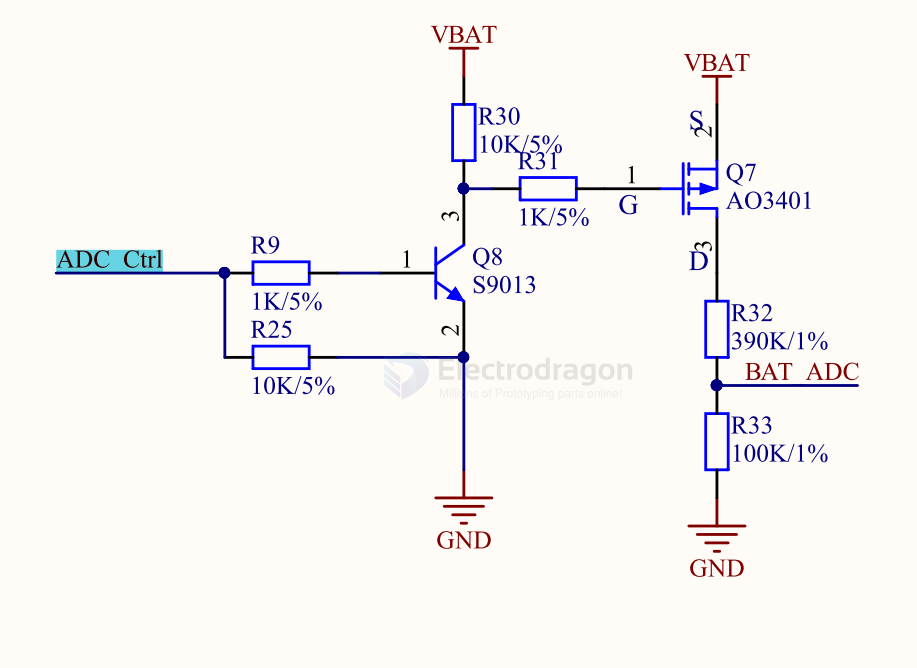
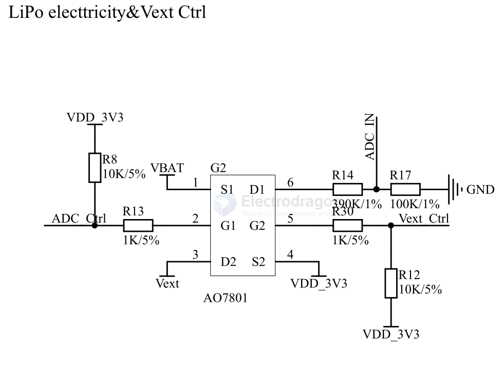
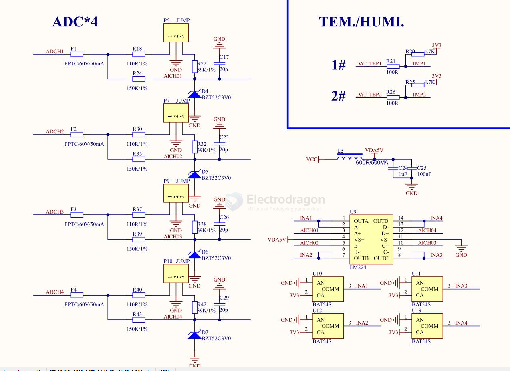

# ADC-dat

- [[DAC-dat]]

normally from - [[op-amp-dat]], [[ADC-dat]] can be on [[MCU-dat]]

- [[ADC-bat-monitor-dat]] - [[voltage-divider-dat]]

- not this is chip [[Analog-device-dat]]

- [[sensor-analog-dat]] - [[sensor-dat]]

- [[codec-audio-dat]] - [[codec-dat]] - [[I2S-dat]]

- [[ADC-dat]] - [[ADC-RECORD-dat]] - [[DAC-dat]] - [[DAC-PLAYBACK-dat]]

## relevant boards 

- [[NWI1119-dat]]

- [[SSL1071-dat]] - [[SSL1072-dat]] == Load Cell Amplifier, Weight Sensor Kit, HX711 [KG] - [[HX711-dat]]

- [[ADC-DAT]] - [[DAC-dat]] - [[IO-expander-dat]]

- [[MSP1064-dat]] - [[PCF8591-dat]]

- [[MPC1101-dat]] - [[RPI-SBC-dat]]

## apps to build 

- [[sensor-analog-dat]]

- [[sensor-temperature-dat]] - [[sensor-light-dat]]

- [[sensor-voltage-dat]]

## SCH 

### ADC with measure MOSFET control 

- [[transistor-dat]] - [[mosfet-dat]]

- [[voltage-divider-dat]] 

- [[ESP32-ADC-dat]]

1. **ADC Ctrl LOW (0V):**
    - Q8 is **OFF** (no base current).
    - The gate of Q7 is pulled up to VBAT via R30.
    - Q7 (P-MOSFET) is **OFF** (Vgs ≈ 0V).
    - No voltage is present at BAT_ADC; the voltage divider is disconnected from VBAT.
    - **ADC input is isolated** (saves power, prevents leakage).

2. **ADC Ctrl HIGH (e.g., 3.3V or 5V):**
    - Q8 is **ON** (base current flows via R9/R25).
    - Q8 pulls the gate of Q7 **towards GND** through R31.
    - Vgs of Q7 becomes negative (gate lower than source), **turning Q7 ON**.
    - VBAT is now connected to the voltage divider (R32/R33).
    - The divided voltage appears at **BAT_ADC** for ADC measurement.

### Purpose

- **Power Saving:** Only connects the voltage divider to the battery when ADC measurement is needed, reducing continuous current drain.
- **Control:** Allows the microcontroller to enable/disable battery voltage sensing.

### Summary Table

| ADC Ctrl | Q8 (NPN) | Q7 (P-MOSFET) | BAT_ADC Output      |
|----------|----------|---------------|---------------------|
| LOW      | OFF      | OFF           | Disconnected (0V)   |
| HIGH     | ON       | ON            | Battery voltage via divider |

---
**In summary:**  
`ADC Ctrl` enables or disables the battery voltage divider connection to the ADC

### 2x mosfet 2x ADC measurement 

### 4x ADC reader 

- [[LM224-dat]] - [[TI-interface-dat]]

- [[BAT54S-dat]]

## chips 

- [[HX711-dat]]

- [[TI-ADC-dat]] - [[TI-dat]]

- [[AD-ADC-dat]] - [[analog-device-dat]]

- [[cirrus-dat]] - [[CS553x-dat]]

- [[CS1237-dat]] - [[ADC-dat]] - [[chipsea-dat]]

## chips 

- [[INA219-dat]] - [[INA226-dat]]

- [[ADS1100-dat]]
- AD7606
- AD7799
- AD7880 == LC2 MOS Single +5 V Supply, Low Power, 12-Bit Sampling ADC

- [[ADS7822-dat]] - 12-Bit, 200 kSPS, SPI Interface, Micro Power, Single Supply, Rail-to-Rail I/O ADC with Internal Reference

	
- AD9224ARSZ - 12 Bit Analog to Digital Converter 1 Input 1 Pipelined 28-SSOP

- [[microchip-ADC-dat]] - [[microchip-dat]]

## other chips 

- [ADS7046 12-Bit, 3-MSPS, Single-Ended Input, Small-Size, Low-Power SAR ADC](https://www.ti.com/lit/ds/symlink/ads7046.pdf?ts=1758413865175)

- ADS1015

- AD9854ASTZ == CMOS 300 MSPS Quadrature Complete DDS == Data Acquisition ADCs/DACs - Specialized 200 MHZ QUADRATURE DDS SYNTHESIZER PBFre == 

- AD8561ARZ

- AD7864 == 4-Channel, Simultaneous Sampling, High Speed, 12-Bit ADC

- [[maxim-dat]] - MAX196/MAX198 - Multirange, Single +5V, 12-Bit DAS with 12-Bit Bus Interface

- [[renesas-dat]]

- [[analog-device-dat]] 

AD7366/AD7367 - True Bipolar Input, Dual 12-Bit/14-Bit, 2-Channel, Simultaneous Sampling SAR ADC

HEXINHULIAN `CL1606` - LQFP-64 Analog to Digital Converters (ADC) RoHS

## ADC 3V3 

### 公式

Vout = Vin × R2 / (R1 + R2)
3.3V = 12V × R2 / (R1 + R2)
=> R1 / R2 = (12 - 3.3) / 3.3 ≈ 2.64

### 推荐分压电阻

| 用途 | R1（上拉） | R2（下拉） | 12V 时 Vout | 余量 |
|------|-----------|-----------|------------|------|
| ✅ 推荐 | **27kΩ** | **10kΩ** | **3.24V** | 安全 |
| ✅ 可选 | **33kΩ** | **12kΩ** | **3.20V** | 安全 |
| ✅ 可选 | **15kΩ** | **5.6kΩ** | **3.26V** | 安全 |
| ⚠️ 偏高 | **10kΩ** | **3.9kΩ** | **3.37V** | 超 3.3V |

wiring 接线图

    12V ──── R1(27kΩ) ────┬──── GPIO19 (ADC)
                          │
                          R2(10kΩ)
                          │
                          GND

## ref 

- [[tech-dat]]
