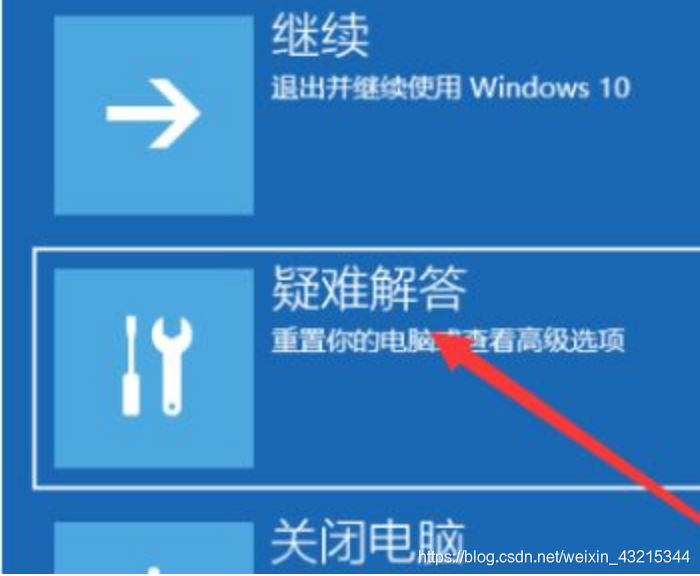
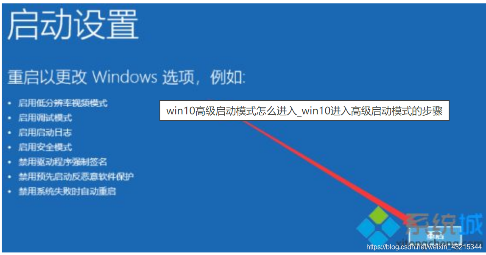

# driver-dat

## USB driver 

- libusb0 - [[libusb0.zip]]

- progisp [[progisp.zip]]

- [[usbasp-dat]]

- http://zadig.akeo.ie/

## 试图将驱动程序添加到存储区时遇到问题

点击开始按钮，选择电源。此时先按住键盘上的shif键，再点击"重启”；（注：如无法正常进入系统，可在开机出现LOGO时强制关机三次来触发修复模式，再进入高级选项）

6. 一般是按数字键“7”选择“禁用驱动程序强制签名

7. 然后重新进系统后再安装打印机驱动。