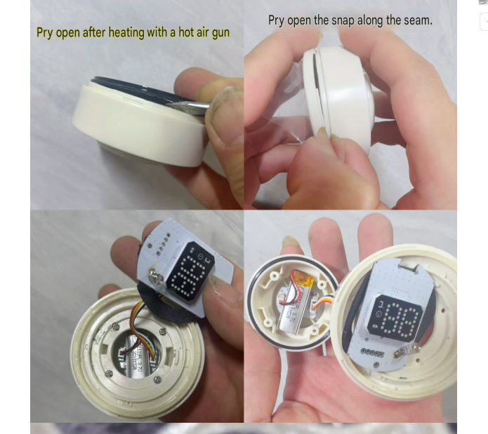

# hack-dat

- [[hack-dat]] - [[fab-mechanics-dat]] - [[hack-dat]] - [[installation-dat]]

- [[rc-hack-dat]]

## simple hack 

- [[glue-dat]] - [[velcro-dat]]

## invasive hack 

- [[screw-dat]] 

- [[plastic-dat]] - [[plastic-soldering-dat]]

## build materials 

- [[sheet-dat]]

## for fun 

- [[insta360-dat]] - [[gopro-dat]] - [[insta360-go-rack-dat]] - [[gopro-amount-dat]]

## mechanics 

- [[spacer-copper-dat]] - [[spacer-dat]] 

- [[Heat-Set-Insert-dat]]

## methods 

- [[fab-tools-dat]] - [[hot-air-station-dat]]

- [[battery-charger-dat]]

## projects 

- [[hack-dat]] - [[vacuum-flask-dat]]

## common difficulties

- [[DJI-dat]]

The short answer is: **No, you cannot directly "hack" a DJI flight control system and flash it with a fully open-source firmware (such as Betaflight or ArduPilot).**

DJI's hardware and software ecosystem is highly closed and heavily protected by security measures. Here is a breakdown of why this is the case:

### 1. Deep Hardware Closed-Loop

* **Proprietary Chips and Architecture:** DJI's flight controllers often use custom application-specific integrated circuits (ASICs), custom MCUs, or highly integrated SoCs. Their low-level register definitions, bus protocols, and peripheral drivers are entirely proprietary and undocumented.
* **Lack of Standard Interfaces:** The flight controller boards typically do not expose standard SWD/JTAG debugging pads, or those interfaces are fuse-locked/encrypted at the factory, preventing direct reading or writing of unsigned custom bootloaders.

### 2. Software and Security Mechanisms (Cryptographic Verification)

* **Firmware Encryption and Secure Boot:** DJI firmware is heavily encrypted and digitally signed. Even if a firmware binary is extracted via an exploit, unauthorized or modified code will fail the bootloader's signature check, resulting in a bricked device or a refusal to boot.
* **Proprietary Protocols:** From low-level sensor fusion and attitude estimation (AHRS) to motor control protocols (such as DJI's proprietary ESCs and video transmission systems), the entire communication pipeline relies on closed-source, proprietary protocols that the open-source community cannot natively interface with.

---

### What are the alternatives if you want an open-source or deeply customizable system?

While you cannot convert an official DJI flight controller into an open-source one, developers looking for customizability typically pursue these alternative paths:

1. **The Official SDK Route (For Enterprise/Select Consumer Drones):**
* DJI provides developer kits such as **Payload SDK**, **Mobile SDK**, and **Onboard SDK** (supported on platforms like the Matrice series). You can interface an onboard companion computer (like a Raspberry Pi or an industrial mini-PC) to send high-level flight commands (such as waypoints, velocity vectors, and gimbal control) via the SDK, achieving autonomous control similar to open-source platforms.

2. **The Open-Source Hardware Ecosystem:**
* If your goal is complete transparency, total freedom to flash custom firmware (Betaflight, ArduPilot, or PX4), and hackable hardware, the standard approach is to use open-source flight controllers (such as the Pixhawk series or STM32/H7-based FPV stacks) paired with open ESCs and peripherals.

## ref 

- [[hack]]