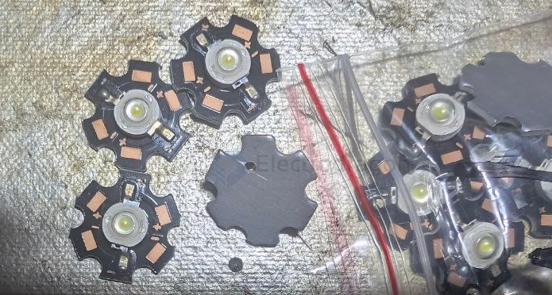
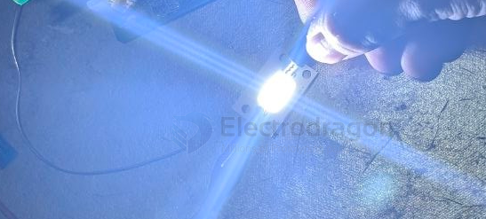
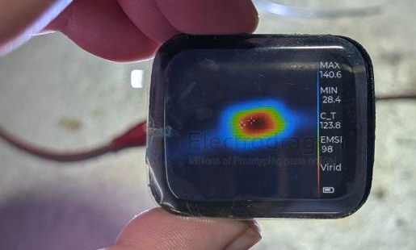
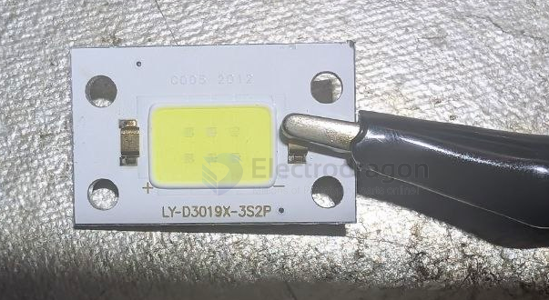
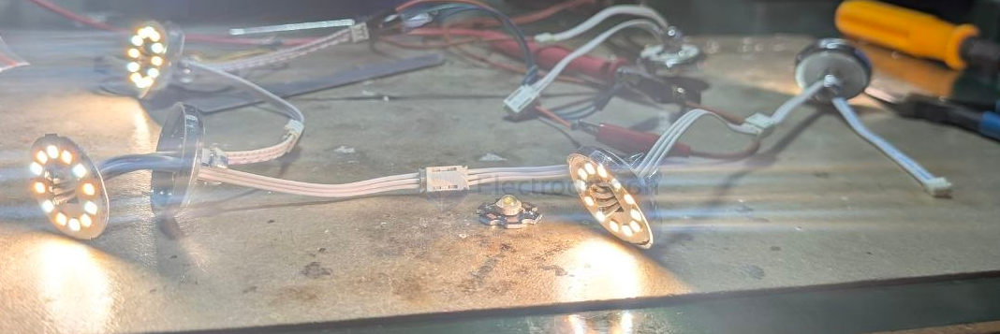
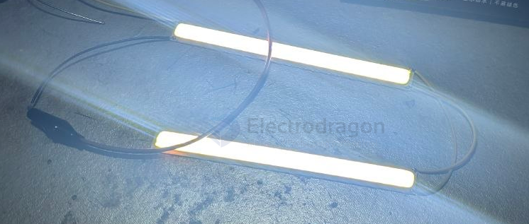
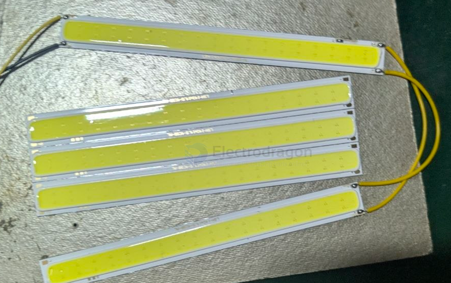

# LED-board-dat

- [[LED-board-dat]] - [[LED-dat]]

- [[PCB-dat]] - [[LED-board-dat]] - [[PCB-aluminium-dat]]

## build 

build 4 - [[ILE1036-dat]] == 3.3V 0.15A 

build 3 - 12V 1A over-flow current // 3S2P try parallel 

build 2 

- [[installation-dat]] - [[LED-board-dat]] 

build 1 12V-24V 

## ref 