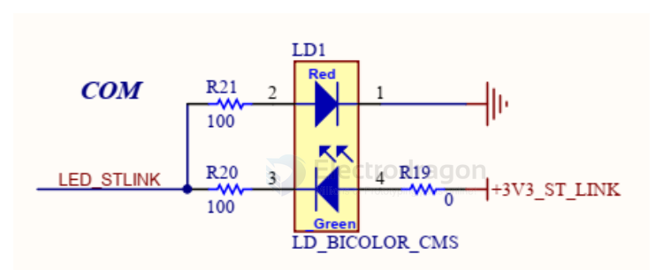
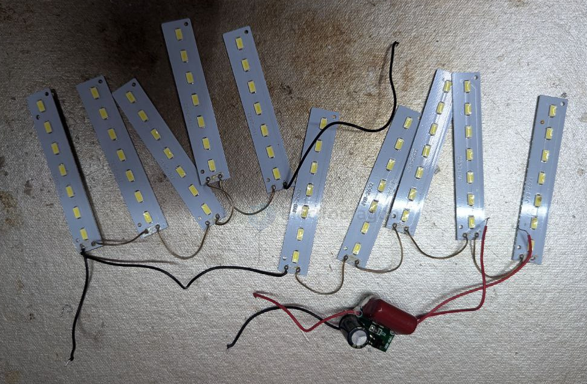
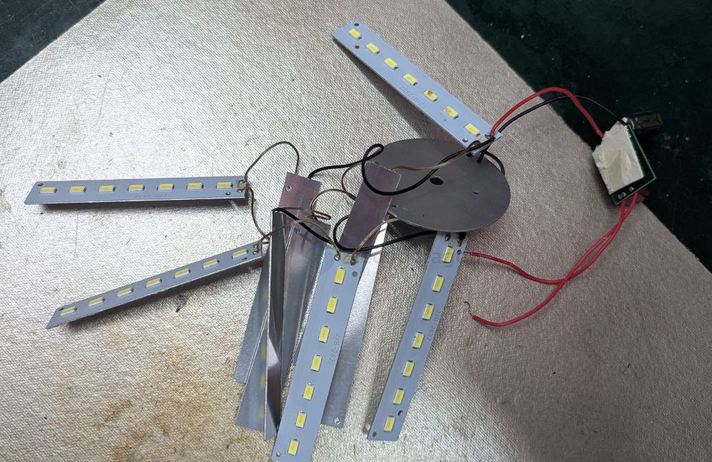
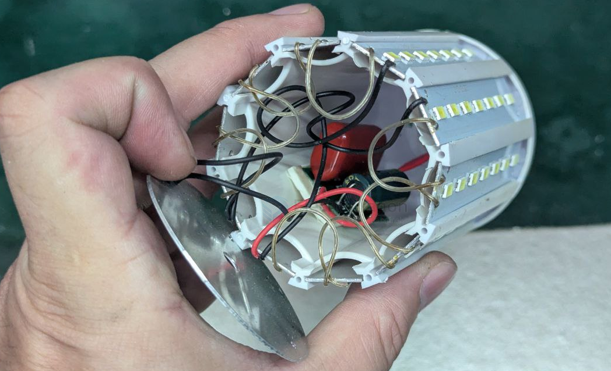
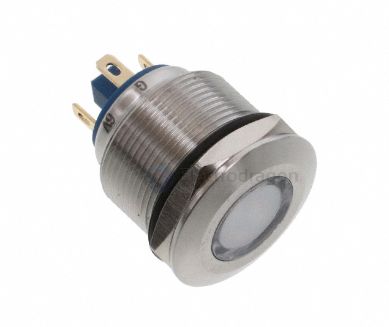
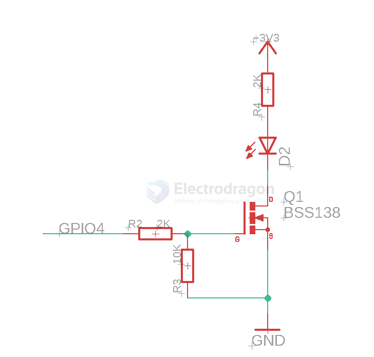
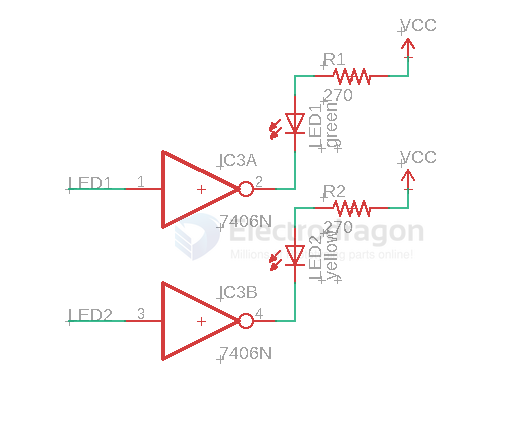

# LED-dat

- [[infrared-led-dat]]

- [[LED-strip-dat]] 
 
- general led driver [[led-driver-dat]] - [[ILC1063-dat]] - [[IDD1002-dat]]

## functional LEDs 

- [[LED-UVA-dat]]

- [[RGB-led-dat]]

## LED driver boards  

- [[ILE1073-dat]] - [[NWI1124-dat]] - [[NWI1126-dat]]

## general single PTH led 

[20PCs 3mm Super-light Transparent LED [Bright Color]](https://www.electrodragon.com/product/basic-led-100-pcs-3mm/)

- [[ILE1016-dat]] - [[ILE1017-dat]] - [[ILE1018-dat]] - [[ILE1019-dat]] - [[ILE1020-dat]] - [[ILE1021-dat]]
== - yellow - red - blue - white - purple - green 

## SMD LED with / without internal chips

SMD LED with internal chips [[WS2812-dat]]

pre-programmed USB driving cable for [[WS2812-dat]] - [[IDD1011-dat]]

SMD LED without internal chips - [[ILE1002-dat]]

other types - [[APA102-2020-dat]]

## high power LED 

- [[high-power-led-dat]]

- 100W == [[ILE1044-dat]] - 20W == [[ILE1041-dat]]

- 10W == [[ILE1039-dat]]

- 1W 3W 5W 

## drive high brightness LED 

GPIO4: 

## dual color LED 

## Q5 LED Bead 

### Key Features
- **LED Type**: Cree XR-E Q5 (from Cree XR-E series)
- **Light Output**: ~200–230 lumens (depending on drive current)
- **Drive Current**: Typically 350mA to 1000mA
- **Voltage (Forward Voltage)**: ~3.2–3.7V
- **Luminous Efficiency**: Around 80–100 lm/W
- **Color Temperature**: Available in cool white (6000–7000K) and neutral white options
- **Package Size**: ~7mm × 9mm
- **Beam Angle**: ~90°–100° (depending on lens/reflector design)
- **Lifetime**: >50,000 hours (under proper thermal management)

---

### Advantages
- High brightness in compact size
- Energy efficient compared to older LED generations
- Reliable and durable (long lifespan)
- Widely adopted in **flashlights**, **bike lamps**, **spotlights**, and **DIY lighting projects**

## commerial LED panels 

## panel LED indicator 

ED PNL IND RGB DIF 13.80MM SLDR - 6211122304F

LED Panel Indicator Red, Green, Blue (RGB) Diffused 6V 15mA Red, 15mA Green, 15mA Blue Solder Lug

## LED control SCH 

- [[mosfet-dat]] 

- [[logic-dat]] convert for [[RPI-SBC-dat]]

## tech 

- [[ACDC-dat]]

## ref 

- [[LED]] - [[leds]]