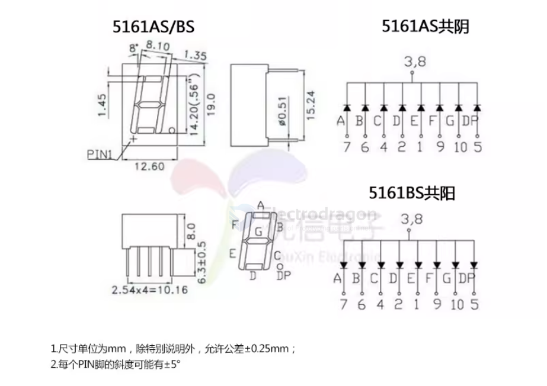
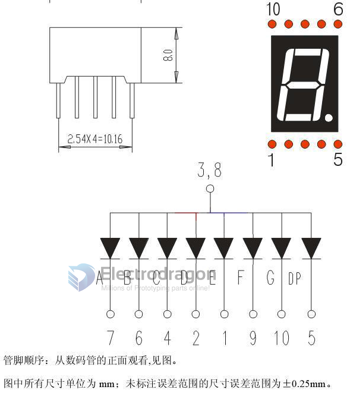
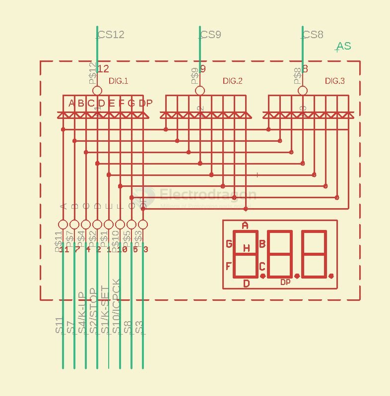
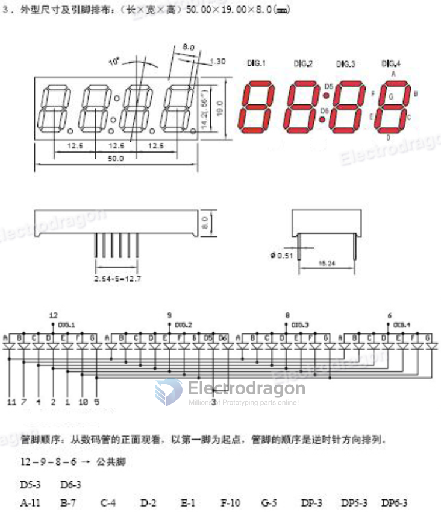
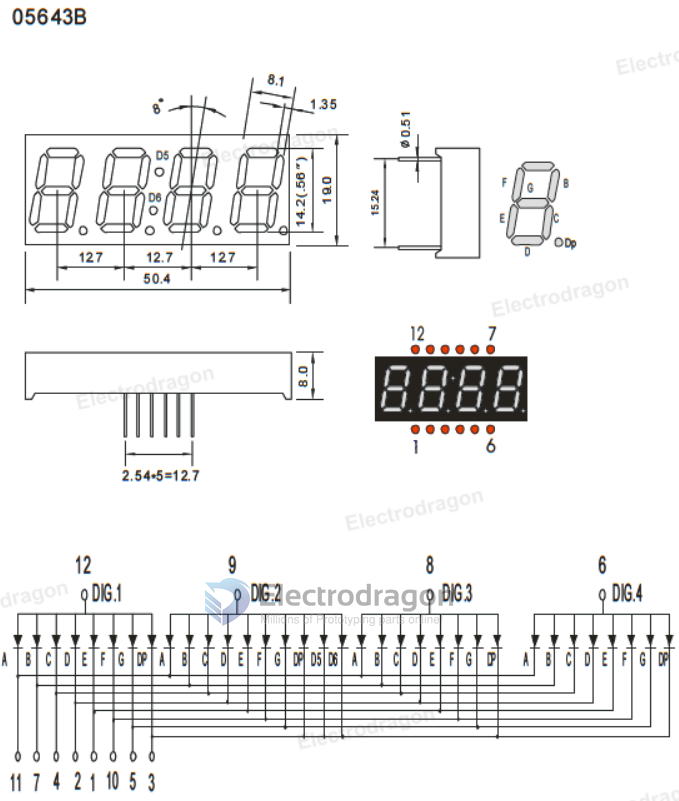
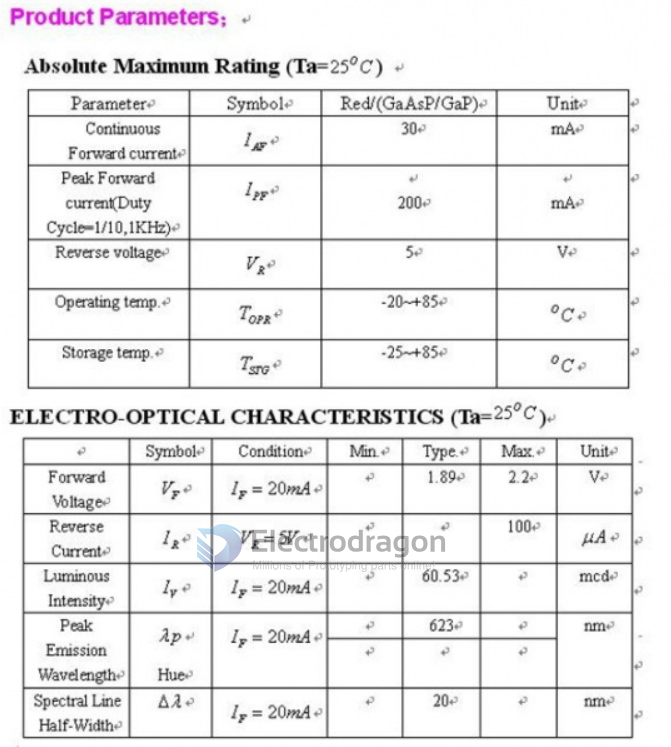

# segment-display-dat

- [[LED-matrix-driver-dat]]

- [[IMS1030-dat]] == 0.56"

- [[display-segment-driver-dat]] - [[LED-segment-display-dat]] - [[display-driver-dat]]

- [[7-segment-display-dat]]

## common 7-segment display size 

- 0.36" - 0.56" - 0.8" - 1" - 1.2" - 1.5" - 2" - 2.3" - 3" - 4"

## common driving methods 

- common-anode
- common-cathode

## models 

5161AS == 0.56" 1-digi common-cathode / 5161BS == 0.56" 1-digi common-anode

## 7-segment 1-digi

- common cathode

## 7-segment 3-digi 

## 7-segment 4-digi

- 50 x 19 mm
- common cathode

## parameters 

## ref 

- [[interactive-dat]]

- [[7-segment-display]]

