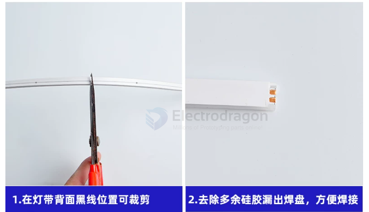
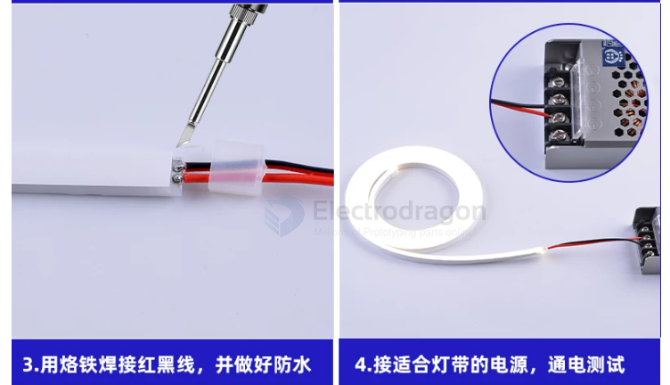
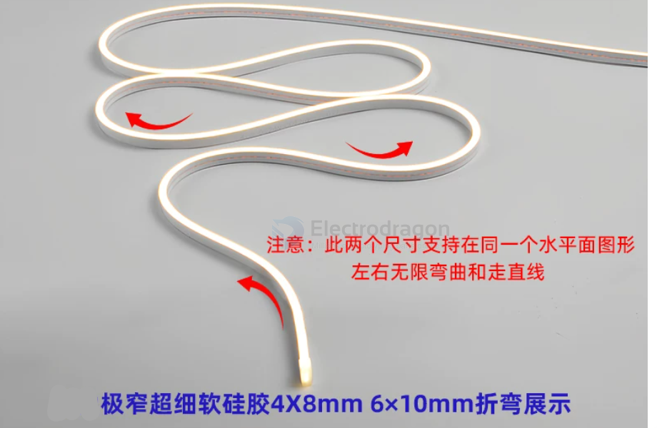
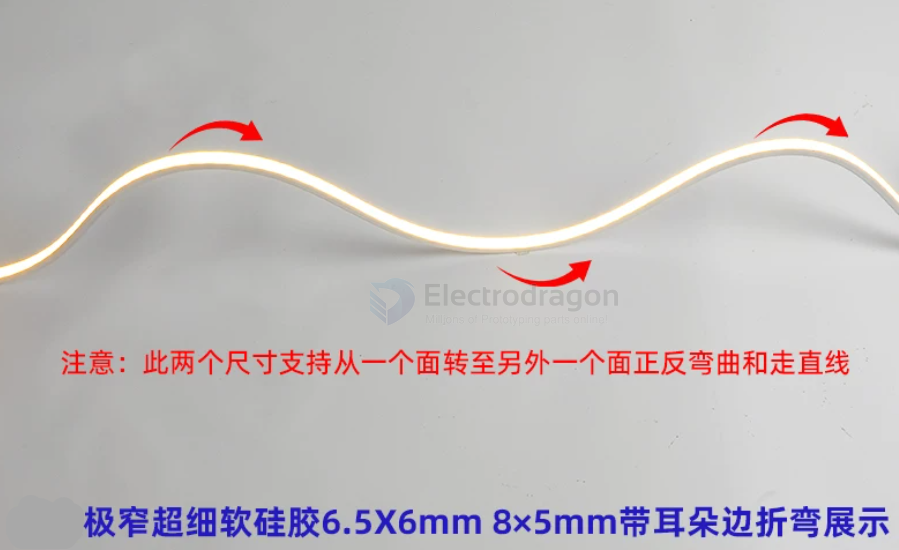

# led-strip-silicone-dat

滴胶灯条（IP65/IP67）并不适合长期潜水

在讨论固定胶体前，必须先指出灯条本身的防护等级风险：

普通滴胶灯条（表面覆一层 PU/环氧树脂）： 防护等级通常仅为 IP65 或 IP67，只能防泼水或短时间浸水。海水的渗透性极强，且带有盐分，滴胶层时间长了会老化开裂，背面的 PCB 铜箔和焊点一旦接触海水会迅速发生电化学腐蚀（青绿色的铜绿）并短路失效。

海水浸泡的正确选型： 真正能长期浸泡在水下（IP68）的灯条，通常是全挤出硅胶套管+内部灌胶的结构。

## projects 

- [[rc-boat-dat]] - [[adhesive-marine-dat]] - [[glue-dat]] - [[waterproof-dat]] - [[led-strip-dat]] - [[led-strip-silicone-dat]] - [[underwater-dat]] - [[nature-dat]] - [[projects]]

## use 

1. 在灯带背面黑线位置可裁剪
2. 去除多余硅胶漏出焊盘，方便焊接
3. 用烙铁焊接红黑线，并做好防水
4. 接适合灯带的电源，通电测试

## bending type 1 

## bending type 2 

## ref 