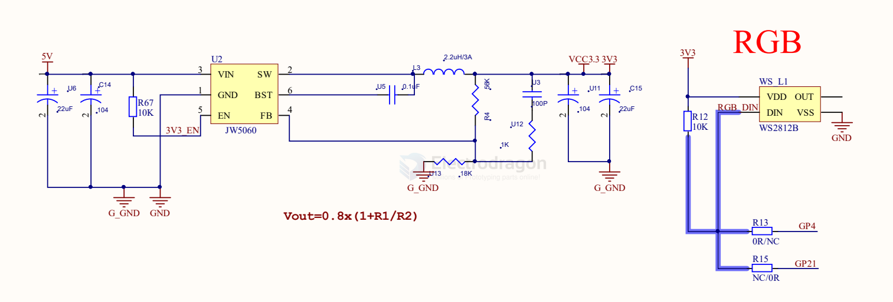
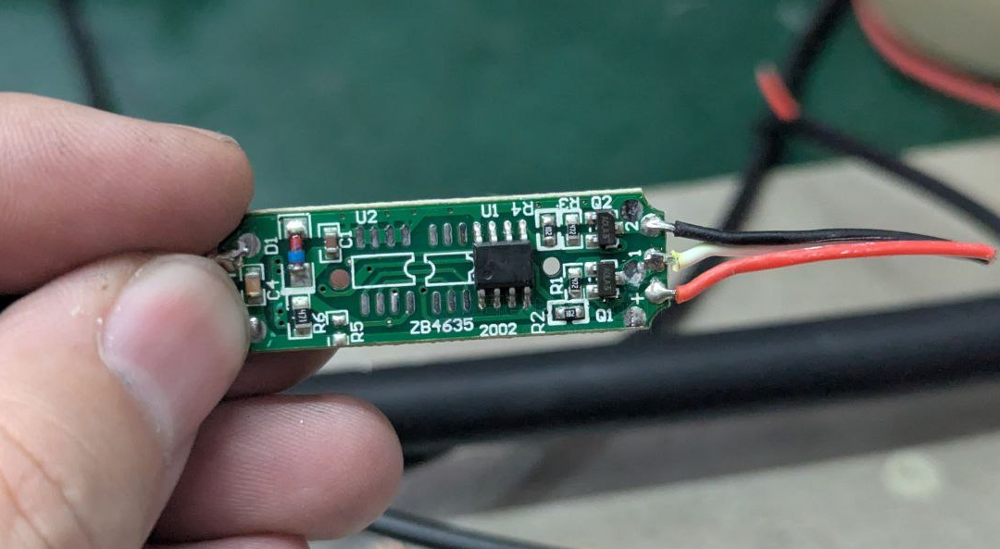
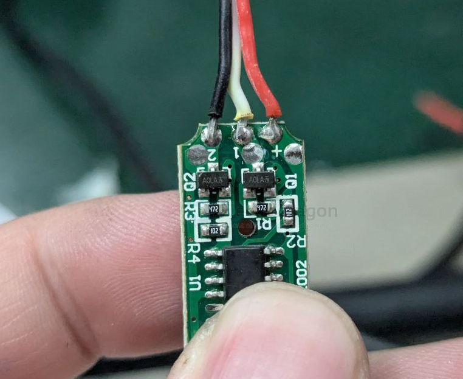

# led-driver-dat

https://w.electrodragon.com/w/LED_Drive

- [[constant-current-dat]]

## boards 

- [[ILC1063-dat]] - [[PWM-dat]]
- [[IDD1002-dat]] - [[PT4115-dat]]
- [[XL4015-dat]]
- [[CN5711-dat]]

## tech 

- [[mosfet-dat]]

- [[constant-current-dat]]

## Common questions 

This is a buck (step-down) constant-current LED driver. Input: 5–32 V.

- The input voltage must be at least 1 V higher than the LED string voltage required. This is a constant-current driver, not a constant-voltage regulator.
- People often ask "what is the output voltage?" — the board controls current, not voltage. The output voltage will adjust to whatever the LEDs require.
  - Example: if one LED requires ~3 V, the LED voltage stays ~3 V. Two in series ~6 V, etc.
  - Do not measure output voltage with no load. No-load output reads the input voltage (a phantom voltage).
- This is a step-down (buck) constant-current driver, not a boost driver.
  - If two LEDs in series require 6 V to light, and you supply 5 V, they will not light. You must supply at least ~7 V (6 V + ~1 V headroom).
- Output current formula: I = 0.1 / R_CS (R_CS = current sense resistor).

## driver options 

### integrated chip solutions 

- [[diodes-dat]] - [[AL8805-dat]]

### mosfet control options 

The FQP30N06L MOSFET (datasheet) is an N-channel MOSFET designed for switching high-speed circuits, and it’s perfect for switching LEDs. It can control up to a 60V, 30A load and can be switched from 3.3V or 5V.

https://cdn.sparkfun.com/datasheets/Components/General/FQP30N06L.pdf

- [[mosfet-dat]]

### mosfet PWM control 

- [[PWM-dat]]

## futher concern 

### high speed switching 

- writing .. == [[mosfet-driver-dat]]

## LCD backlight drive

## option 1

- [[JW5060-dat]]

### chip 

- [[silergy-dat]] - [[SY7200-dat]] - [[SY7201-dat]] - [[SY7301-dat]]

- [[powtech-dat]] - [[PT4103-dat]] - [[PT4115-dat]]

- [[CN5711-dat]] - [[consonance-dat]]

### option 3 

背光驱动

该部分用于驱动RGB屏幕背光，标准40Pin RGB屏幕基本采用串联背光，由于本身开发板供电只有5V，所以我们需要使用背光驱动芯片升压到合适的电压，来驱动屏幕背光。同时，背光驱动芯片采用恒流控制，可以避免电流过大导致背光LED烧毁，该部分原理图如下所示：

其中：

C19 C20为滤波电容，C19电容的耐压需要特别考虑，一般的RGB屏背光电压基本在18V以上(白光LED压降3V*6串)，过低的电容耐压会导致电容损坏。

BL_CTR为芯片背光控制引脚，此处直接接入了上拉，再开发时可以将BL_CTR引脚接入F1C200S的PWM引脚上，这样可以灵活控制屏幕亮度，同时，有恒流驱动的存在，控制亮度时，背光也不存在明显的频闪。

L1 为升压电路的电感，按照要求一般取10uh或22uh即可，不需要使用公式详细计算，但是需要注意电流不能超过电感额定电流。

R5为芯片的反馈电阻，用于调节输出的电流，计算公式可参考下方：

图2.13反馈电阻计算公式

此处我们选择20ma，所以R1=0.25/0.020（Ω） = 12.5Ω，就近取12Ω。

选择的20ma电流可以参考屏幕数据手册：

图2.14 屏幕数据手册线路原理图

如上图，下方说明了LED为2并5串，额定电流为40ma，我们为了保险，选择了20ma，亮度会有所损失。

## 12V button-MCU-transistor driver 

button buttons on the back side, low-side control white and warm white LED strips

driver AOA3 ?

## unsort 

- MIC2871YMK-T5 - LED Driver IC 1 Output DC DC Regulator Step-Up (Boost) Single-Wire Dimming 1.2A (Flash) 14-LDFN (3x2)

## driving method 

Current Push vs Pull: Power Supply & LED

### 1️⃣ Conceptual difference

| Term             | Meaning                                        | Direction of Current     | Notes                                                                                                |
| ---------------- | ---------------------------------------------- | ------------------------ | ---------------------------------------------------------------------------------------------------- |
| **Current Push** | Source **actively drives current into a load** | From power supply → load | Standard operation of most DC power supplies: source “pushes” electrons into the device.             |
| **Current Pull** | Load **draws current from the source**         | From load → source       | Seen when load is voltage-controlled, like LEDs with a series resistor on a constant voltage supply. |

> In practice:
> - **Power supply**: pushes current.
> - **LED**: draws (pulls) current according to its forward voltage and series resistor/driver.

---

### 2️⃣ Relation to LEDs

- **LED is a current-driven device**:
  - Brightness is determined by **current**, not voltage.
  - Excess current → LED damage.

- **Power supply types**:
  1. **Constant Voltage (CV, e.g., 12V)**  
     - Supply pushes voltage → LED pulls current through series resistor.  
     - Resistor needed to **limit current**.
  2. **Constant Current (CC, e.g., 350mA)**  
     - Supply pushes fixed current → LED sets voltage automatically.  
     - Stable brightness, no extra resistor needed.

---

### 3️⃣ Practical Examples

**12V LED with resistor:**

12V (push) → resistor → LED (pull)

- Power supply pushes 12V.
- LED pulls current: I = (12V - Vf) / R
- If R too small → LED pulls too much → burns out.

**Constant current driver:**

12V CC driver (pushes 350mA) → LED (accepts 350mA)

- Driver maintains current automatically.
- LED adjusts voltage accordingly.
- No resistor needed.

---

### 4️⃣ Key Takeaways

1. **LEDs are current-driven**; control current rather than voltage.  
2. **Push vs Pull is perspective**: supply pushes, LED pulls.  
3. **Use constant current drivers** to protect LEDs.  
4. With voltage supply, **always use a series resistor** to limit current.

### ref 

- https://tigoe.github.io/LightProjects/led-strips.html

- [[led-driver]] - [[led]]