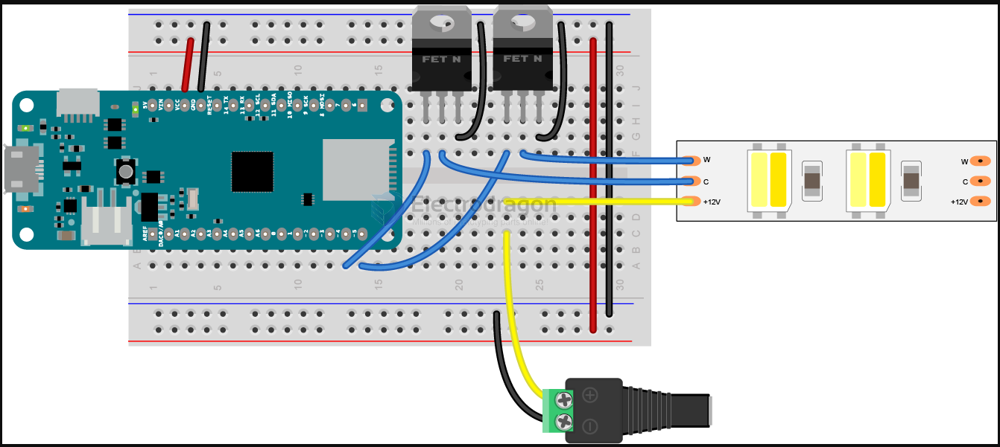
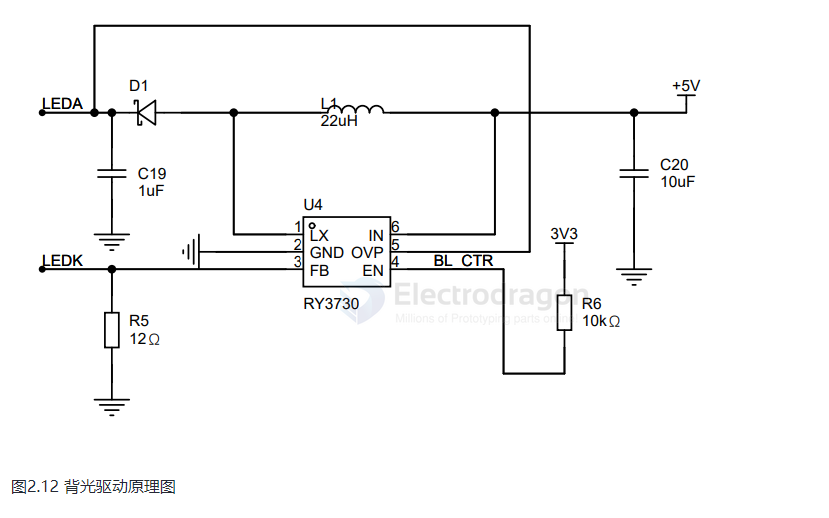
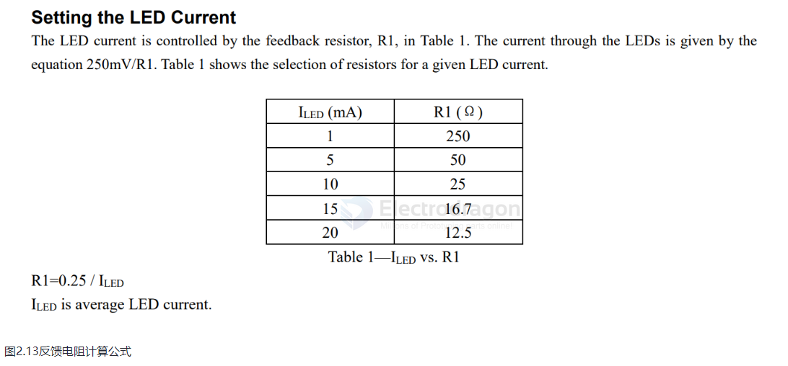

# led-driver-dat

https://w.electrodragon.com/w/LED_Drive

## boards 

- [[ILC1063-dat]] - [[IDD1002-dat]]

## driver options 

### integrated chip solutions 

- [[diodes-dat]] - [[AL8805-dat]]

### mosfet control options 

The FQP30N06L MOSFET (datasheet) is an N-channel MOSFET designed for switching high-speed circuits, and it’s perfect for switching LEDs. It can control up to a 60V, 30A load and can be switched from 3.3V or 5V.

https://cdn.sparkfun.com/datasheets/Components/General/FQP30N06L.pdf

- [[mosfet-dat]]

### mosfet PWM control 

- [[PWM-dat]]

## futher concern 

### high speed switching 

- writing .. == [[mosfet-driver-dat]]

## LCD backlight drive

### chip 

- [[silergy-dat]] - [[SY7200-dat]] - [[SY7201-dat]] - [[SY7301-dat]]

- [[powtech-dat]] - [[PT4103-dat]] - [[PT4115-dat]]

- [[CN5711-dat]] - [[consonance-dat]]

### option 3 

背光驱动

该部分用于驱动RGB屏幕背光，标准40Pin RGB屏幕基本采用串联背光，由于本身开发板供电只有5V，所以我们需要使用背光驱动芯片升压到合适的电压，来驱动屏幕背光。同时，背光驱动芯片采用恒流控制，可以避免电流过大导致背光LED烧毁，该部分原理图如下所示：

其中：

C19 C20为滤波电容，C19电容的耐压需要特别考虑，一般的RGB屏背光电压基本在18V以上(白光LED压降3V*6串)，过低的电容耐压会导致电容损坏。

BL_CTR为芯片背光控制引脚，此处直接接入了上拉，再开发时可以将BL_CTR引脚接入F1C200S的PWM引脚上，这样可以灵活控制屏幕亮度，同时，有恒流驱动的存在，控制亮度时，背光也不存在明显的频闪。

L1 为升压电路的电感，按照要求一般取10uh或22uh即可，不需要使用公式详细计算，但是需要注意电流不能超过电感额定电流。

R5为芯片的反馈电阻，用于调节输出的电流，计算公式可参考下方：

图2.13反馈电阻计算公式

此处我们选择20ma，所以R1=0.25/0.020（Ω） = 12.5Ω，就近取12Ω。

选择的20ma电流可以参考屏幕数据手册：

图2.14 屏幕数据手册线路原理图

如上图，下方说明了LED为2并5串，额定电流为40ma，我们为了保险，选择了20ma，亮度会有所损失。

### ref 

- https://tigoe.github.io/LightProjects/led-strips.html

