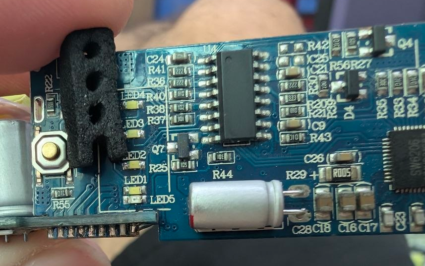

# led-indicator-dat

- [[led-indicator-dat]] - [[LED-dat]] - [[power-bank-dat]] - [[SW6206-dat]] - [[PCB-form-dat]]

LED arrays isolator 

## apps 

for mosfet control indicator 

- [[led-dat]] - [[led-indicator-dat]] - [[mosfet-dat]]

To indicate the GPIO Control State (`GPIO -> Resistor -> LED -> GND`): Use this if you just want to verify that your microcontroller pin is sending a high signal to the gate, independent of whether the load is connected or working.

## ref 