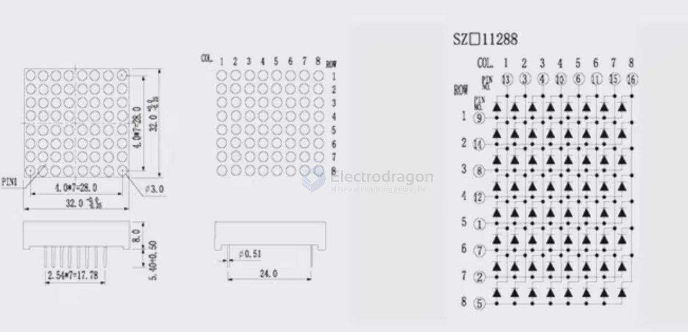
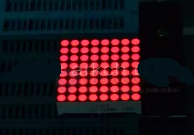

# led-mono-matrix-dat

- [[matrix-display-driver-dat]] - [[led-mono-matrix-dat]]

- [[IMS1008-dat]] - [[IMS1009-dat]] - [[led-mono-matrix-dat]]

- [[IMS1010-dat]]

# matrix-display-dat

- [[IMS1009-dat]]

- dot matrix display normally driven by LEDs 

## drive chip 

- [[MAX7219-dat]]

HCMS-29xx Series - High-Performance CMOS 5×7 Alphanumeric Displays

The Broadcom® HCMS-29xx series are high-performance, easy-to-use dot matrix displays that are driven by onboard CMOS ICs.
