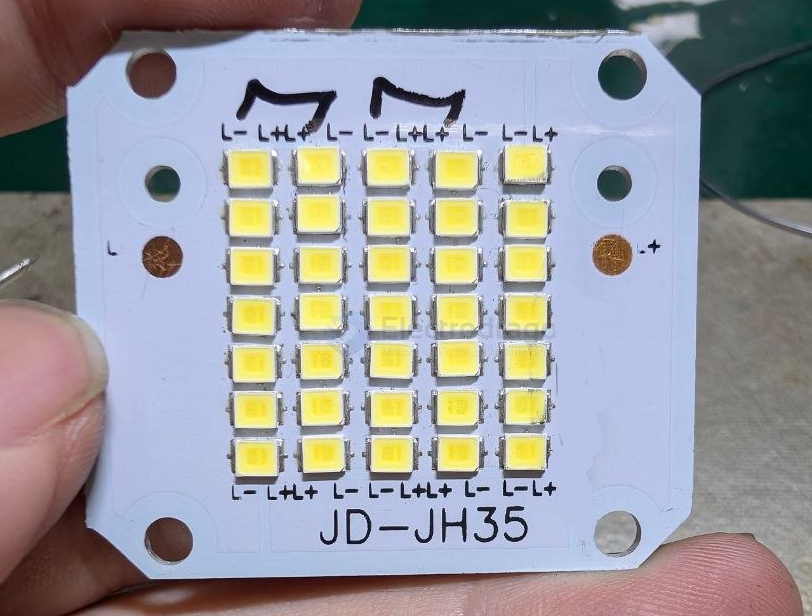
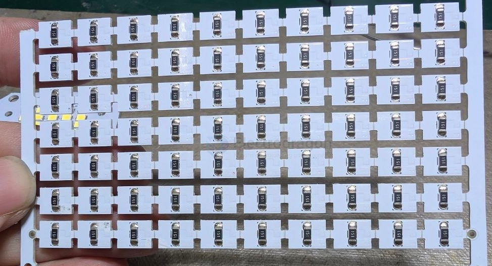
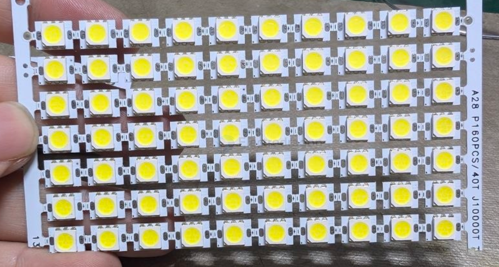
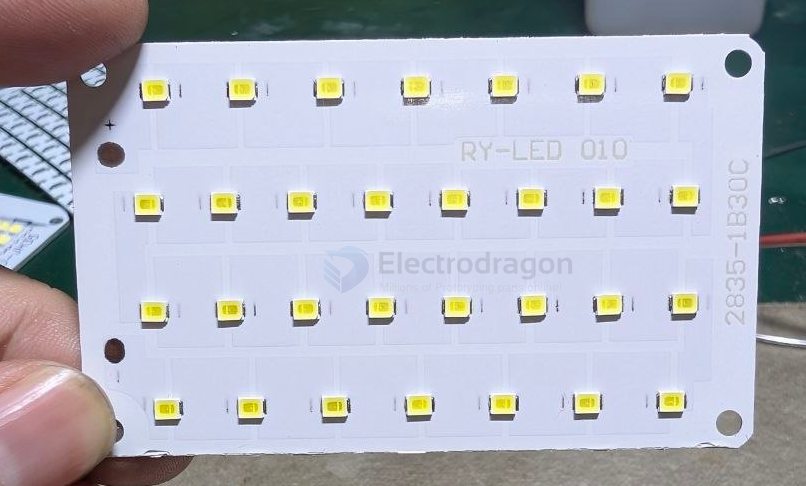
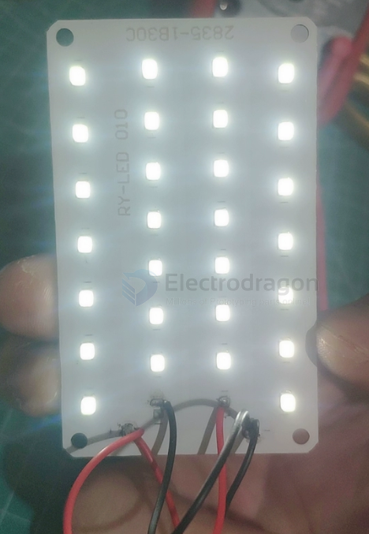

# led-panel-dat

- [[LED-dat]] - [[LED-strip-dat]] - [[led-driver-dat]] - [[led-panel-dat]] - [[led-types-dat]]

- [[PCB-aluminium-dat]] - [[PCB-design-dat]] - [[led-panel-dat]]

- [[led-2835-dat]] - [[led-5730-dat]] - [[LED-5050-dat]] - [[led-types-dat]]

## build 3 

10W LED灯板 铝基板灯片 色温6000K 白光

2S + 2S + 1S 

## build 2 

- 9V - [[LED-5050-dat]]

## build 1 

- [[led-2835-dat]]

- 90V

一般2835灯珠最低的有0.25W，最高的1W的都有，按0.25W算28串才7W，电流可能就80多mA，一般还要稍微降低电流以提高寿命，如果是0.5W一个灯珠，电流可以到160多mA，稍微降一点跑120mA都没问题，整个板大概10W左右

hack 

现在是 1*30，我改成 1*14，2并了，42v用，挺好

拆掉俩灯珠，重新连线。35v点亮，45v温度45°左右。

## ref 