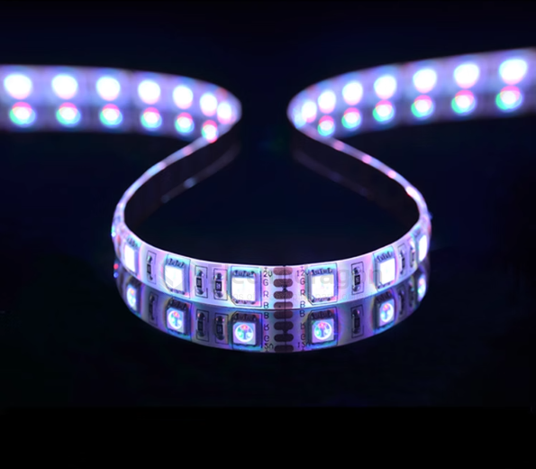
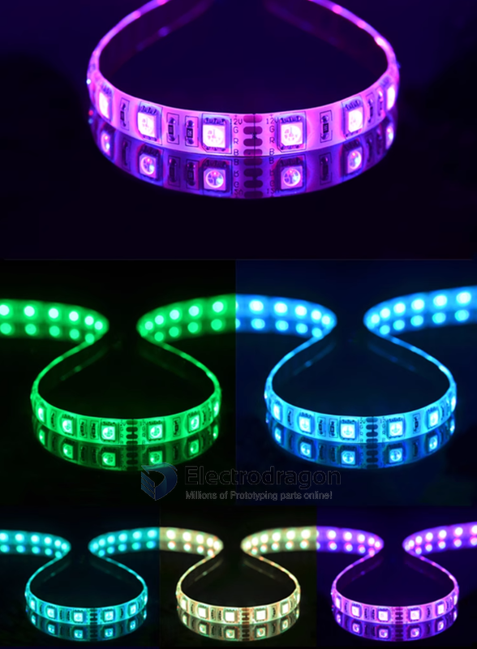
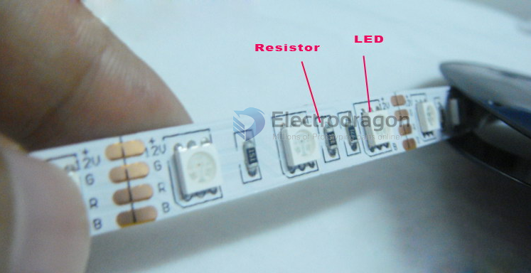
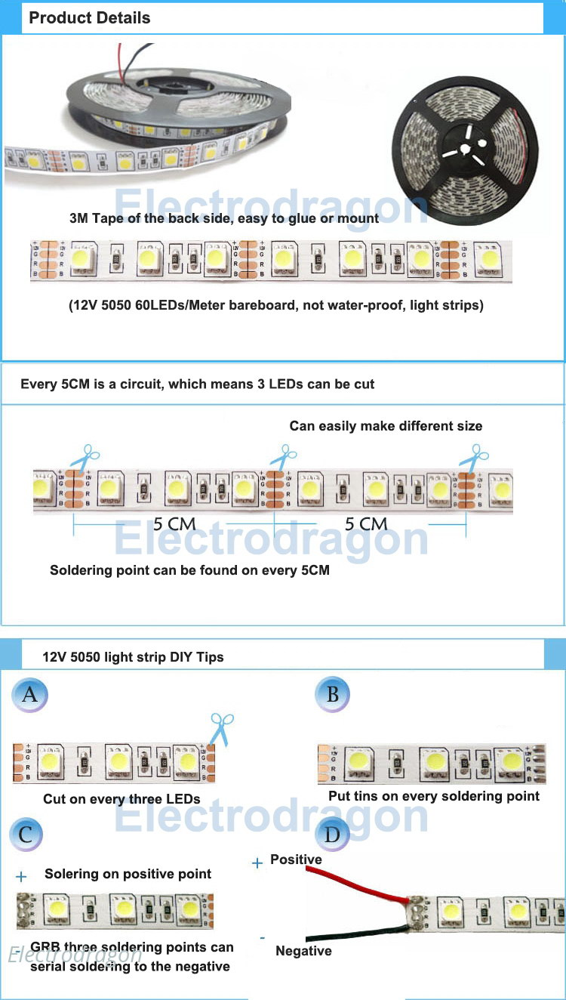
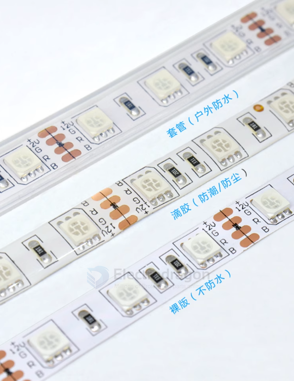

# led-strip-dat

## 5050 RGB LED Strips, 60 LEDs/M [Meters]
- [[ILSS007-dat]] - [[ILSS008-dat]]

## Super Light LED Strip (White), 60 LEDs/M [Meters]
- [[ILSS013-dat]]

## power supply power adapter 
- [[CPP1040-dat]]

## control box 
- [[ILSS001-dat]]
- [[NWI1126-dat]]

## Modify / cutting or connecting 

## Protection Type 

- in-tube 
- in-glue 
- no-protect

## ref 

- [[led-strip-dat]] - [[ws2812-dat]]