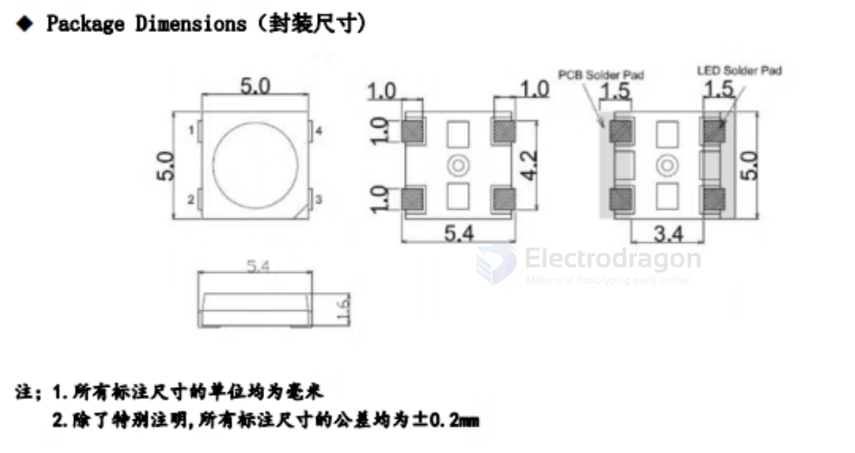

# WS2812 dat 

- [legacy wiki page ](https://www.electrodragon.com/w/W2812)

- [legacy wiki page WS2812-Matrix](https://w.electrodragon.com/w/WS2812-Matrix)

- [[WS2813-dat]]

- [[WS2812-boards-dat]]

## Our Boards 

- [[NWI1124-dat]] - [[NWI1126-dat]]

- [[ILE1001-dat]] - [[ILE1047-dat]]

- [[ILE1062-dat]]

- [[ILE1050-dat]] - [[ILE1051-dat]] - [[ILE1052-dat]]

pre-programmed USB driving cable - [[IDD1011-dat]]

## About WS2812:

**WS2812** is a set of control circuit and lighting circuit in one of the smart external control LED light source. Its shape and a same 5050LED lamp beads, each element is a pixel. Pixels contained within an intelligent digital interface data latch signal shaping amplification drive circuit further includes a high-precision internal oscillator and programmable 12V high voltage constant current control section, effectively ensuring the color pixel light highly consistent.

NRZ data protocol uses a single line of communication, pixel after power-on reset, DIN end receives data transmitted from the controller, the first sent over 24bit pixel data is extracted first point, to the internal pixels data latch, the remaining data processing circuit through the internal plastic shaping amplified through the DO output port begins forwarding to the next cascade of pixels, each pixel through the transmission of a signal to reduce 24bit. Pixel using automatic shaping forwarding technology, so the number of pixels of the cascade unrestricted signal transmission, only limited by the signal transmission speed requirements.

LED has a low voltage driving, high energy saving and environmental protection, brightness, scattering angle, consistency, and ultra-low-power, long life and other advantages. The control circuit is integrated in the LED above the circuit becomes more simple, small size, installation more convenient.

## Note 

- WS2812 - ESP32 IO36

## LEDS

- VDD Power Supply
- DOUT Data Out 
- VSS  Ground 
- DIN Data In 

## SCH 

ESP32 

## ref 

- smd3535

- [[led-strip-dat]] - [[ws2812-dat]]