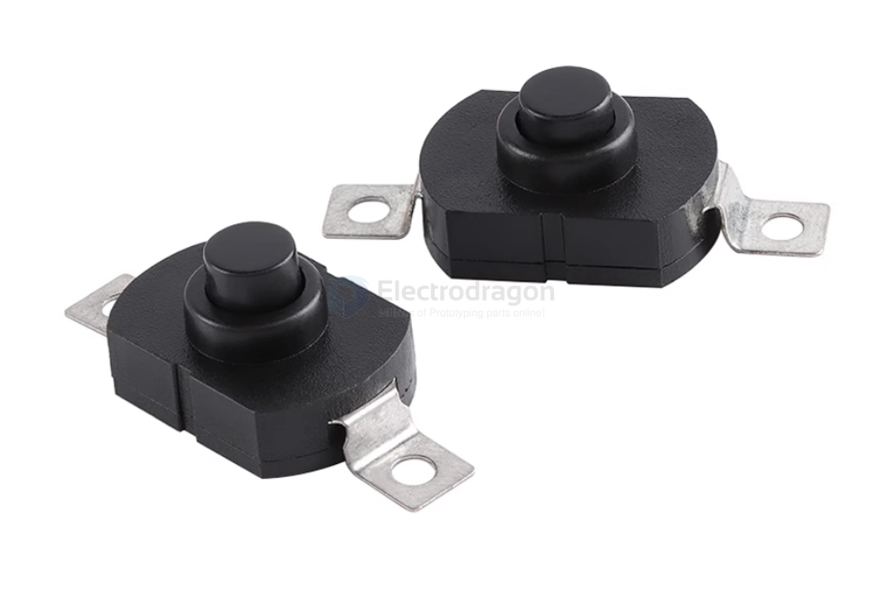
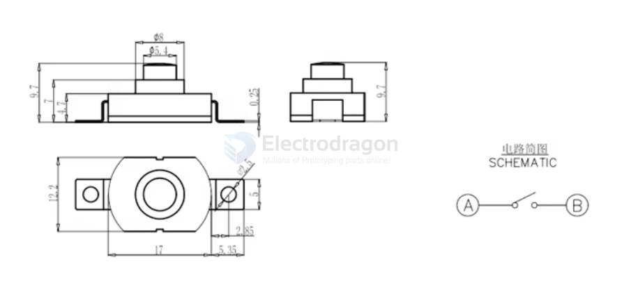

# button-dat 

## press button 

press to connect, release to diconnect 

- [[ISB1014-dat]] - [[ISB1007-dat]] - [[ISB1016-dat]]

## inter-lock button 

- [[ISB1033-dat]]

17 x 12 x 9.5

## Buttons Circuits 

Reading by Analog Value 

voltage divider 1K / 4.7K / 10K == [[voltage-divider-dat]]

button with ripple capacitor

## ref 

- [[switch-dat]]
