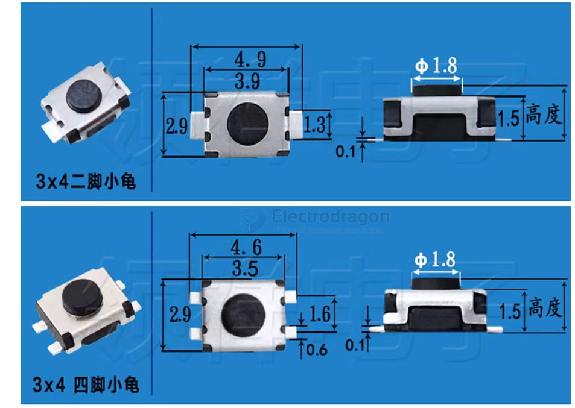
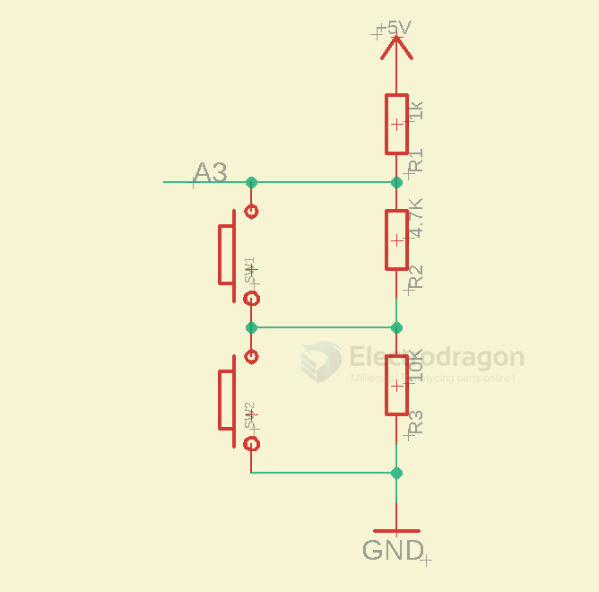
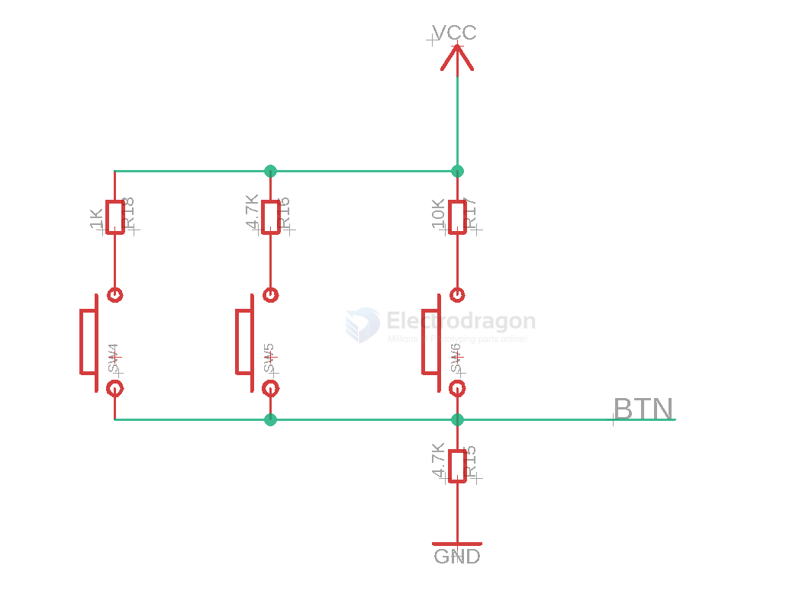
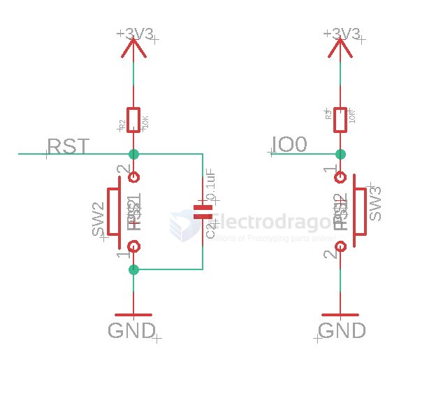

# button-dat 

## turtle button 

- normally all manually tested
- Still has low rate that the button has no response while pushing
- issue still analyzing but not a big problem, we tested all the buttons before shipping

## Buttons Circuits 

one analog pin to read multiple buttons 

[[analog-dat]] feedback multiple buttons 1

voltage divider 1K / 4.7K / 10K == [[voltage-divider-dat]]

[[analog-dat]] feedback multiple buttons 2 

button with ripple capacitor

## ref 

- [[switch-dat]]
