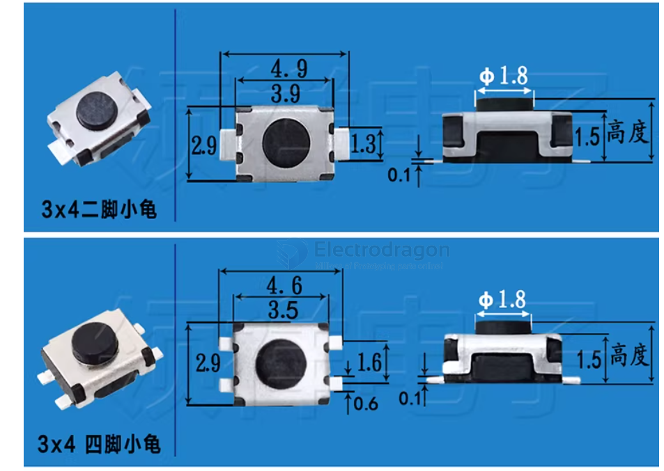
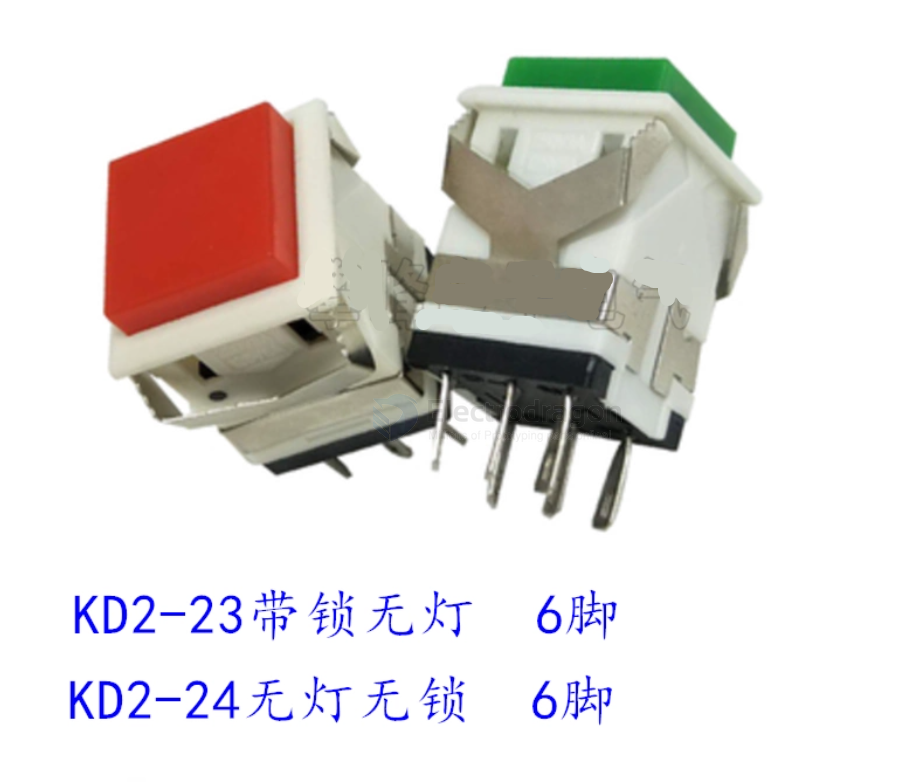
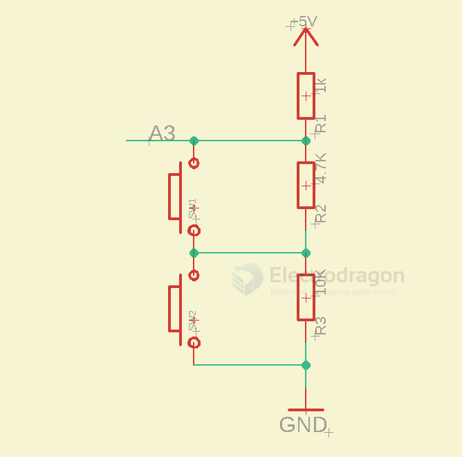
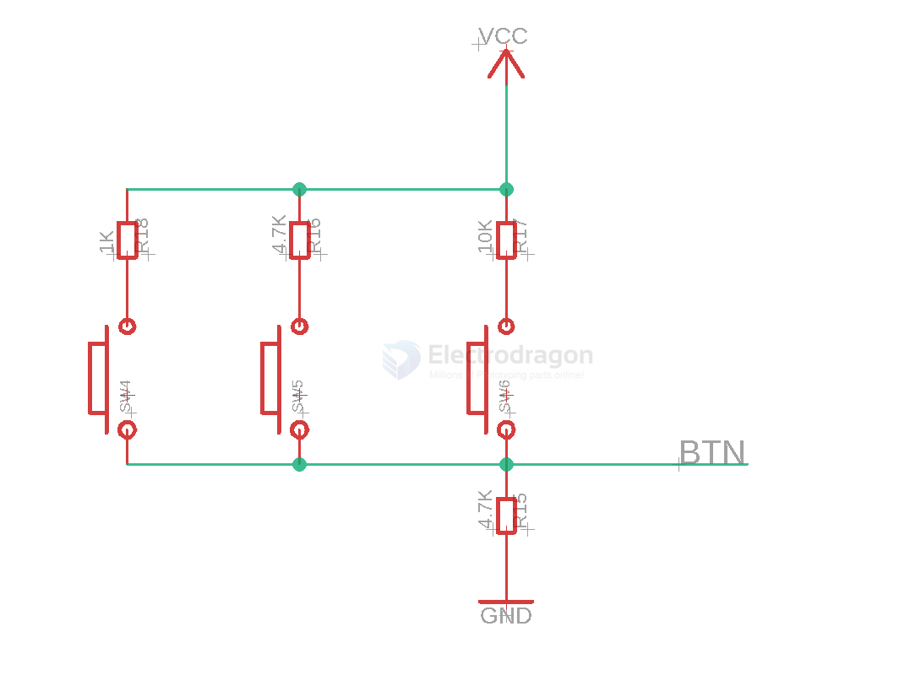
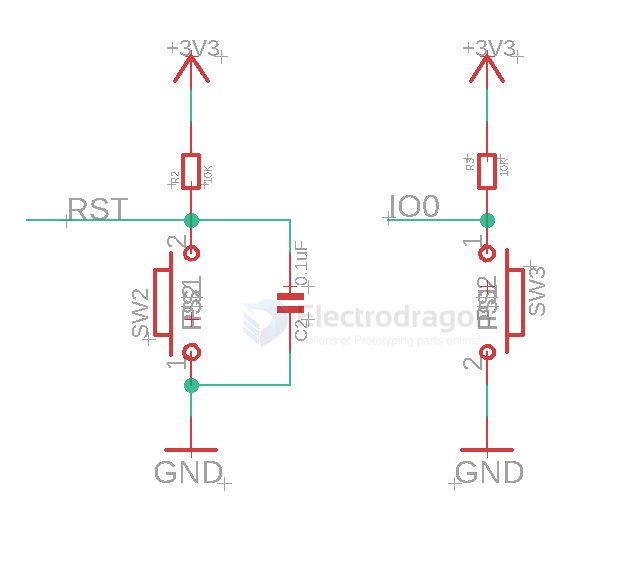
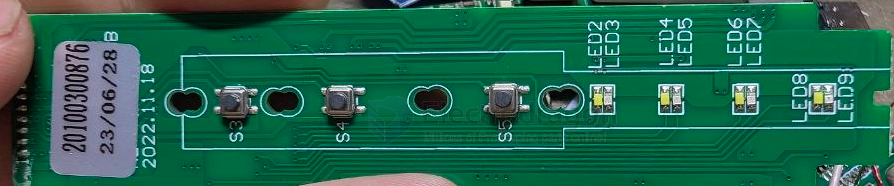

# button-dat 

- [[switch-dat]] - [[button-dat]]

## turtle button 

- normally all manually tested
- Still has low rate that the button has no response while pushing
- issue still analyzing but not a big problem, we tested all the buttons before shipping

## button types 

- 带锁（锁）功能：按下去锁住，再按下松掉。
- 无锁（不带锁）功能：按下去自动回弹。

combinations 

- KD2-21 有灯有锁
- KD2-22 有灯无锁
- KD2-23 无灯有锁
- KD2-24 无灯无锁

常开常闭，

- 带灯是8只脚
- 无灯是6只脚。

## Buttons Circuits 

one analog pin to read multiple buttons 

[[analog-dat]] feedback multiple buttons 1

voltage divider 1K / 4.7K / 10K == [[voltage-divider-dat]]

[[analog-dat]] feedback multiple buttons 2 

button with ripple capacitor

## nice button investigation 

small size 

## ref 

- [[switch-dat]]

- [[button]]