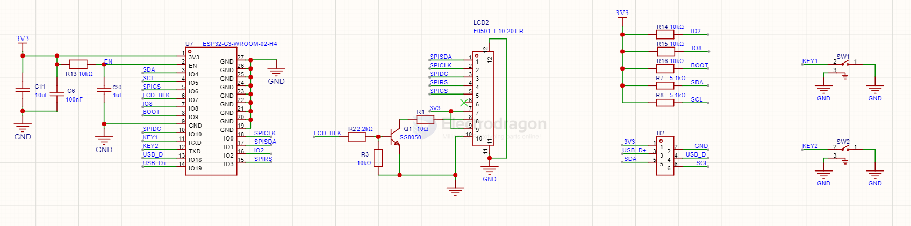

# LCD-SPI-dat

- [[display-dat]] - [[LCD-SPI-dat]] 

## build 

- [[display-dat]] - [[LCD-SPI-dat]] - [[ESP32-C3-dat]] - via [[I2C-dat]] to [[SW3566-dat]]

## EDL 160x128 1.8 SPI LCD

## Setup 

Obsolete, Pin definition of EDL 160x128 1.8 SPI LCD

| ! Pins  | Name          | Description                | Common Connecting to Arduino Pin |
| ------- | ------------- | -------------------------- | -------------------------------- |
| GND     | Power Ground  | -                          | GND                              |
| VCC     | Power VCC     | -                          | 5V                               |
| NC...NC | NC1, NC2, NC3 | -                          | NC                               |
| Reset   | Reset         | LCD reset pin              | Pin 8                            |
| A0      | D/C           | -                          | Pin 9                            |
| SDA     | SDA           | LCD data input/slave input | Pin 11 (MOSI of arduino)         |
| SCK     | SCK           | Clock Pin                  | Pin 13                           |
| CS      | CS            | Chip Select of LCD         | Pin 10                           |
| SD_SCK  | -             | -                          | -                                |
| SD_MISO | -             | -                          | -                                |
| SD_MOSI | -             | -                          | -                                |
| SD_CS   | -             | -                          | -                                |
| LED+    | LED+          | LED VCC                    | 3.3V                             |
| LED-    | LED-          | LED GND                    | GND                              |

## ref 

* Reference Setup [link 1 by simtronyx.de](http://blog.simtronyx.de/en/a-1-8-inch-tft-color-display-hy-1-8-spi-and-an-arduino/) 
* and [link 2 by benbarbour.com](http://www.benbarbour.com/arduinolcd)

