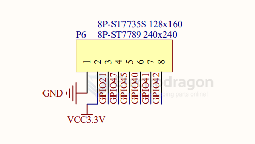

# LCD-dat 

- [[display-dat]] 

- [[RGB-LCD-dat]]

- [[fpc-ips-lcd]]

- [[parallel-display-dat]]

- [[LCD1602-dat]] - [[LCD12864-dat]]

- [[LCD2004-dat]] == [2004A 20*4 Char LCD LCM Display](https://www.electrodragon.com/product/2004a-char-lcdlcm-204-words-support-5v/)

- [[touchpanel-dat]]

- [[MIPI-dat]]

## SCH

using with STM32 SPI2 

## NRF52840 1.14 TFT LCD 

- TFT_RST --- A12 --- P0.02/AIN0 
- TFT_EN  --- B13 --- P0.03/AIN1 
- TFT_SCL --- P2 --- P0.08
- TFT_SDA --- RI --- P1.08
- TFT_CS --- T2 --- P1.09
- TFT_RS --- Ui --- PO.11
- TFT_LED_EN -- AD10 --- P0.15

- [[NRF52840-dat]]

## driver 

- [[ILI9342-dat]]

2.4" LCD 

## backlight SCH 

- [[PT4103-dat]]

## parallel interface LCDs

### LCD 40Pin 

LCD data 24-bit 

### RGB888 LCD 

## LCD ports 

8-pin 

## controller

chip - [[SSD1963-dat]] - [[XPT2046-dat]]

- #define ITDB32			0	// HX8347-A (16bit)
- #define ITDB32WC		1	// ILI9327  (16bit)
- #define ITDB32S			2	// SSD1289  (16bit)
- #define CTE32			2	// SSD1289  (16bit)
- #define ITDB24			3	// ILI9325C (8bit)
- #define ITDB24D			4	// ILI9325D (8bit)
- #define ITDB24DWOT		4	// ILI9325D (8bit)
- #define ITDB28			4	// ILI9325D (8bit)
- #define DMTFT24104      4   // ILI9325D (8bit)
- #define DMTFT28103      4   // ILI9325D (8bit)
- #define ITDB22			6	// HX8340-B (8bit)
- #define ITDB22SP		7	// HX8340-B (Serial 4Pin)
- #define ITDB32WD		8	// HX8352-A (16bit)
- #define CTE32W			8	// HX8352-A	(16bit)
- #define ITDB18SP		9	// ST7735   (Serial 5Pin)
- #define LPH9135			10	// PCF8833	(Serial 5Pin)
- #define ITDB25H			11	// S1D19122	(16bit)
- #define ITDB43			12	// SSD1963	(16bit) 480x272
- #define ITDB50			13	// SSD1963	(16bit) 800x480
- #define CTE50			13	// SSD1963	(16bit) 800x480
- #define EHOUSE50		13	// SSD1963	(16bit) 800x480
- #define ITDB24E_8		14	// S6D1121	(8bit)
- #define ITDB24E_16		15	// S6D1121	(16bit)
- #define INFINIT32		16	// SSD1289	(Latched 16bit) -- Legacy, will be removed later
- #define ELEE32_REVA		16	// SSD1289	(Latched 16bit)
- #define CTE32_R2		17	// ILI9341	(16bit)
- #define ITDB24E_V2_16   17  // ILI9341	(16bit)
- #define ITDB28_V2_ALT   17  // ILI9341	(16bit)
- #define ITDB32S_V2      17  // ILI9341	(16bit)
- #define ITDB28_V2       18  // ILI9341	(8bit)
- #define ITDB24E_V2_8    18  // ILI9341	(8bit) 
- #define ELEE32_REVB		19	// SSD1289	(8bit)
- #define CTE70			20	// SSD1963	(16bit) 800x480 Alternative Init
- #define EHOUSE70		20	// SSD1963	(16bit) 800x480 Alternative Init
- #define CTE32HR			21	// ILI9481	(16bit)
- #define CTE28			22	// ILI9325D (16bit) Alternative Init
- #define CTE22			23	// S6D0164	(8bit)
- #define DMTFT22102      23  // S6D0164  (8bit)
- #define DMTFT28105      25  // ILI9341  (Serial 5Pin)
- #define MI0283QT9		26  // ILI9341	(Serial 4Pin)
- #define CTE35IPS		27	// R61581	(16bit)
- #define CTE40			28	// ILI9486	(16bit)
- #define EHOUSE50CPLD	29	// CPLD		(16bit)
- #define CTE50CPLD		29	// CPLD		(16bit)
- #define CTE70CPLD		29	// CPLD		(16bit)
- #define DMTFT18101      30  // HX8353C  (Serial 5Pin)

## ref 

- [[LED-driver-dat]]

- [[interactive-dat]]

- [[LCD]]