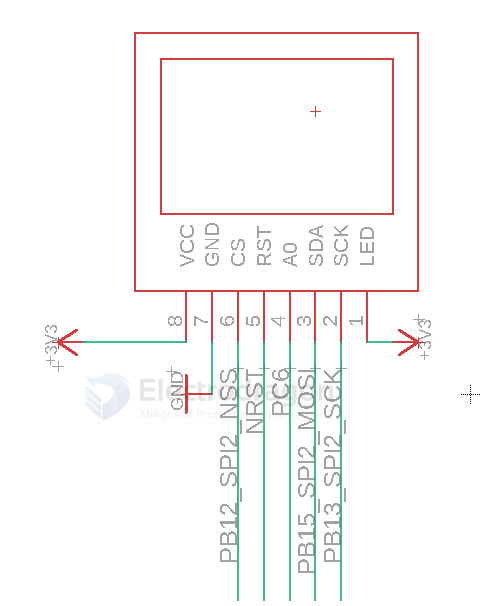
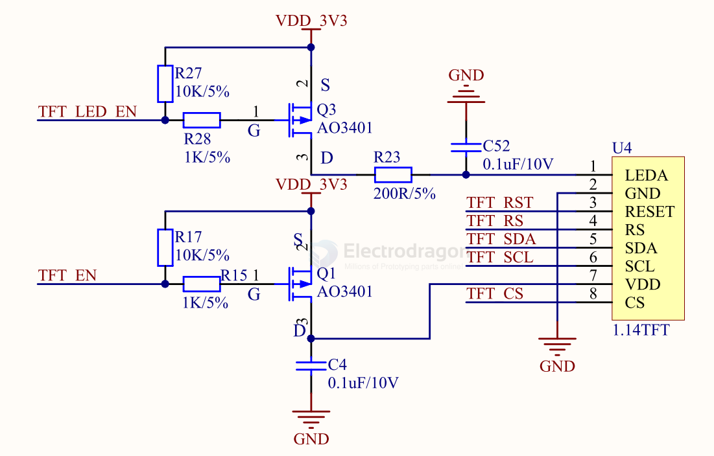
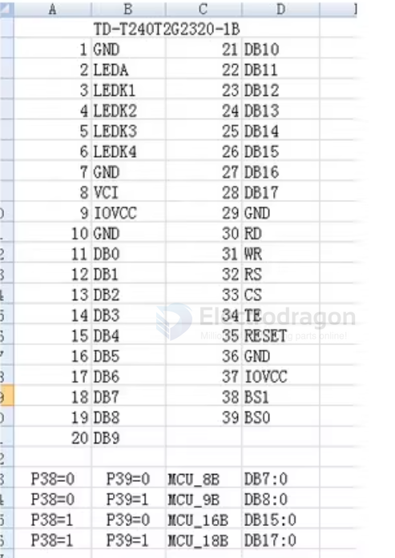
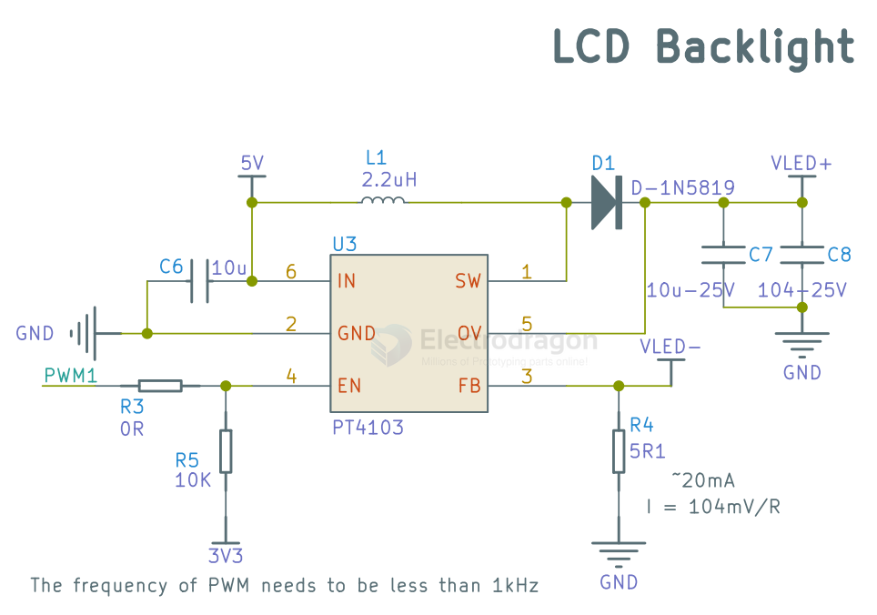
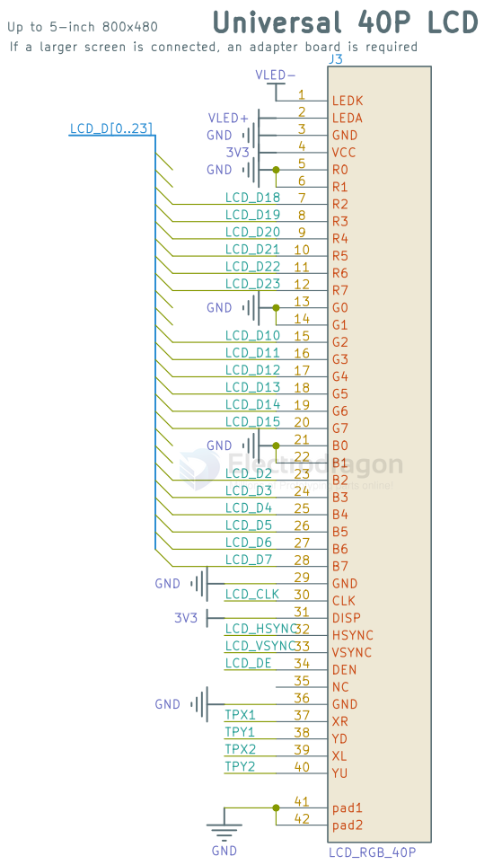

# LCD-dat 

- [[display-dat]] 

- [[RGB-LCD-dat]]

- [[fpc-ips-lcd]]

- [[parallel-display-dat]]

- [[LCD1602-dat]] - [[LCD-12864-dat]]

- [[LCD2004-dat]] == [2004A 20*4 Char LCD LCM Display](https://www.electrodragon.com/product/2004a-char-lcdlcm-204-words-support-5v/)

## SCH

using with STM32 SPI2 

## NRF52840 1.14 TFT LCD 

- TFT_RST --- A12 --- P0.02/AIN0 
- TFT_EN  --- B13 --- P0.03/AIN1 
- TFT_SCL --- P2 --- P0.08
- TFT_SDA --- RI --- P1.08
- TFT_CS --- T2 --- P1.09
- TFT_RS --- Ui --- PO.11
- TFT_LED_EN -- AD10 --- P0.15

- [[NRF52840-dat]]

## driver 

- [[ILI9342-dat]]

2.4" LCD 

## backlight SCH 

- [[PT4103-dat]]

## parallel interface LCDs

### LCD 40Pin 

LCD data 24-bit 

### RGB888 LCD 

## ref 

- [[LED-driver-dat]]

- [[interactive-dat]]

- [[LCD]]