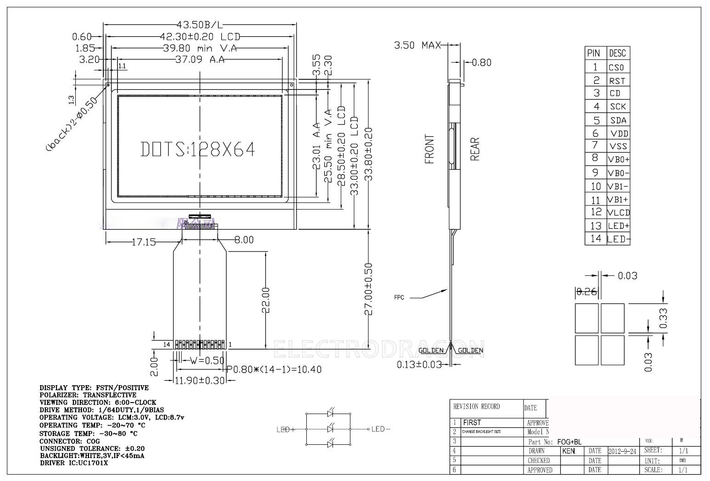
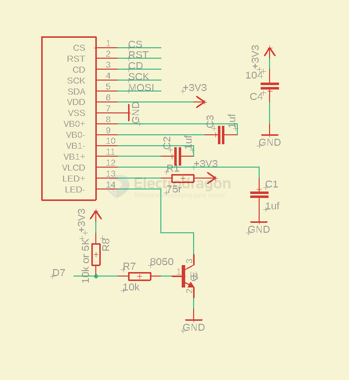

# LCD12864-dat

## specs 
- Product name LCD module
- Model 12864G
- Appearance (L*W*H) 43.5*33.0*3.5
- Viewing area (L*W) 39.8*25.5
- Point (L*W)mm 0.26*0.33
- Point (L*W)MM 0.29*0.36
- IC model UC1701X
- 5V/3.3V 3.3V
- PCB board FPC interface, no PCB
- Parallel/Serial Serial

legacy wiki page - https://www.electrodragon.com/w/12864min_LCD

## schematic wiring 

### with arduino

- CS - D10
- CD - D9
- RST - D8 
- SCK - D13
- MISO - D12
- MOSI - D11

## ref 

- [[ILC1007-dat]] - [[ILC1008-dat]]

- [[chars-dat]]

- [[UC1701X-dat]]