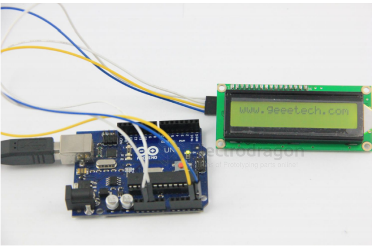

# LCD1602-code.md

## arduino code 

code 1 

    #include <Wire.h>
    #include <LiquidCrystal_I2C.h>

    LiquidCrystal_I2C lcd(0x27,16,2); // set the LCD address to 0x27 for a 16 chars and 2 line display

    void setup()
        {
            lcd.init();
            // Print a message to the LCD.
            lcd.backlight();
            lcd.print("www.electrodragon.com");
        }
    void loop()
        {

        }

## C code for 8051 

At the beginning of the program, the LCD module is initialized and the display format is set. 

Note that when displaying characters, the cursor automatically moves to the right without manual intervention. 

Each time a command is entered, the DELAY subroutine is called first to check if the LCD module is busy, then the display position address 0C0H is entered, and finally the code 41H for the character 'A' to be displayed.

SMC1602A (16x2) simulated port wiring method

Wiring diagram:

    LCM---51LCM-----51LCM------51
    DB0-----P1.0 DB4--P1.4 RW-----P2.0
    DB1-----P1.1 DB5--P1.5 RS-----P2.1
    DB2-----P1.2 DB6--P1.6 E-----P2.2
    DB3-----P1.3 DB7--P1.7 VLCD connects a 1K resistor to GND

[注：AT89S52使用12M晶振]

- code file == [[lcd1602-c-1.c]]

## ASM code 

## Demo Code and Video

The character generator ROM (CGROM) inside the 1602 LCD module already stores 160 different dot-matrix character patterns, as shown in Table 1. These characters include: Arabic numerals, uppercase and lowercase English letters, common symbols, and Japanese kana. Each character has a fixed code. For example, the code for the uppercase English letter "A" is 01000001B (41H). When displayed, the module shows the dot-matrix character pattern at address 41H, so we can see the letter "A".

Below is a program that displays the letter 'A' at the first character position of the second line of the LCD module: ORG 0000H

- [[LCD1602-asm.asm]]

## ref 

- [[LCD1602-dat]]