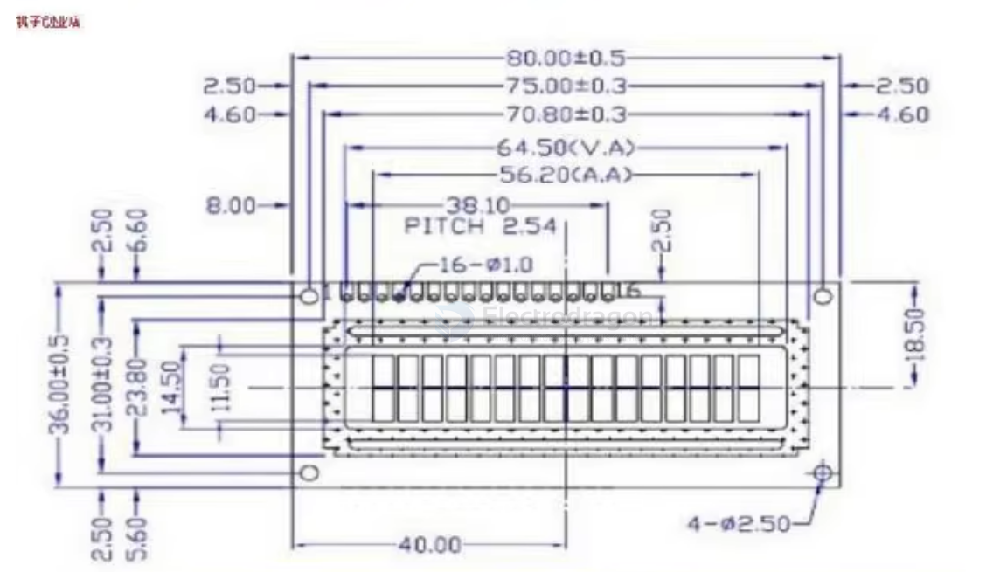
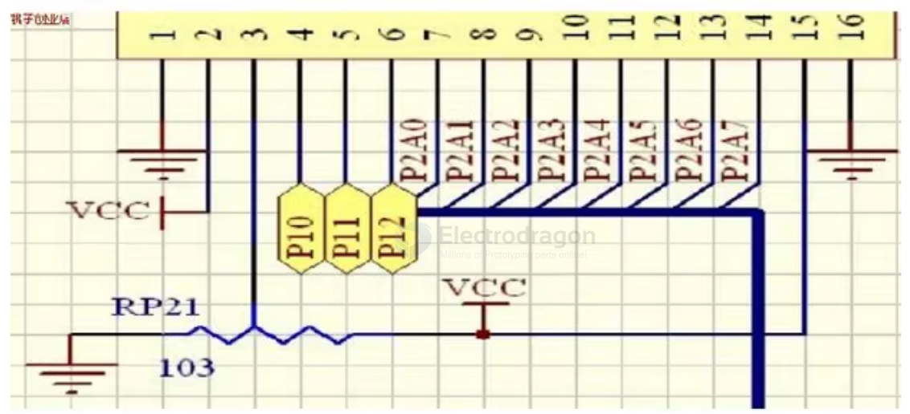

# LCD1602-dat

- [[LCD1602-code]]

## relevant boards 

- [[ILC1022-dat]]

- [[arduino-shields-dat]] == [[DAS1022-dat]] == [1602 LCD+Keypad Shield](https://www.electrodragon.com/product/arduino-lcd-1602-keypad-shield-for-your-arduino-project/)

- [[ILC1073-dat]] == [1602 LCD USB Mini Drive Board, RPI Driver Free](https://www.electrodragon.com/product/1602-lcd-usb-mini-drive-board-rpi-driver-free/)

- [[ILC1047-dat]] == [LCD1602 Parallel-IIC PCF8574 Convert Board R2](https://www.electrodragon.com/product/lcd1602-parallel-to-iic-pcf8574-convert-board-r2/) == [[PCF8574-dat]]

- [[ILC1025-dat]] == [1602 LCD Parallel-IIC Converter Board](https://www.electrodragon.com/product/1602-iic-converter-board-back-light-adjustable/)

- [[CCO3577-dat]] == [[Retired]10Pcs 16Pin 2.54P Break Away Pin-Header Female (For 1602 LCD)](https://www.electrodragon.com/product/10pcs-16pin-2-54pitch-pin-header-female-for-1602-lcd/)

- [[2101009-dat]] == [[Retired]1602 IIC/I2C Module for Arduino](https://www.electrodragon.com/product/1602-iici2c-module-for-arduino/)

- [[2102138-dat]] == [[Retired]1602 LCD I2C/SPI Back-Converter Module (for Arduino, Bare PCB)](https://www.electrodragon.com/product/1602-lcd-i2c-spi-adapter-shield-arduino-bare-pcb-board/)

- [[2101010-dat]] == [[Retired] LCD1602 I2C/SPI Module (Double-Protocol)](https://www.electrodragon.com/product/i2cspi-lcd1602-module/)

- [[PINS001-dat]] == [[Retired]Capacitor Inductor Meter (Kit)](https://www.electrodragon.com/product/capacitor-inductor-meter-kit/)

## wiring 

dimension 

Pin out 

1602采用标准的16脚接口，其中：

- 第1脚：VSS为地电源
- 第2脚：VDD接5V正电源
- 第3脚：V0为液晶显示器对比度调整端，接正电源时对比度最弱，接地电源时对比度最高，对比度过高时会产生"鬼影”，使用时可以通过一个10K的电位器调整对比度
- 第4脚：RS为寄存器选择，高电平时选择数据寄存器、低电平时选择指令寄存器。
- 第5脚：R/W为读写信号线，高电平时进行读操作，低电平时进行写操作。当RS和RW共同为低电平时可以写入指合或者显示地址，当RS为低电平RW为高电平时可以读忙信号，当RS为高电平RW为低电平时可以写入数据。
- 第6脚：E端为使能端，当E端由高电平跳变成低电平时，液晶模块执行命合。
- 第7~14脚：D0~D7为8位双向数据线。
- 第15脚：背光电源正极
- 第16脚：背光电源负极

## ref 

- [[LCD-dat]]