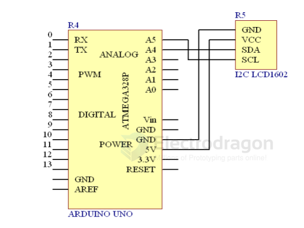
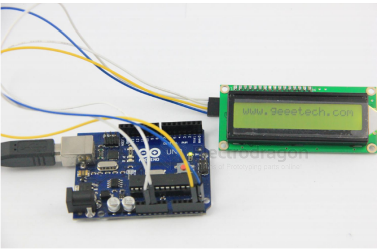

# LCD1602-dat

## wiring 

## demo code 

code 1 

    #include <Wire.h>
    #include <LiquidCrystal_I2C.h>

    LiquidCrystal_I2C lcd(0x27,16,2); // set the LCD address to 0x27 for a 16 chars and 2 line display

    void setup()
        {
            lcd.init();
            // Print a message to the LCD.
            lcd.backlight();
            lcd.print("www.electrodragon.com");
        }
    void loop()
        {

        }

