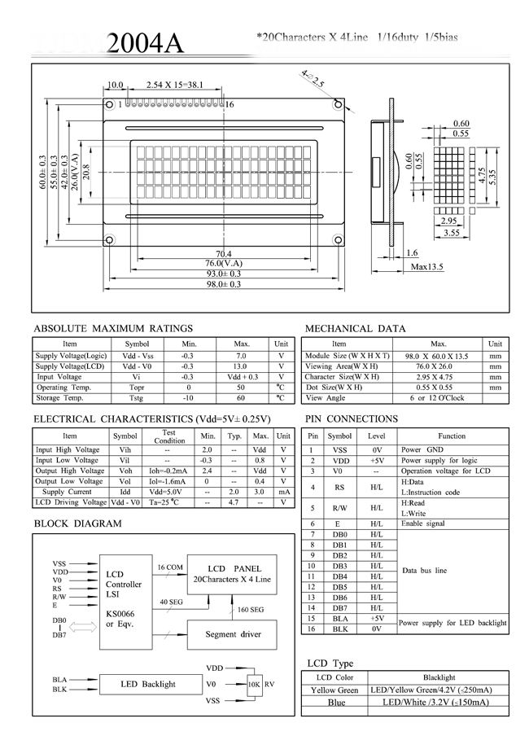
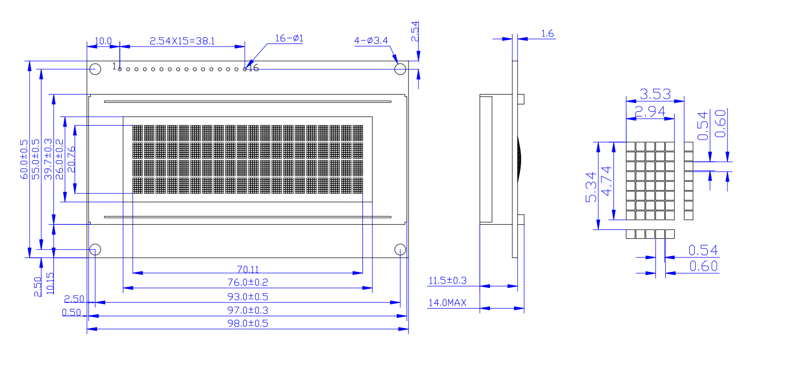
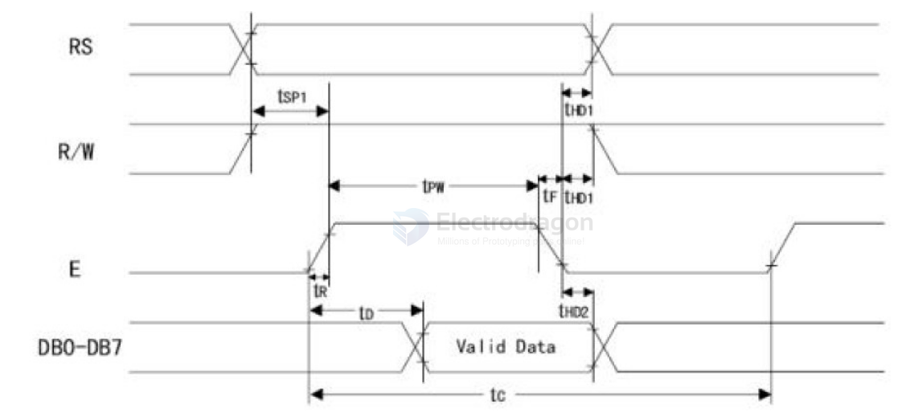
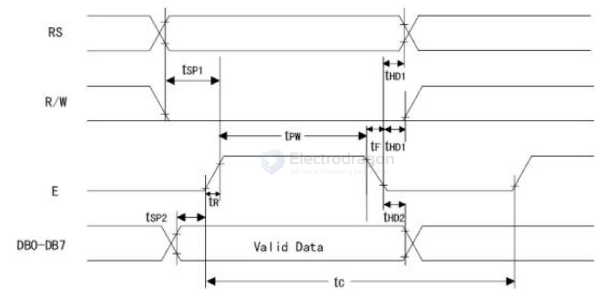
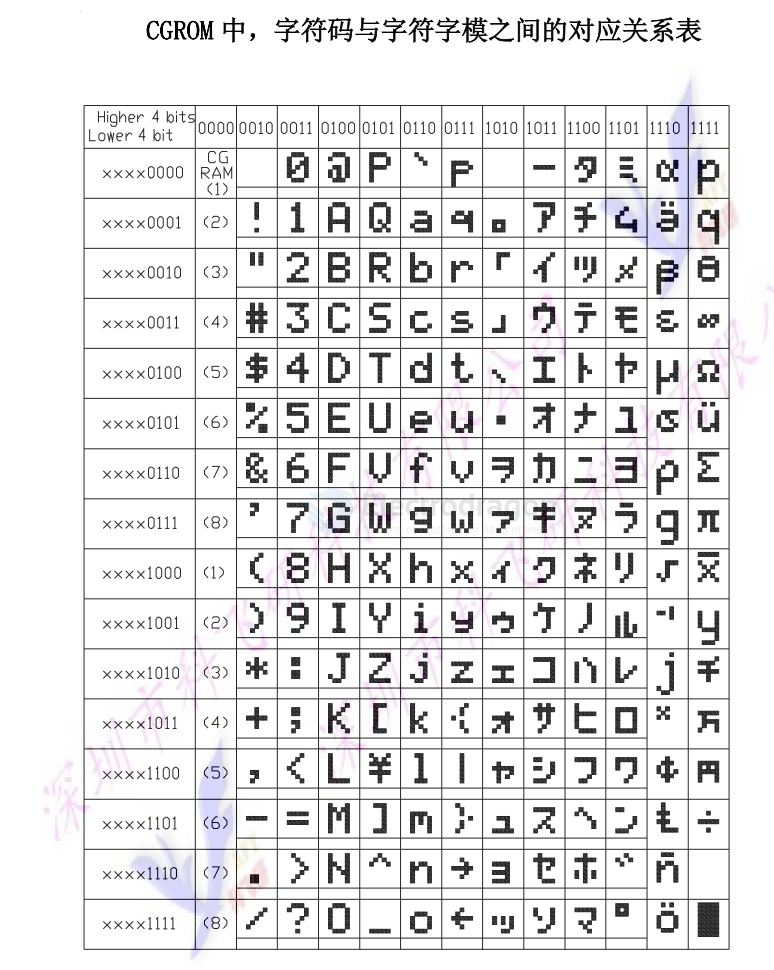

# LCD2004 Character LCD Module


- [[LCD-char-dat]] - [[ILC1040-dat]] - [[LCD2004-dat]] - [[ILC1022-dat]] - [[LCD1602-dat]] - [[LCD-12864-dat]] - [[ILC1016-dat]] - [[ILC1038-dat]]

- [[LCD-char-driver-dat]] - [[ILC1073-dat]] - [[ILC1047-dat]] (out-of-stock) - [[ILC1025-dat]]

## spec 



## 1. Summary
The J204A is an industrial-grade character LCD module. It can display 4 lines of 20 characters each (80 characters in total).

## 2. Module Dimensions



## 3. Pin Interface Specifications

| Pin | Symbol | Description | Pin | Symbol | Description |
| :--- | :--- | :--- | :--- | :--- | :--- |
| 1 | VSS | Ground (0V) | 9 | D2 | Data Bit 2 |
| 2 | VDD | Power Supply (+5V) | 10 | D3 | Data Bit 3 |
| 3 | VL | Contrast Adjustment (Bias) | 11 | D4 | Data Bit 4 |
| 4 | RS | Register Select (Data/Command)| 12 | D5 | Data Bit 5 |
| 5 | R/W | Read/Write Select | 13 | D6 | Data Bit 6 |
| 6 | E | Enable Signal | 14 | D7 | Data Bit 7 |
| 7 | D0 | Data Bit 0 | 15 | BLA | Backlight Positive (+5V) |
| 8 | D1 | Data Bit 1 | 16 | BLK | Backlight Negative (0V) |

### Pin Details:
- **Pin 1 (VSS):** System Ground.
- **Pin 2 (VDD):** +5V Power Supply.
- **Pin 3 (VL):** LCD contrast adjustment. Connecting it to VDD provides the lowest contrast, while GND provides the highest contrast. A 10K Ohm potentiometer is recommended to permit adjustment. "Ghosting" may occur if contrast is set too high.
- **Pin 4 (RS):** Register Select. High level selects the Data Register; Low level selects the Instruction Register.
- **Pin 5 (R/W):** Read/Write Select. High level for Read operations; Low level for Write operations. 
    - When RS=Low, R/W=Low: Write Command/Instruction.
    - When RS=Low, R/W=High: Read Busy Flag and Address Counter.
    - When RS=High, R/W=Low: Write Data.
    - When RS=High, R/W=High: Read Data.
- **Pin 6 (E):** Enable signal. A transition from High to Low (falling edge) triggers the LCD module to execute the instruction.
- **Pins 7 to 14 (D0-D7):** 8-bit bidirectional data bus.
- **Pin 15 (BLA):** Backlight Anode (+).
- **Pin 16 (BLK):** Backlight Cathode (-).

## 4. Control Instructions
The J204A LCD module uses an internal controller with 11 standard instructions:

| No. | Instruction | RS | R/W | D7 | D6 | D5 | D4 | D3 | D2 | D1 | D0 |
| :-- | :--- | :--- | :--- | :--- | :--- | :--- | :--- | :--- | :--- | :--- | :--- |
| 1 | Clear Display | 0 | 0 | 0 | 0 | 0 | 0 | 0 | 0 | 0 | 1 |
| 2 | Return Home | 0 | 0 | 0 | 0 | 0 | 0 | 0 | 0 | 1 | * |
| 3 | Entry Mode Set | 0 | 0 | 0 | 0 | 0 | 0 | 0 | 1 | I/D | S |
| 4 | Display On/Off | 0 | 0 | 0 | 0 | 0 | 0 | 1 | D | C | B |
| 5 | Cursor/Display Shift| 0 | 0 | 0 | 0 | 0 | 1 | S/C | R/L | * | * |
| 6 | Function Set | 0 | 0 | 0 | 0 | 1 | DL | N | F | * | * |
| 7 | Set CGRAM Address | 0 | 0 | 0 | 1 | A | A | A | A | A | A |
| 8 | Set DDRAM Address | 0 | 0 | 1 | A | A | A | A | A | A | A |
| 9 | Read Busy Flag | 0 | 1 | BF | A | A | A | A | A | A | A |
| 10 | Write Data | 1 | 0 | D | D | D | D | D | D | D | D |
| 11 | Read Data | 1 | 1 | D | D | D | D | D | D | D | D |

*Note: A = Address bit, D = Data bit, * = Don't care.*

### Instruction Details:
1. **Clear Display (01H):** Clears the entire display and resets the cursor to address 00H.
2. **Return Home:** Resets the cursor to address 00H without clearing the display.
3. **Entry Mode Set:**
    - **I/D:** 1 = Increment (right), 0 = Decrement (left).
    - **S:** 1 = Shift display, 0 = No shift.
4. **Display On/Off:**
    - **D:** 1 = Display On, 0 = Display Off.
    - **C:** 1 = Cursor On, 0 = Cursor Off.
    - **B:** 1 = Cursor Blinking, 0 = No Blinking.
5. **Cursor/Display Shift:**
    - **S/C:** 1 = Display Shift, 0 = Cursor Move.
    - **R/L:** 1 = Shift Right, 0 = Shift Left.
6. **Function Set:**
    - **DL:** 1 = 8-bit bus, 0 = 4-bit bus.
    - **N:** 1 = 2-line display (includes 4-line models), 0 = 1-line.
    - **F:** 1 = 5x10 dots, 0 = 5x7 dots.
7. **Set CGRAM Address:** Sets the Character Generator RAM address.
8. **Set DDRAM Address:** Sets the Display Data RAM address.
9. **Read Busy Flag (BF):** BF=1 indicates the module is busy and cannot receive new commands.
10. **Write Data:** Writes data content to RAM.
11. **Read Data:** Reads data content from RAM.


## 5. Timing Sequences

### Read Operation Sequence


### Write Operation Sequence


## 6. RAM Address Mapping
The LCD is a slow device. Before sending any instruction, ensure the Busy Flag (BF) is Low (0). To display a character, you must first specify the DDRAM address.

### Internal Display Addresses (Hex)
The J204A spans 4 lines. For example, the first character of the second line is at address `40H`. To set the cursor to this position, the command must include the high bit (D7=1).
- **Internal Address:** `40H` (Binary: `01000000`)
- **Command Calculation:** `40H + 80H = C0H` (Binary: `11000000`)

During initialization, the display mode should be set. Usually, characters are entered with the cursor automatically moving to the right.


## char table 




## 7. C51 Example Code

```c
#include <reg52.h>

#define uint  unsigned int
#define uchar unsigned char

#define comm 0
#define dat  1

sbit rs = P3^5; // Register Select: H=Data, L=Command
sbit rw = P3^4; // Read/Write: H=Read, L=Write
sbit e  = P3^3; // Enable signal

uchar code tab1[] = "Electrodragon.com TEL: 18576608994";

void delay(uint ms) {
    uint i, j;
    for(i = 0; i < ms; i++) {
        for(j = 0; j < 120; j++);
    }
}

void wr_lcd(uchar type, uchar content) {
    if(type == dat) {
        rs = 1; // Data
        rw = 0; // Write
    } else {
        rs = 0; // Command
        rw = 0; // Write
    }
    P1 = content;
    e = 1;
    delay(1);
    e = 0;
}

void init_lcd(void) {
    e = 0;
    wr_lcd(comm, 0x38); // 8-bit interface, 2-line mode (works for 4-line)
    wr_lcd(comm, 0x01); // Clear screen
    wr_lcd(comm, 0x06); // Cursor move direction (increment)
    wr_lcd(comm, 0x0c); // Display On, Cursor Off
}

void chrt_disp(uchar code *chrt) {
    uchar i, j;
    wr_lcd(comm, 0x80); // Set DDRAM address to 00H
    for(j = 0; j < 2; j++) {
        for(i = 0; i < 16; i++) {
            wr_lcd(dat, chrt[j * 16 + i]);
        }
        wr_lcd(comm, 0xc0); // Move to second line (40H)
    }
}

void cgram_wr(uchar zm_data1, uchar zm_data2) {
    uchar i, j;
    wr_lcd(comm, 0x40); // Set CGRAM address 00H
    for(j = 0; j < 8; j++) {
        for(i = 0; i < 4; i++) {
            wr_lcd(dat, zm_data1);
            wr_lcd(dat, zm_data2);
        }
    }
}

void cgram_disp(void) {
    uchar i, j;
    wr_lcd(comm, 0x80);
    for(j = 0; j < 2; j++) {
        for(i = 0; i < 8; i++) {
            wr_lcd(dat, i);
        }
        wr_lcd(comm, 0xc0);
    }
}

void main(void) {
    init_lcd();
    while (1) {
        chrt_disp(tab1);
        delay(2000);
        
        cgram_wr(0x1f, 0x1f); 
        cgram_disp(); 
        delay(2000);
        
        cgram_wr(0x15, 0x15);
        cgram_disp(); 
        delay(2000);
        
        cgram_wr(0x1f, 0x00);
        cgram_disp();
        delay(2000);
        
        cgram_wr(0x15, 0x0a);
        cgram_disp(); 
        delay(2000);
    }
}
```


## ref 

datasheet == [[2004A-DS.pdf]]