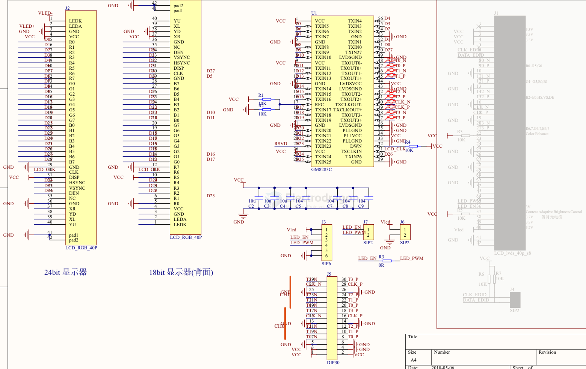

# RGB-LCD-dat

## datasheet 

- 5.0 AT050TN43 == [[AT050TN43 V.1 Pre Ver01 20100511 (A050-43-TT-11)_201102115899.pdf]]
- 4.3 FGD430A4005 == [[4.3inch_FGD430A4005_Spec.pdf]]

## RGB to LVDS 

- [[LVDS-dat]]

- [[GM8283-dat]]

3通道RGB转LVDS芯片：

SN75LVDS84

SN75LVDS85

SN65LVDS84

DS90CF363

DS90C365

DS90CR217

国产:

GM8184

GM8263C

## RGB to LVDS 

## GM8283

GM8283型28位并串转换预加重LVDS发送器主要用于视频/图像传输中的发送部分；它可将并行输入的28 bits LVTTL/LVCMOS数据和参考时钟转换为4路的串行LVDS数据流和1路LVDS同步时钟；在每一时钟周期内，24 bits的RGB数据和3 bits的控制数据分别在4个LVDS串行通道中传输。输入参考时钟频率为10MHz～90MHz，总数据率最高可达2520Mbps。

GM8283内部模块由串行器、锁相环、LVDS驱动器和使能模块组成。内部工作情况如下：串行器载入28 bits并行数据后，在锁相环产生的多相位同步时钟的触发下将数据移出，同时利用多相位时钟将时钟信号与数据信号同步后输出。LVDS驱动器模块将串行器同步输出的4路串行数据流信号和1路同步时钟信号转化为LVDS形式的信号后输出。使能模块在待机状态下，可将内部模块电流关断，使器件进入低功耗状态。GM8283具有可编程数据选通控制功能，通过RFC控制可实现时钟对数据的上升沿采样或下降沿采样。

GM8283可PIN-to-PIN替换的国外产品为： DS90C383、DS90C383A、DS90C383B、DS90C385、DS90C385A、DS90CR281、DS90CR283、DS90CR285 和DS90CR287、SN75LVDS81、SN75LVDS83、SN75LVDS83A、SN75LVDS83B、SN65LVDS93、SN65LVDS93A；

GM8283不可PIN-to-PIN替换的国外产品为：DS90CF383、DS90CF383A和DS90CF383B；除非国外产品第17脚的焊盘做了可选到GND的连接。

TI: SN75LVDS83

THINE： THC63LVDM83C/83R/83D

DOESTEK: DTC34LM85A

NationalSemiconductor: DS90C385