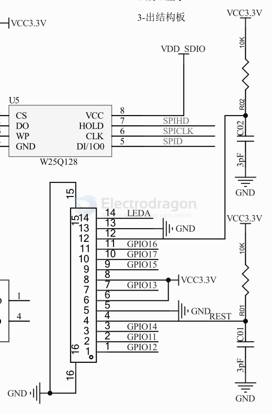

# fpc ips lcd 

| Common Size | Status | Pins  | Drive   | Specs W x H | Installation | Pins                                                     |
| ----------- | ------ | ----- | ------- | ----------- | ------------ | -------------------------------------------------------- |
| 0.96        | Pick   | 8Pin  | ST7735  | IPS 80*160  | FPC          | LEDA GND RESET RS SDA SCL VDD CS                         |
| 1.14        | Pick   | 8Pin  | ST7789  | 135 x 240   | FPC          | LEDA GND RESET RS SDA SCL VDD CS                         |
| 1.3''       |        | 12Pin | ST7789  | IPS 240*240 |              | GND LEDK LEDA VDD GND GND DC CS SCL SDA RESET GND        |
| 1.44''      | Pick   | 14Pin | ST7735  | IPS 128*128 | Soldering    | GND VSS LEDK LEDA VSS RST AO SDA SCK VDD VDDI CS VSS GND |
| 1.77''      |        | 10Pin | ST7735  | IPS 128*160 |              |
| 1.77''      |        | 12Pin | ST7735  | IPS 128*160 |              | GND AO SCK SDA GND CS RSTB LEDK LEDA VCC VCC GND         |
| 1.77''      |        | 14Pin | ST7735  | IPS 128*160 |              |
| 2.0''       | Pick   | 12Pin | ST7789V | IPS 240*320 | Soldering    | GND LEDK LEDA VCI GND AO CS SCL SDA RESET GND            |
| 2.4''       |        | 15Pin | ST7789V | IPS 240*320 |
| 2.8''       | Pick   | 12Pin | ST7789  | IPS 240*320 | FPC          | LEDK LEDA GND VCC IOVCC TE CS RESET DC SCK SDA GND       |

- [[ILC1075-dat]] - [[ilc1078-dat]]

## SCH 

