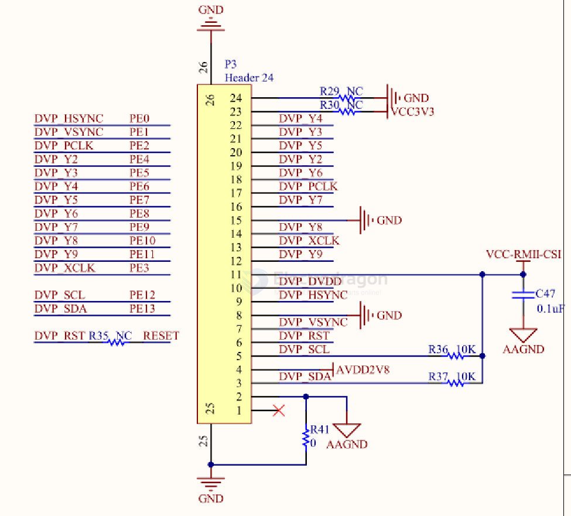

# DVP-display-dat

**DVP** in the display context usually refers to the **Digital Video Port** interface.  - [[parallel-display-dat]]
It’s a **parallel interface** commonly used in cameras, simple LCDs, or microcontroller-driven displays.

## How it works

- Transfers **pixel data** in parallel (8, 16, or 24 data lines, depending on color depth).
- Uses **synchronization signals**:
  - **HSYNC** (Horizontal Sync) – signals the start of a new line
  - **VSYNC** (Vertical Sync) – signals the start of a new frame
  - **PCLK** (Pixel Clock) – latches each pixel’s data
- Can work with formats like **RGB565**, **RGB888**, or **YUV422**.

## Key Characteristics
1. **Simple protocol** – no complex packetization (unlike MIPI-DSI).
2. **Lower speed** – parallel clock typically in the tens of MHz.
3. **More pins needed** – due to multiple parallel data lines.
4. **Used in MCUs and simple SoCs** – no need for high-speed serializers.

## Common Uses

- Cheap TFT LCD modules with MCU controllers
- CMOS camera modules with parallel output
- Low-resolution displays in industrial or hobby projects

## Comparison (DVP vs MIPI-DSI)

| Feature         | DVP (Digital Video Port)        | MIPI-DSI                          |
|-----------------|---------------------------------|------------------------------------|
| Data Transfer   | Parallel (8–24 data lines)      | High-speed serial (2–4 lanes)      |
| Speed           | Tens of MHz                     | Hundreds of MHz to Gbps            |
| Pin Count       | High                            | Low                                |
| Complexity      | Simple                          | Complex, packetized                |
| Use Case        | Simple displays, cameras        | High-res smartphone/tablet displays|

## SCH 

- [[F133-dat]]

8-bit Y2 ~ Y9 // HSYNC + VSYNC + PCLK + XCLK + SCL + SDA + **RST

## ref 

- [[parallel-display-dat]]