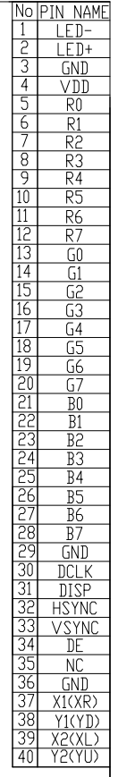

# RGB-LCD-dat

- [[display-protocols-dat]]

## datasheet 

AT050TN43

- 5.0 AT050TN43 == [[AT050TN43 V.1 Pre Ver01 20100511 (A050-43-TT-11)_201102115899.pdf]]

- 4.3 FGD430A4005 == [[4.3inch_FGD430A4005_Spec.pdf]]

## standard RGB LCD 40P == RGB24Bit

## RGB LCD 40-Pin Interface Pinout

| Pin No. | Symbol | Description                                    | When Not in Use |
| ------- | ------ | ---------------------------------------------- | --------------- |
| 1       | LEDA   | B/L positive pin                               |                 |
| 2       | LEDK   | B/L negative pin                               |                 |
| 3       | VDD    | Power supply, 2.8–3.3V type                    |                 |
| 4–13    | GND    | Power Ground                                   |                 |
| 14      | VS     | Frame synchronizing signal                     |                 |
| 15      | HS     | Line synchronizing signal                      |                 |
| 16      | Pclk   | Dot clock signal                               |                 |
| 17      | DE     | Data enable signal for RGB interface operation | Power Ground    |
|         |        | Low: access enabled; High: access inhibited    |                 |
| 18–22   | B0–B4  | 5-bit Blue data input                          |                 |
| 23–28   | G0–G5  | 6-bit Green data input                         |                 |
| 29–33   | R0–R4  | 5-bit Red data input                           |                 |
| 34      | RESET  | Reset the LCM                                  |                 |
| 35      | CSA    | Chip select signal                             |                 |
| 36      | SCL    | Serial clock                                   |                 |
| 37      | SDA    | Serial data input/output (bidirectional pin)   |                 |
| 38      | GND    | Power Ground                                   |                 |
| 39      | VDD    | Power supply, 2.8–3.3V type                    |                 |
| 40      | NC     | Dummy                                          |                 |

available size == 5" 

IPS / 800*480

power 
- LEDK
- LEDA
- GND
- VCC

red 
- R0 - GND
- R1 - GND
- R2
- R3
- R4
- R5
- R6
- R7

green 
- G0 - GND
- G1 - GND
- G2
- G3
- G4
- G5
- G6 
- G7

blue
- B0 - GND
- B1 - GND
- B2
- B3
- B4
- B5
- B6
- B7

- GND 
- CLK
- DISP - 3V3
- HSYNC
- VSYNC
- DEN == LCD_DE
- NC - 3V3
- GND

touch 
- XR
- YD
- XL
- YU

40Pin RGB/触摸接口

此处参考屏幕数据手册即可，由于F1C200S只支持RGB565,RGB666，此处使用RGB666，屏蔽了RGB三色的低2位，这样最终色彩影响比较小，同时，F1C200S内置色彩抖动，可以更加接近RGB888效果。

其中需要注意的是,CTP_SDA/CTP_SCL最好加上上拉电阻，此处选用了内部上拉，所以并没有加电阻，该部分原理图如下所示：

图2.15 RGB/触摸接口原理图

引脚定义可参考屏幕数据手册，如下图：

## 8-bit parallel RGB LCD

# Typical 8-bit Parallel TFT LCD Pinout (Example: ILI9341, ST7789V, HX8357)

| Pin | Name | Function                              |
| --- | ---- | ------------------------------------- |
| 1   | A    | LED anode (backlight +)               |
| 2   | K    | LED cathode (backlight –)             |
| 3   | NC   | No connection                         |
| 4   | NC   | No connection                         |
| 5   | NC   | No connection                         |
| 6   | VCC  | Power supply (usually 3.3 V or 5 V)   |
| 7   | D7   | Data bit 7                            |
| 8   | D6   | Data bit 6                            |
| 9   | D5   | Data bit 5                            |
| 10  | D4   | Data bit 4                            |
| 11  | D3   | Data bit 3                            |
| 12  | D2   | Data bit 2                            |
| 13  | D1   | Data bit 1                            |
| 14  | D0   | Data bit 0                            |
| 15  | RD   | Read strobe (MCU reads data from LCD) |
| 16  | WR   | Write strobe (MCU writes data to LCD) |
| 17  | RS   | Register select / Data-Command (DC)   |
| 18  | CS   | Chip select                           |
| 19  | TE   | Tearing effect signal (sync)          |
| 20  | RST  | Reset                                 |
| 21  | GND  | Ground                                |
| 22  | GND  | Ground                                |

**Notes:**
- **Interface type:** 8-bit parallel MCU (8080 or 6800 mode)
- **Typical driver ICs:** ILI9341, ST7789V, HX8357
- `A` & `K` are for LED backlight, powered separately
- `TE` is optional and used for synchronizing to avoid tearing

## working board 

- [[F133-dat]]

## ref 

- [[github]]