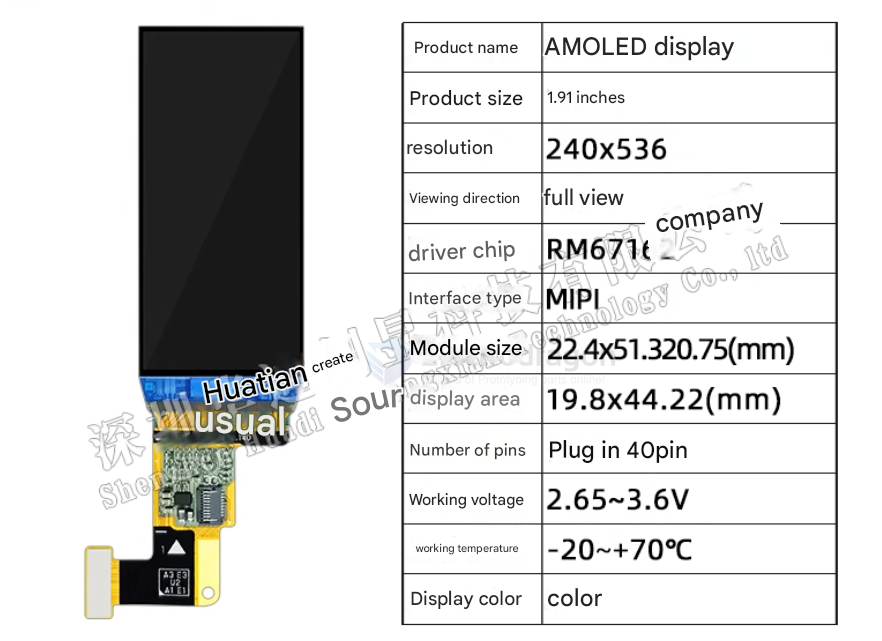
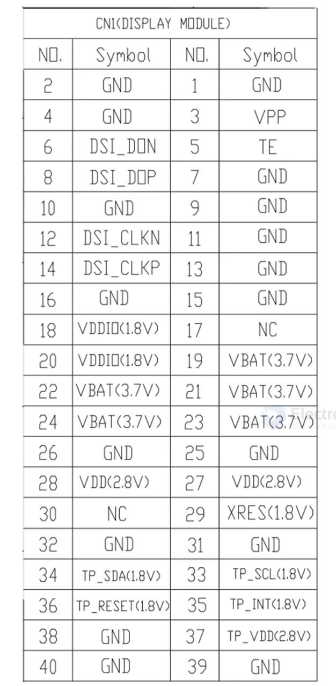
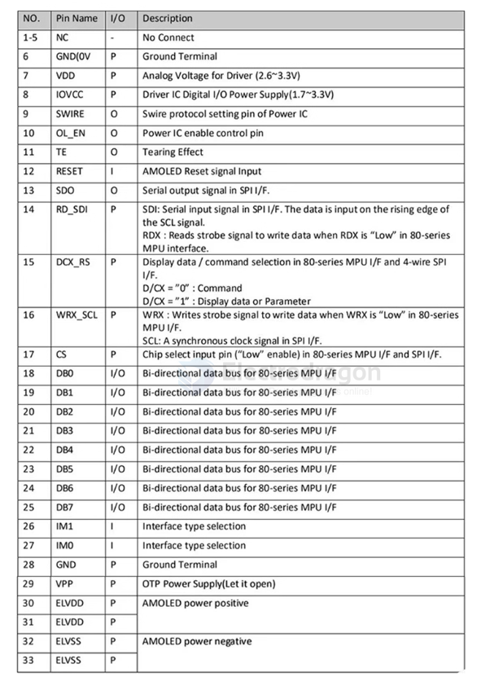

# AMOLED-dat

驱动 1.9 寸 AMOLED 240*536 高分屏

## 1.9' AMOLED Display Module

- 产品名称 == AMOLED显示屏
- 产品尺寸 == 1.91寸
- 分辨率 == 240 x 536
- 视角方向 == 全视角
- 驱动芯片 == RM67162Itd
- 接口类型 == MIPI
- 模块尺寸 == 22.4x51.320.75(mm)
- 显示区域 == 19.8x44.22(mm)
- 排针数量 == 插接40pin
- 工作电压 == 2.65~3.6V
- 工作温度 == 20~+70℃
- 显示颜色 == 彩色

## AMOLED Display

**AMOLED** stands for **Active Matrix Organic Light-Emitting Diode**.

### How it works
- **OLED part**: Each pixel produces its own light using organic compounds that glow when electricity passes through them.  
  → No need for a backlight (unlike LCD).
- **Active Matrix part**: Uses a thin-film transistor (TFT) layer to control each pixel individually, allowing fast refresh rates and better control.

### Key Features
1. **High Contrast** – Pixels can turn completely off for true blacks.
2. **Vivid Colors** – Wide color gamut and saturation.
3. **Thin & Flexible** – Can be made on flexible substrates.
4. **Power Efficient** – Saves power when showing dark images.
5. **Fast Response** – Great for videos and animations.

### Common Uses
- Smartphones
- Smartwatches
- High-end TVs
- VR headsets

### Comparison (AMOLED vs LCD)
| Feature         | AMOLED                     | LCD                          |
|-----------------|----------------------------|------------------------------|
| Black Level     | True black (pixels off)    | Backlight leakage            |
| Contrast        | Very high                  | Lower                        |
| Viewing Angle   | Excellent                  | Good, but not perfect        |
| Power Usage     | Lower for dark screens     | Constant (backlight always on) |
| Thickness       | Thinner, can be flexible   | Thicker, rigid               |

## ref 

- [[OLED]] - [[AMOLED]]