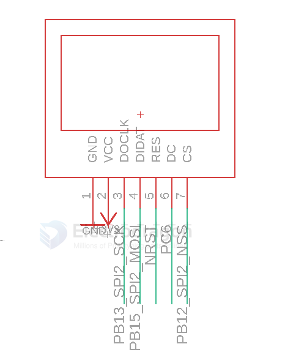
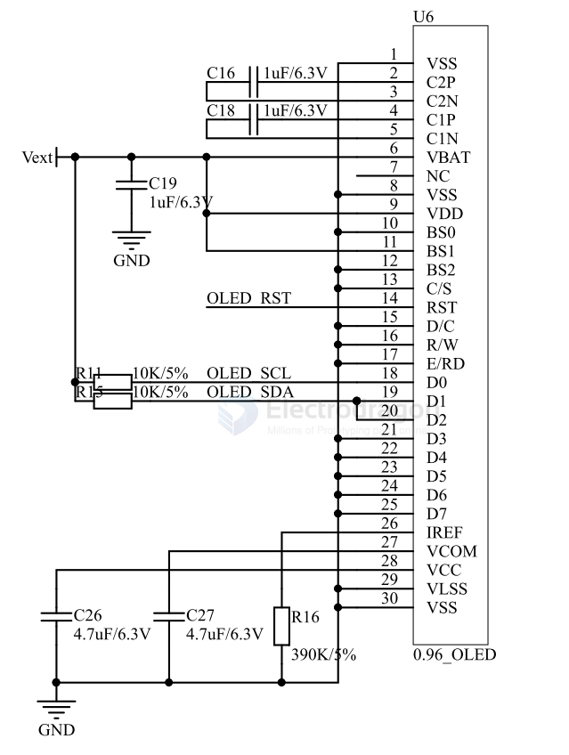

# OLED-dat

- [[OLED-I2C-dat]] - [[OLED-SPI-dat]] drive interface - [[I2C-dat]] - [[SPI-dat]]

- [[OLED-PCB-dat]] - [[OLED-raw-dat]]  - [[AMOLED-dat]] 

- [[OLED-SDK-dat]]

[legacy wiki page](https://www.electrodragon.com/w/0.96%27%27_128*64_OLED_Display)

## boards 

- [[IOD1003-dat]] - [[IOD1001-dat]] - [[IOD1004-dat]] - [[IOD1005-dat]]

- [[ESP32-ISO-dat]]

- [[MPC1090-dat]] - [[MPC1101-dat]] - [[MPC1056-dat]]

## SCH 

### using with STM32 SPI2 

### SCH 2 I2C+RESET 

## repositories 

- https://github.com/Edragon/Display_OLED-HDK
- https://github.com/Edragon/Display_OLED
- demo code - https://github.com/Edragon/Arduino-ESP32/tree/master/Sketchbook/driver-interactive/OLED/SSD1306SimpleDemo

- [oled](https://github.com/Edragon/Interactive-Display_OLED)

## ref 

- [[display-dat]]

- [[arduino-lib-dat]]

- [[display]] - [[OLED]] 