# OLED-dat

[legacy wiki page](https://www.electrodragon.com/w/0.96%27%27_128*64_OLED_Display)

drive interface - [[I2C-dat]] - [[SPI-dat]]

## boards 

- [[IOD1003-dat]] - [[IOD1001-dat]] - [[IOD1004-dat]] - [[IOD1005-dat]]

- [[ESP32-ISO-dat]]

- [[MPC1090-dat]]

## OLED Libs for arduino 

    Name                                               Installed Available   Location Description
    ACROBOTIC SSD1306                                  1.0.1     -           user     -
    ESP8266 and ESP32 OLED driver for SSD1306 displays 4.6.1     -           user     -
    SSD1306wire                                        2.0.1     -           user     -

## PCB OLED 

### 0.96"

- [[IOD1003-dat]] - [[IOD1001-dat]]

https://www.electrodragon.com/product/0-96-12864-oled-display-iicspi/

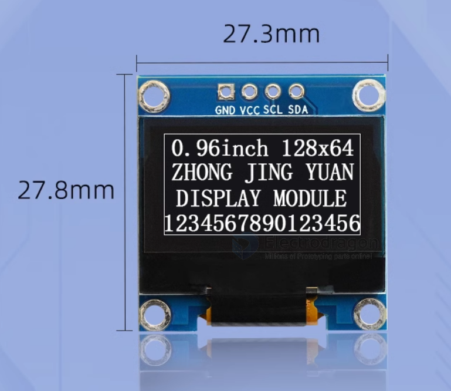

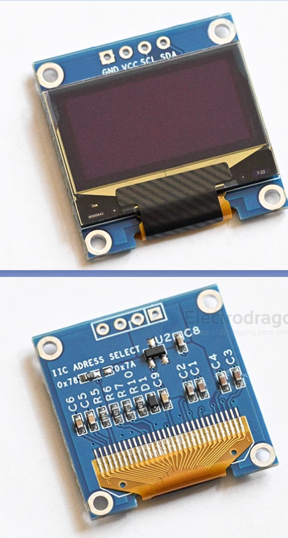

#### specs 

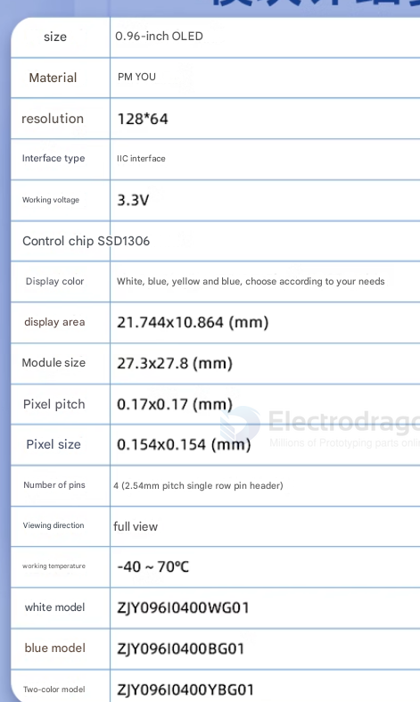

#### Pin definitions and Wiring  

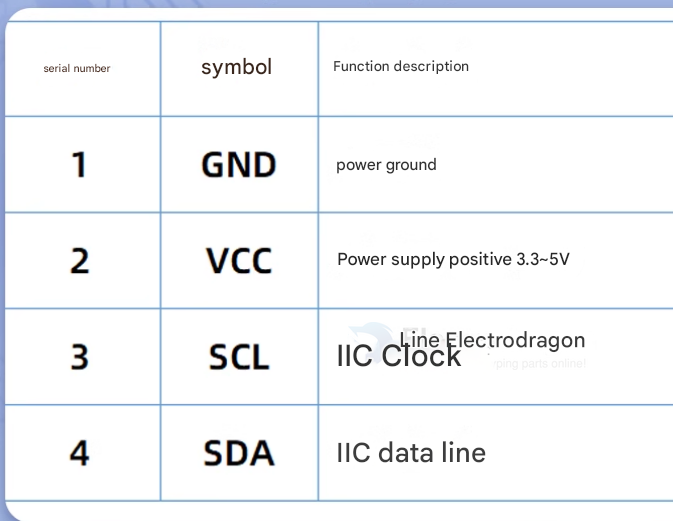

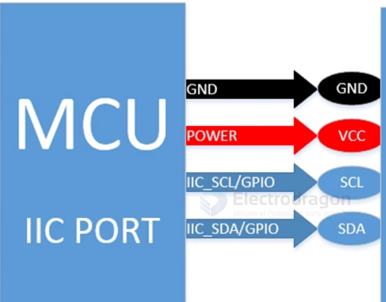

#### Dimension 

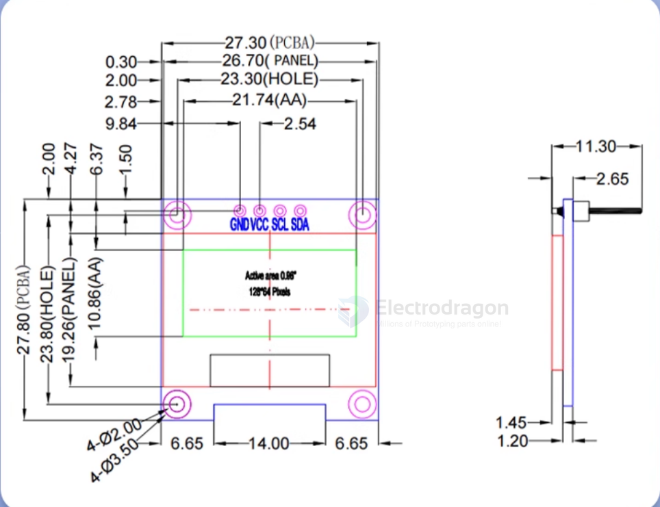

### 1.3"

- [[IOD1004-dat]] - [[IOD1005-dat]]

https://www.electrodragon.com/product/1-3-12864-blue-oled-display-iicspi/

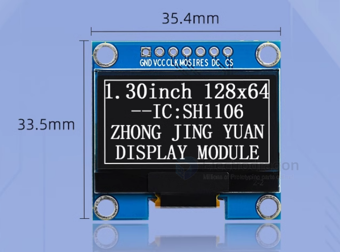

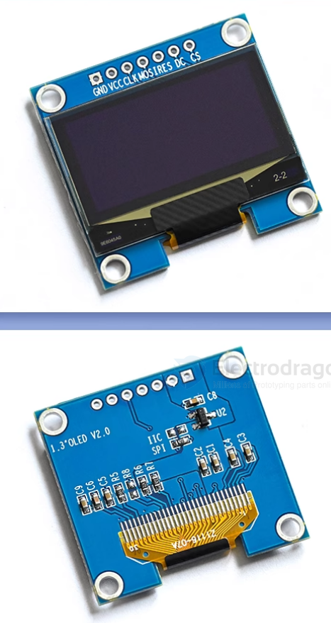

#### specs 

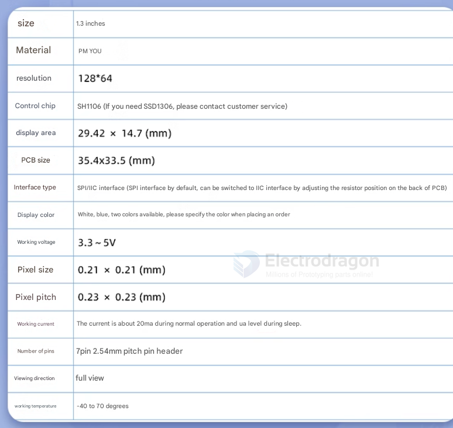

#### Pin definitions and Wiring

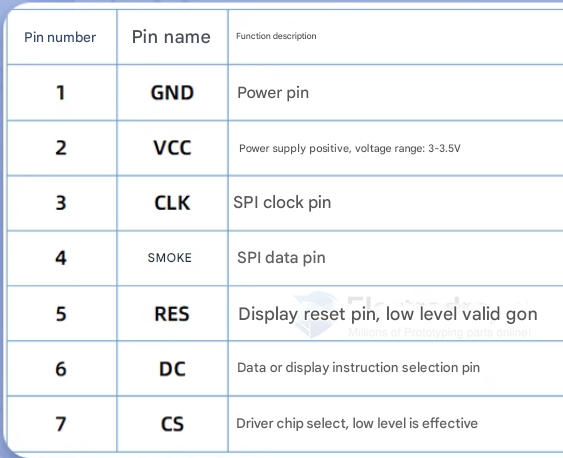

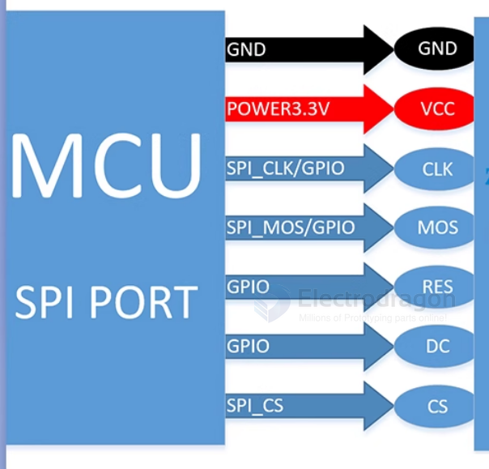

#### Dimension 

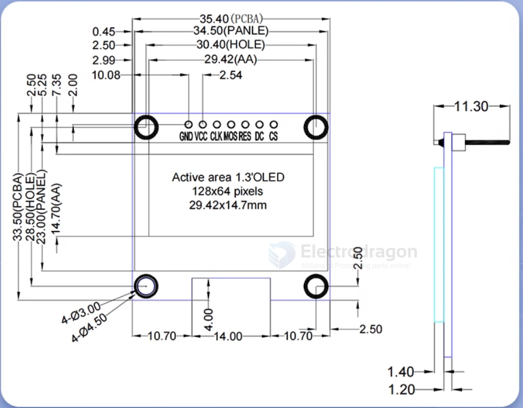

### demo video 

- https://www.youtube.com/watch?v=-S0XRB664-M&feature=youtu.be

- https://www.youtube.com/watch?v=-S0XRB664-M&feature=youtu.be

## RAW OLED 

### 0.96"

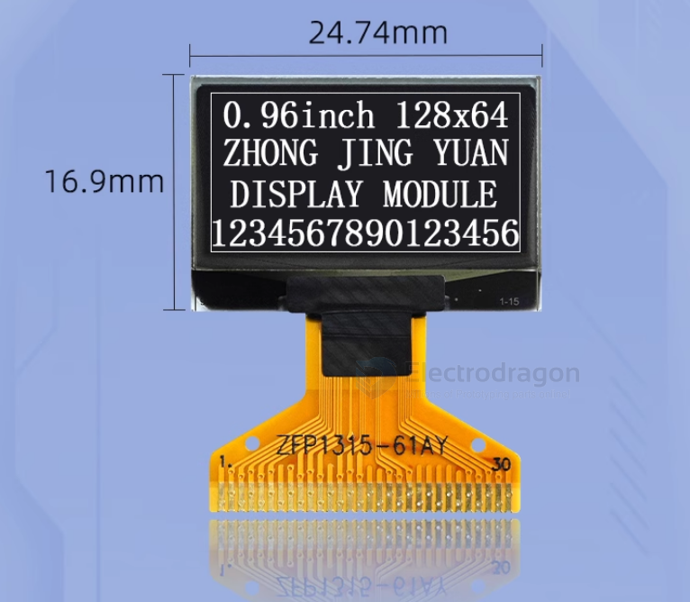

#### Specs

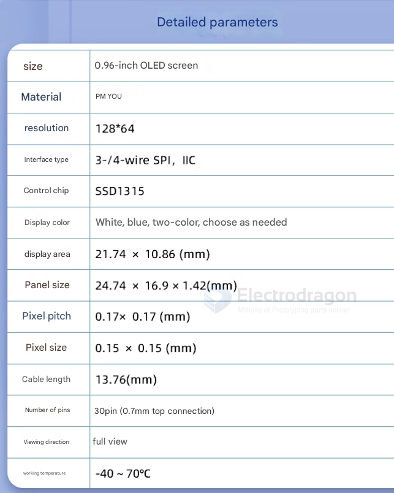

#### Pin Definitions, dimensions 

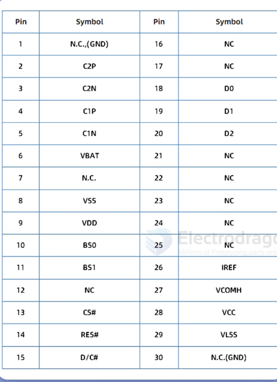

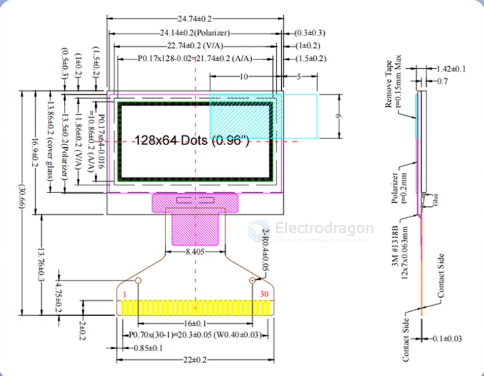

### 1.3"

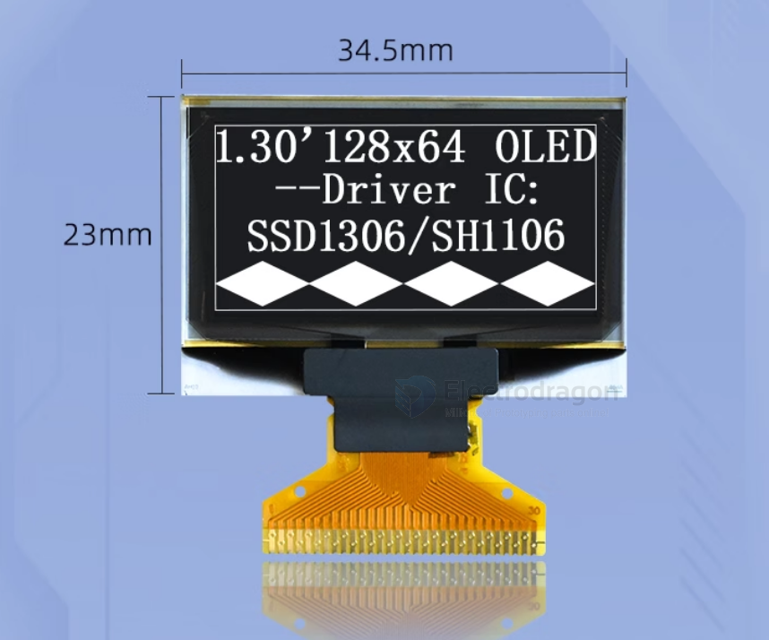

#### Specs 

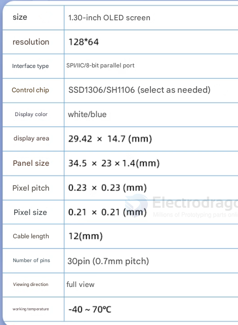

#### Pin Definitions, dimensions

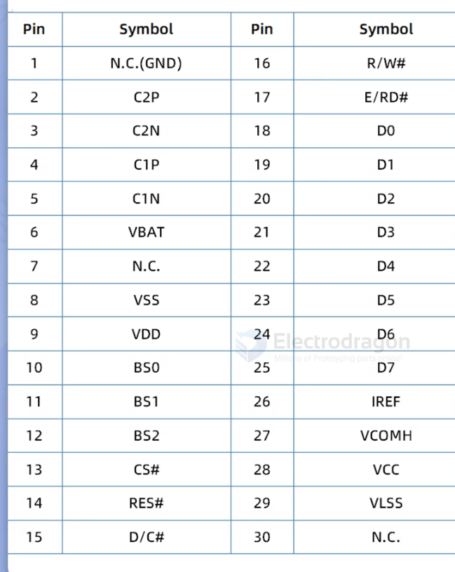

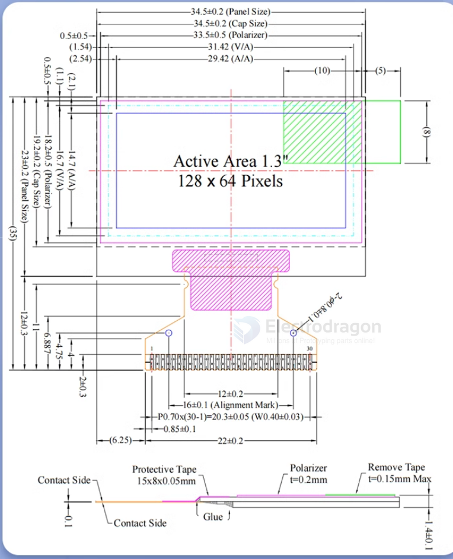

## OLED Driver 

- [[SH1106-dat]] - [[SSD1306-dat]] - [[oled-driver-dat]] - [[SSD1315-dat]]

## code 

### init 

    SSD1306Wire display(0x3c, 12, 2);   // ADDRESS, SDA, SCL , ESP32 pin IO12 for SDA and IO2 for SCL
    SSD1306Wire display(0x3c, 15, 13);

### arduino OLED library 

- [SSD1306ascii](https://github.com/greiman/SSD1306Ascii)

### ESP8266_and_ESP32_OLED_driver_for_SSD1306_displays

code

    display.init();
    delay(50);
    display.clear();
    display.setTextAlignment(TEXT_ALIGN_LEFT);

    display.setFont(ArialMT_Plain_16);
    display.drawString(0, 0, "Temp: ");
    display.drawString(50, 0, String(temperature));

    display.setFont(ArialMT_Plain_16);
    display.drawString(0, 20, "Press: ");
    display.drawString(50, 20, String(pressure));

### common OLED I2C address

- 0x3C = the version we are selling

## SCH 

### using with STM32 SPI2 

### SCH 2 I2C+RESET 

## OLED Memory Layout 

The following diagram shows the display memory layout: **64×128 bits**

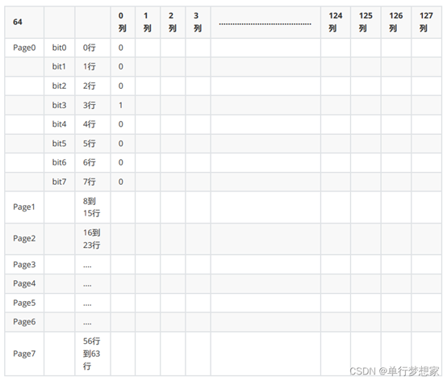

### Data Types

Data written to the OLED screen is divided into two types:

1. **Command Type:** Controls cursor position and other settings
   - Format: `0x00 + command_value`
   - Example: Setting cursor position

2. **Data Type:** Writes values to the display buffer
   - Format: `0x01 + data_value`
   - Example: Writing pixel data

### Display Principle

The display works by:

1. **Buffer Allocation:** Create a buffer matching the screen size
   - **Buffer Size:** `64 × 128 ÷ 8 = 1024 bytes`
   
2. **Buffer Modification:** Update the buffer content as needed

3. **Display Refresh:** Send the entire buffer content to display memory
   - **Refresh Method:** Update all columns in the display memory simultaneously

## repositories 

- https://github.com/Edragon/Display_OLED-HDK
- https://github.com/Edragon/Display_OLED
- demo code - https://github.com/Edragon/Arduino-ESP32/tree/master/Sketchbook/driver-interactive/OLED/SSD1306SimpleDemo

- [oled](https://github.com/Edragon/Interactive-Display_OLED)

## ref 

- [[display-dat]]

- [[arduino-lib-dat]]

- [[display]] - [[OLED]] 