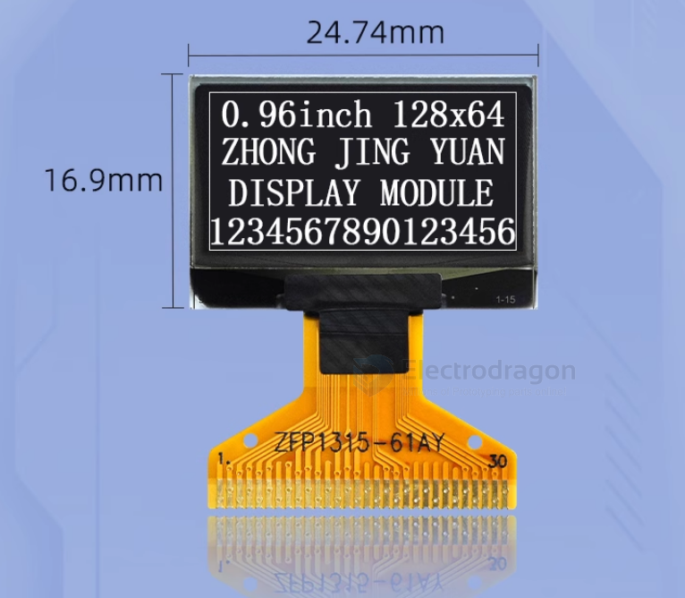
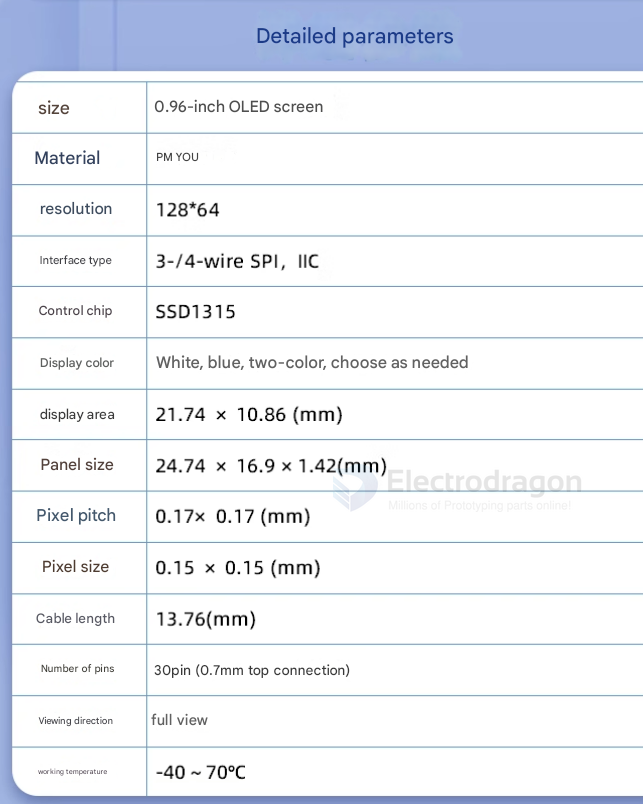
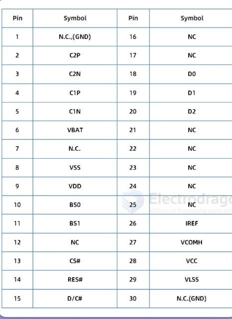
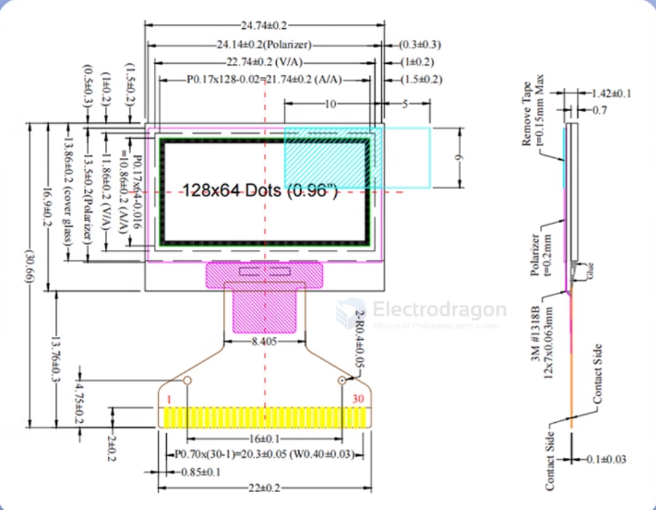

# OLED-raw-0.96-dat

- [[OLED-raw-0.91-dat]] - [[OLED-raw-0.96-dat]] - [[OLED-raw-1.3-dat]] - [[OLED-raw-dat]] - [[OLED-dat]]

- [[IOD1012-dat]]

- [[SPI-dat]] - [[I2C-dat]]

#### Specs

0.7 pitch 

#### Pin Definitions, dimensions 

## ref 

