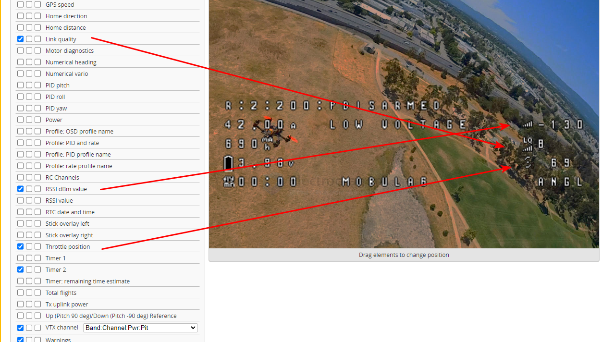
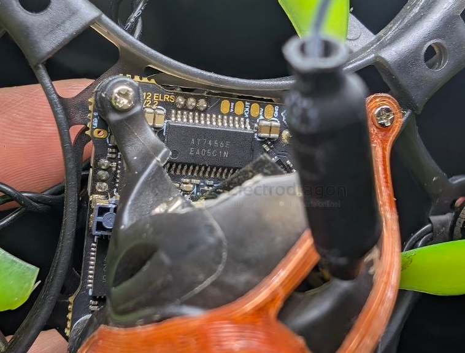

# OSD-dat.md

- [[betaflight-OSD-dat]] - [[OSD-dat]] - [[FPV-dat]]

- [[OSD-dat]] - [[VTX-dat]]

- [[OSD-dat]] - [[display-driver-dat]] - [[OSD-driver-dat]] - [[zhongkewei-dat]]

- [[camera-analog-dat]] - [[SPI-dat]] - [[video-dat]]

- [[VTX-dat]] - [[OSD-dat]] - [[flight-controller-dat]]

## setup 

- [[betaflight-receiver-dat]]

1. 去「Receiver（接收机）」页面：
   - 检查最下方的 RSSI Channel ➔ 改成 DISABLED。
   - （让飞控直接读取板载 CC2500 的物理真实信号，不要从通道抓假数据）。

2. 去「OSD」页面：
   - 在左侧可选元素列表中，取消勾选原来的 RSSI。
   - 改选以下两个正规元素：
     1. Link Quality（链路质量）：显示百分比（如 99、80、50），数值降到 30 以下警告，最直观好懂！
     2. RSSI dBm：如果开启，正常显示应该永远带负号（如 -65、-78、-85）。
3. 点右下角「Save（保存）」。

## use 

## chip 

- [[AT7456E-dat]] - [[zhongkewei-dat]]

## info 

### What is OSD (On-Screen Display)?

**OSD** stands for **On-Screen Display**. It is a graphical overlay—a menu, icon, or text—that is superimposed onto the main image of a screen. 

Essentially, an OSD allows you to interact with a device's settings or view real-time information without needing to navigate physical buttons or complex external menus.

---

### Common Uses of OSD

* **Monitors and Televisions:** This is the most common use. You use the OSD to adjust settings like brightness, contrast, color temperature, volume, and input source selection.
* **Gaming:** OSDs are frequently used in video games to show essential "heads-up" information, such as health bars, ammunition counts, mini-maps, or system performance metrics (like frame rate and CPU temperature) without pausing the game.
* **FPV (First-Person View) Drones:** OSDs are critical for drone pilots, as they overlay flight telemetry—such as altitude, battery life, speed, and GPS coordinates—directly onto the video feed from the drone's camera.
* **Cameras and Camcorders:** OSDs help users review photos, adjust exposure, resolution, and shooting modes while looking through the viewfinder or at the screen.

---

### How It Works
An OSD works by creating a digital graphical layer that is merged with the video signal. When you trigger the display (usually by pressing a button on the device, a remote, or a specific key on a keyboard), the device’s firmware generates this layer and composites it on top of whatever content you are currently watching.

### Why It Is Used
* **User-Friendly Interface:** It replaces cumbersome physical dials or switches with an intuitive, visual menu.
* **Real-Time Feedback:** When you change a setting (like brightness), you can often see the visual effect immediately, making it much easier to calibrate the device to your preference.
* **Convenience:** It allows you to manage settings on the fly without interrupting your viewing experience or requiring specialized tools.

## ref 