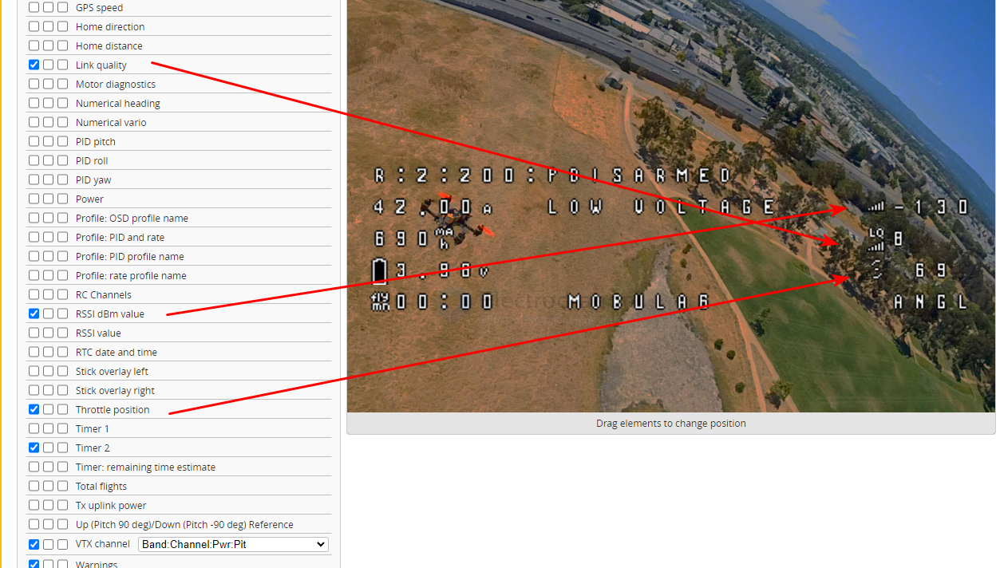
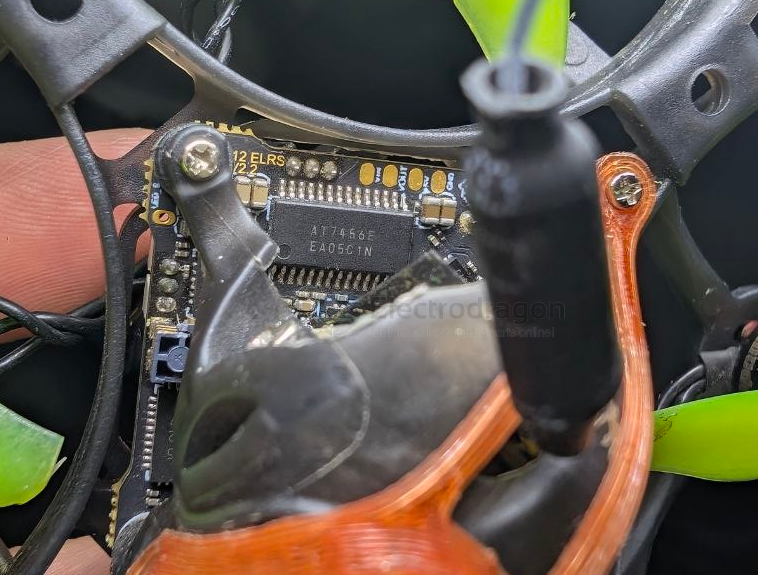

# OSD-dat.md

- [[band-dat]]

- [[MSPOSD-dat]] - [[mavlink-dat]] - [[OSD-dat]] - [[VTX-openIPC-dat]]

- [[OSD-dat]] - [[OSD-MSP-dat]]

- [[betaflight-OSD-dat]] - [[OSD-dat]] - [[FPV-dat]]

- [[OSD-dat]] - [[VTX-dat]]

- [[OSD-dat]] - [[display-driver-dat]] - [[OSD-driver-dat]] - [[zhongkewei-dat]]

- [[camera-analog-dat]] - [[SPI-dat]] - [[video-dat]]

- [[VTX-dat]] - [[OSD-dat]] - [[flight-controller-dat]]

## system 

- [[MSPOSD-dat]] - [[mavlink-dat]]

### MSP-OSD

是的，**MSP-OSD**（在 Betaflight 中通常称为 **MSP DisplayPort** 或直接简称 MSP OSD）在 Betaflight 中是**完全支持**的，而且它是目前连接数字图传（如 DJI、Walksnail、HDZero 等）最核心、最主流的 OSD 协议。

针对你之前提到的 `mposd`，这通常是 **MSP OSD** 的一种常见拼写误植或简称。

### 为什么 MSP-OSD 在 Betaflight 中如此重要？
1. **数字高清图传的标配：** 
   早期的模拟图传依靠硬件 OSD 芯片（如 MAX7456）直接把黑白字符叠加到视频上。而现代数字高清系统（如 DJI O3 Air Unit、Avatar、HDZero）没有传统的模拟视频叠加芯片，它们需要飞控通过串口（UART）以 **MSP (MultiWii Serial Protocol) 协议** 将 OSD 的文本内容、位置坐标和动态画面实时发送给图传天空端，由眼镜端直接渲染出彩色、高清的 OSD 界面。
2. **在 Betaflight 中的配置方法：**
   * **端口设置：** 在 `Ports` 选项卡中，将对应的串口（UART）外设设置为 **`VTX (MSP + DisplayPort)`**。
   * **OSD 设置：** 在 `OSD` 选项卡中，将 OSD 设备的下拉菜单选择为 **`MSP`**。

### 总结
你所说的 `mposd`（即 MSP-OSD / MSP DisplayPort）不仅在 Betaflight 中支持，而且是目前玩数字高清 FPV 绕不开、用得最多的标准 OSD 传输协议。

### mavlink 

- [[INAV-dat]] - [x] [[betaflight-OSD-dat]]

Betaflight 原生**不支持** MAVLink 协议作为其 OSD 或核心遥测通信协议（MAVLink 主要是 ArduPilot、PX4 等开源固定翼/多旋翼飞控使用的协议），也没有名为 `mposd` 的独立协议。不过，Betaflight 在数字高清 OSD 领域广泛使用了一种名为 **MSP DisplayPort**（也常被简称为 MSP OSD）的核心协议。

以下是 Betaflight 中实际支持的 OSD 协议与显示机制的详细盘点：

### 1. 核心的数字 OSD 协议：MSP DisplayPort (MSP OSD)
这是目前 Betaflight 最重要的现代 OSD 协议，用于将飞控的 OSD 画面渲染并传输到数字图传眼镜中：
* **工作原理：** 飞控通过串口（UART）利用 **MSP（MultiWii Serial Protocol）** 协议将 OSD 文本、字符和布局坐标发送给数字图传天空端（如 DJI O3、Vista、Avatar、HDZero 等），再由眼镜端渲染显示。
* **配置方式：** 在 Betaflight 端口（Ports）选项卡中，对应的 UART 外设需要设置为 **VTX (MSP + DisplayPort)**，并在 OSD 选项卡中将设备类型设为 `MSP`。

### 2. 模拟 OSD 硬件/协议（传统方案）
对于模拟图传，Betaflight 并不依赖复杂的通信协议，而是直接驱动硬件芯片：
* **芯片支持：** 原生支持 **AT7456E** 和 **MAX7456** 等硬件 OSD 芯片。
* **工作方式：** 飞控通过 SPI 总线直接将字符叠加到模拟视频信号（PAL/NTSC）上。

### 3. 关于 MAVLink 与 Betaflight
* **Betaflight 的定位：** Betaflight 是为“穿梭机/竞速/花机（FPV Drones）”极速响应而设计的，采用的是轻量级的 MSP 协议，**不原生支持 MAVLink 协议**（无论是作为 OSD 还是主遥测）。
* **例外情况：** 如果你在 Betaflight 固件上看到了 MAVLink 的影子，通常是因为某些第三方地面站软件、GPS 桥接模块或特定外设（如外置大疆/长距 telemetry 转换器）将 MSP 转换成了 MAVLink 转发给地面设备，但飞控本身并不直接处理 MAVLink OSD。

## setup 

- [[betaflight-receiver-dat]]

1. 去「Receiver（接收机）」页面：
   - 检查最下方的 RSSI Channel ➔ 改成 DISABLED。
   - （让飞控直接读取板载 CC2500 的物理真实信号，不要从通道抓假数据）。

2. 去「OSD」页面：
   - 在左侧可选元素列表中，取消勾选原来的 RSSI。
   - 改选以下两个正规元素：
     1. Link Quality（链路质量）：显示百分比（如 99、80、50），数值降到 30 以下警告，最直观好懂！
     2. RSSI dBm：如果开启，正常显示应该永远带负号（如 -65、-78、-85）。
3. 点右下角「Save（保存）」。

## use 

## chip 

- [[AT7456E-dat]] - [[zhongkewei-dat]]

## info 

### What is OSD (On-Screen Display)?

**OSD** stands for **On-Screen Display**. It is a graphical overlay—a menu, icon, or text—that is superimposed onto the main image of a screen. 

Essentially, an OSD allows you to interact with a device's settings or view real-time information without needing to navigate physical buttons or complex external menus.

---

### Common Uses of OSD

* **Monitors and Televisions:** This is the most common use. You use the OSD to adjust settings like brightness, contrast, color temperature, volume, and input source selection.
* **Gaming:** OSDs are frequently used in video games to show essential "heads-up" information, such as health bars, ammunition counts, mini-maps, or system performance metrics (like frame rate and CPU temperature) without pausing the game.
* **FPV (First-Person View) Drones:** OSDs are critical for drone pilots, as they overlay flight telemetry—such as altitude, battery life, speed, and GPS coordinates—directly onto the video feed from the drone's camera.
* **Cameras and Camcorders:** OSDs help users review photos, adjust exposure, resolution, and shooting modes while looking through the viewfinder or at the screen.

---

### How It Works
An OSD works by creating a digital graphical layer that is merged with the video signal. When you trigger the display (usually by pressing a button on the device, a remote, or a specific key on a keyboard), the device’s firmware generates this layer and composites it on top of whatever content you are currently watching.

### Why It Is Used
* **User-Friendly Interface:** It replaces cumbersome physical dials or switches with an intuitive, visual menu.
* **Real-Time Feedback:** When you change a setting (like brightness), you can often see the visual effect immediately, making it much easier to calibrate the device to your preference.
* **Convenience:** It allows you to manage settings on the fly without interrupting your viewing experience or requiring specialized tools.

## ref 