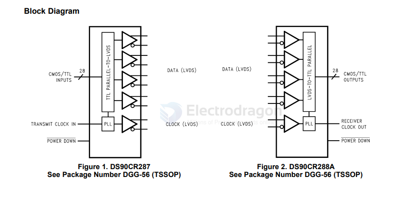
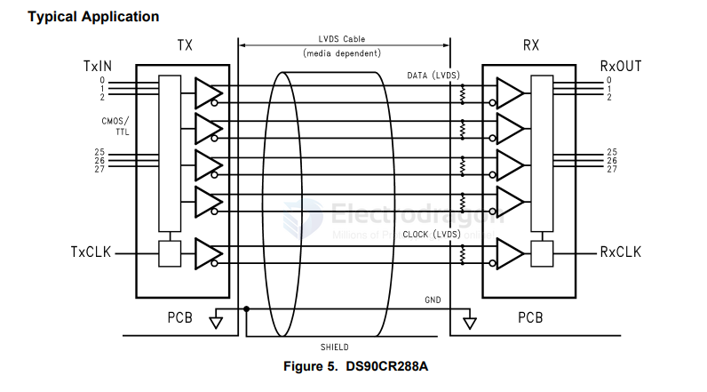

# LVDS-dat

- [[LVDS-dat]] - [[interface-dat]]

[general LVDS interface LCD](https://en.wikipedia.org/wiki/Low-voltage_differential_signaling)

**LVDS** (Low-Voltage Differential Signaling) is an **electrical signaling standard**, not a specific video protocol.  
Whether it’s "parallel" or "serial" depends on how it’s used:

## In Display Interfaces
- **Old PC laptop panels** (LVDS display interface) use **serialized pixel data**:
  - Pixel data from a parallel RGB bus is **serialized** into multiple LVDS lanes.
  - Typically, **3 data pairs + 1 clock pair** for single link (supports up to ~1366×768).
  - **6 data pairs + 1 clock pair** for dual link (for higher resolutions like 1920×1080).
  - Each LVDS lane still carries data in a **parallel-to-serial** fashion internally.

## Key Points
- **LVDS = Serial differential transmission** (each lane is serial).
- **LVDS display interface** = multiple serial lanes operating in parallel (multi-lane serial).
- Main goal: lower EMI, higher speed, longer cable runs vs. raw parallel RGB.

## Summary Table
| Aspect                  | LVDS (as used in displays)                 |
|-------------------------|---------------------------------------------|
| Signal Type             | Differential                               |
| Transmission per lane   | Serial                                     |
| Overall interface       | Multiple serial lanes in parallel          |
| Typical Usage           | Laptop screens, industrial monitors        |
| Speed per lane          | Hundreds of Mbps                           |

## chip 

- [[TI-interface-dat]]

- [[SNx5LVDSxx-dat]] - [[LVDS-dat]] - [[TI-dat]] - [[TI-interface-dat]] - [[differential-line-receiver-dat]]

DS90CR288

DS90CR288AMTDX/NOPB - DS90CR287/DS90CR288A +3.3V Rising Edge Data Strobe LVDS 28-Bit Channel Link - 85MHz

+3.3V Rising Edge Data Strobe LVDS 28-Bit Channel Link Receiver - 85 MHz | DGG | 56 | -10 to 70

app 

## ref 

- [[display-dat]]