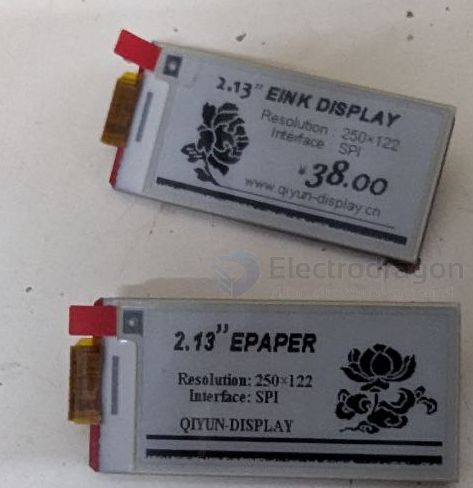

# e-paper-dat

## repo 

- display - https://github.com/Edragon/RPI_Display
- display 2 - https://github.com/Edragon/Display-E-paper
- epaper - https://github.com/Edragon/Display-E-paper

## E-paper 2.13"

please find demo code in epaper repo above, we have V1, V2, V3 versions, currently selling version is V3. If not working please try from the V3 version to the V1.

## command 

[[C-dat]] == ./epd

[[python-dat]] 

    root@raspberrypi:/home/pi/RPI-Display-main/2.13inch_e-Paper_HAT-code/raspberrypi/python# python epd2in13.py

    python /home/pi/RPI-Display-main/2.13inch_e-Paper_HAT-code/raspberrypi/python/epd2in13.py

## ref 

- [[display-dat]]

