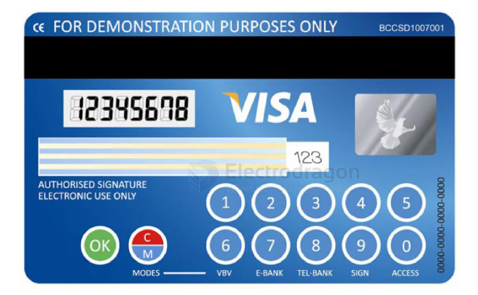

# e-paper-dat

## working principle 

Electronic ink screens, also known as e-paper, commonly use "microcapsule electrophoretic display" technology (EPD). The basic principle is that charged nanoparticles suspended in liquid migrate under the influence of an electric field. Electronic ink is coated onto a layer of plastic film, which is then laminated with a thin-film transistor (TFT) circuit. The pixel pattern is formed by controlling the drive IC.

Electronic ink consists of millions of microcapsules, each about the diameter of a human hair. Each microcapsule contains electrophoretic particles—negatively charged white particles and positively charged black particles—suspended in a transparent liquid.

Using the principle of attraction between positive and negative charges, when the electric field is applied, the corresponding black or white particles move to the top of the microcapsule, allowing the user to see white or black in that area.

Most common e-paper is black and white. Electronic price tags also use a type of three-color e-ink screen, which operates similarly to the two-color system. By applying different voltages, different colored particles move to the top layer, allowing different colors to be seen.

常见的电子纸是黑白色的，电子价签还有一种三色电子墨水屏，系统运作原理与双色系统类似，施加不同的电压，使不同颜色的粒子移动至上层，看见不同的颜色。

## Advantages and Applications

E-paper screens are easy to read: e-paper displays rely on reflecting ambient light to show images, giving them a print-like effect similar to paper.

Lightweight and flexible: Due to their simple structure and the fact that e-paper is based on soft plastic film material, they are naturally flexible and bendable, and can be cut into various shapes as needed.

Energy-saving: When displaying static images, e-paper consumes no power at all. Even if all power is disconnected, the e-paper display can still retain the last image.

For example, the smart card below uses e-paper technology and can display the balance.

There is also this type of NFC passive smart tag, which can refresh its display content via a mobile phone's NFC. It can be used as an electronic pet tag, electronic luggage tag, to display payment QR codes in stores, or to show a contact number for moving a car.

## second-hand epaper module 

## HDK 

墨水屏内置驱动器 IC，采用 COG 封装， IC 厚度 300um，根据 FPC（柔性电路板）宽度的不同，分为 24P 和 34P。墨水屏正面朝向自己，排线朝左边，从上往下分别是引脚 1-24。

## E-paper 2.13"

please find demo code in epaper repo above, we have V1, V2, V3 versions, currently selling version is V3. If not working please try from the V3 version to the V1.

## command 

[[C-dat]] == ./epd

[[python-dat]] 

    root@raspberrypi:/home/pi/RPI-Display-main/2.13inch_e-Paper_HAT-code/raspberrypi/python# python epd2in13.py

    python /home/pi/RPI-Display-main/2.13inch_e-Paper_HAT-code/raspberrypi/python/epd2in13.py

## SCH 

ESP8266 drive 

### BS 

BS = 0 = GND = 4 line spi 默认
BS = 1 = 3V3 = 3 line spi

the main control part 

| dimension          | resistor |   |
|--------------------|----------|---|
| 1.54               | 3R       |   |
| 2.13               | 3R       |   |
| 2.9                | 3R       |   |
| 2.7                | 0.47R    |   |
| 4.2                | 0.47R    |   |
| 7.5                | 0.47R    |   |
| 以及所有尺寸三色屏 | 0.47R    |   |

## ESP8266 

| EPD      | ESP8266 |
| -------- | ------- |
| EPD_BUSY | 105     |
| EPD_RST  | 102     |
| EPD_DC   | 104     |
| EPD_CS   | 1015    |
| EPD_CLK  | 1014    |
| EPD_DIN  | 1013    |
| 3V3      | 3V3     |
| GND      | GND     |

## repo 

- display - https://github.com/Edragon/RPI_Display
- display 2 - https://github.com/Edragon/Display-E-paper
- epaper - https://github.com/Edragon/Display-E-paper

arduino library == esp8266-waveshare-epd

## ref 

- [[display-dat]] - [[e-paper]]

- [[FPC-dat]]
