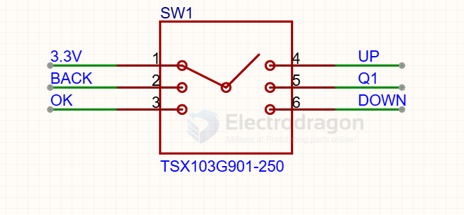
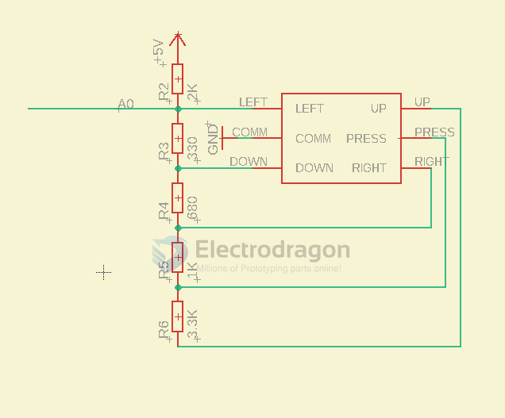
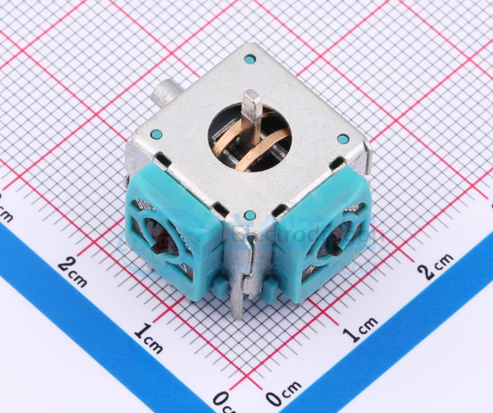
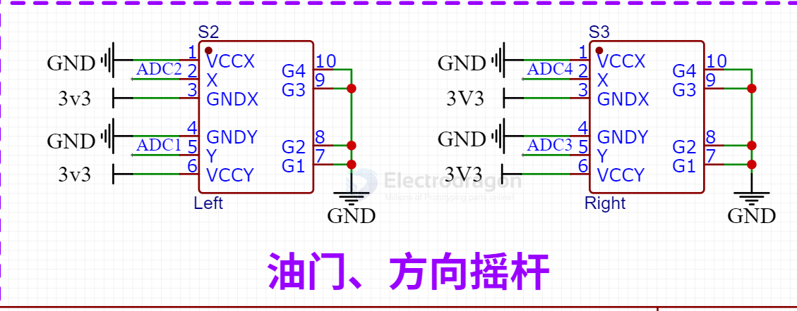

# joystick-dat

## 5-directional joystick

五向按键：
向上= 上一个
向下= 下一个
向左 = 返回
向右 = 快捷键Q1
向里 = 确认

TSX103G901

5-directional joystick, connecting to arduino 

## version 2 

3D161 规格:16mm*16mm 寿命:100万次 特点:3D摇杆 品名：摇杆开关

throttle, yard, etc.

## ref 

- [[joystick]] - [[interactive]]