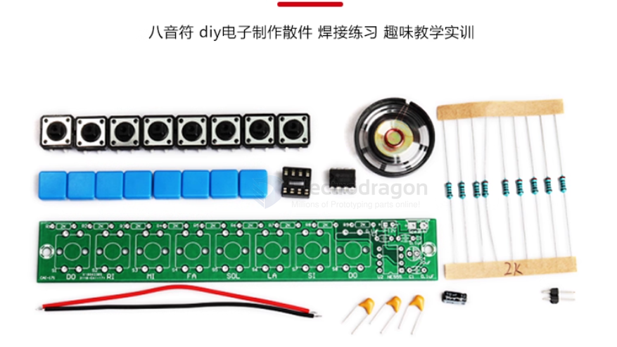
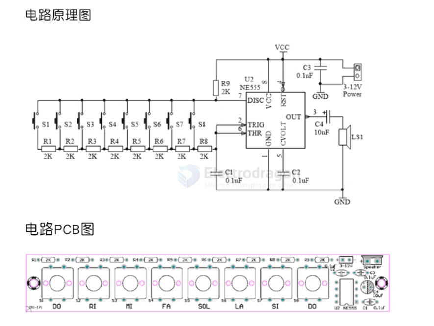

# keyboard-dat

- [[USB-dat]] - [[USB-OTG-dat]] - [[wireless-keyboard-dat]]

- [[interactive-dat]] - [[keypad-dat]] - [[keyboard-dat]] - [[bluetooth-dat]] control - [[MPCS007]]

## matrix keyboard 

## ref 

- [[interactive-dat]]

# electronic-keyboard-dat

- [[keyboard-dat]] 

## working principle 

- [[NE555-dat]]

## ref 

- [[training-board-dat]]