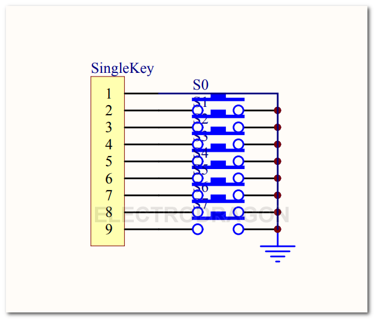
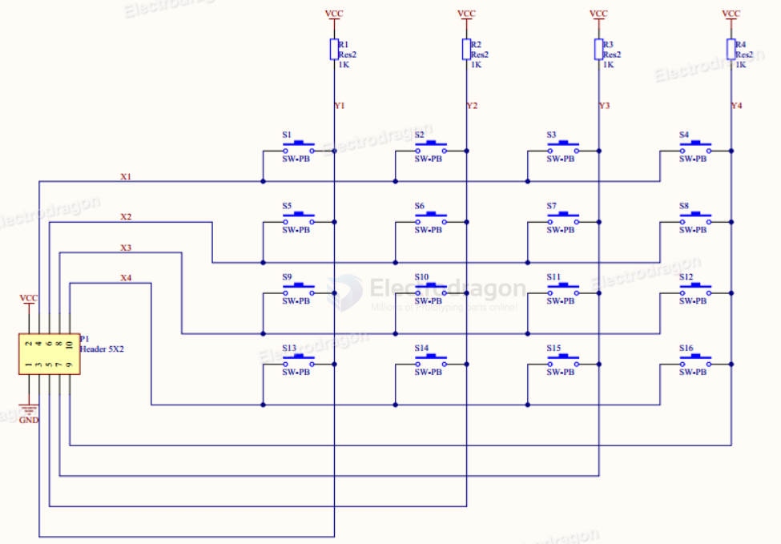
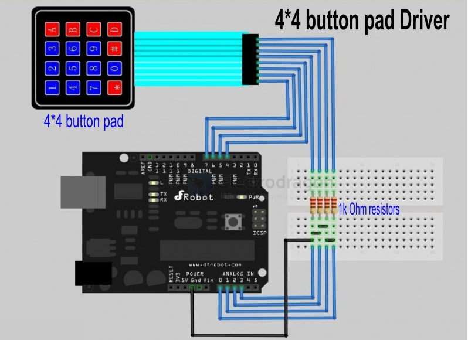

# keypad-dat

## board 

- [[IKE1020-dat]]

- [[membrane-keyboard-dat]] - [[IKE1011-dat]] 

## SCH 

single key pad SCH1 

matrix keypad SCH2

This is a simple application of port manipulation using Arduino to paly with the 4*4 button pad. Before read the code, you'd better see the connection diagram first. 

We use four digital ports as HIGH voltage scanning the row of button pad and four analog ports to read the column of button pad connected with four pull-down resistors. 

If button is pressed,the voltage will be HIGH when it is scanned by HIGH voltage concurrently. Otherwise, the voltage is pulled down and will be LOW. Using eight ports totally, we can read 16 buttons.

SCH3 

## wiring 

- VCC Row 1, 2, 3, 4
- NC Column 1, 2, 3, 4

Output high TTL signal when either row or column buttons are pressed.

## design 

- [[CH552-dat]]

## demo code 

- [[keypad-demo-code-1.c]]

- [[keypad-demo-code-2.ino]]

- [[Key_header.zip]]

## ref 

legacy wiki page 

https://w.electrodragon.com/w/Category:Keypad

https://w.electrodragon.com/w/Category:Input