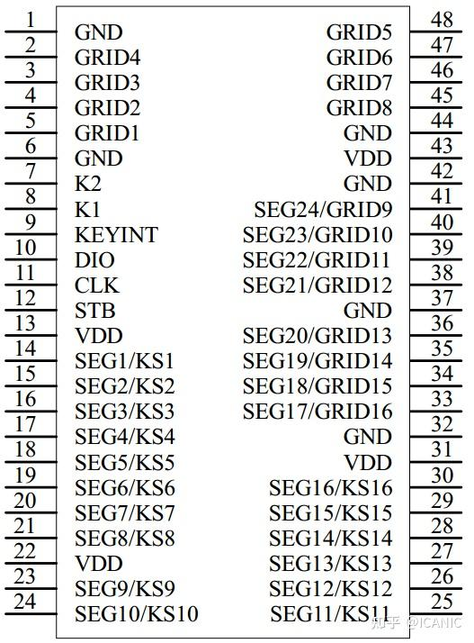
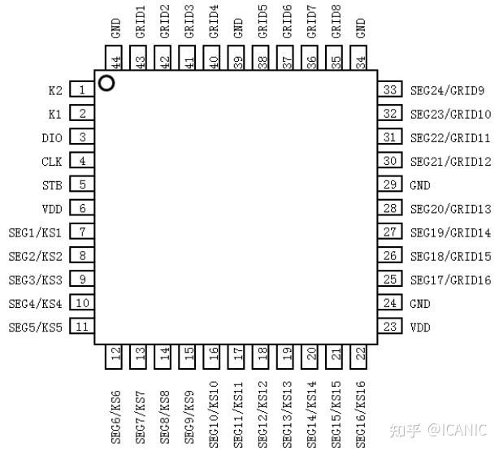

# matrix-display-driver-dat

## driver 

- [[AIP1944-dat]]

 AiP1948/AiP1944 is a dedicated LED display driver controller IC with a 3-wire serial interface, supporting common-cathode 16 segments × 16 digits or 24 segments × 8 digits, and a 16×2 key matrix scan. It integrates MCU digital interface, data latch, RC oscillator, and other circuits, making it widely suitable for various LED panel applications.

主要特点
  - AiP1948：SSOP48（0.635mm）
  - AiP1944：LQFP44

优点

1、AiP1948/1944可驱动较多LED灯珠，最高可达16*16=256颗LED灯珠；
 1. AiP1948/1944 can drive a large number of LEDs, up to 16×16 = 256 LEDs.

2、AiP1948管脚KEYINT为按键中断输出，平时为高电平，有按键被按下时，在键扫周期内出现低电平脉冲；
 2. The KEYINT pin on AiP1948 provides key interrupt output; it is normally high, and when a key is pressed, a low-level pulse appears during the key scan cycle.

3、AiP1948/1944与AiP1628指令兼容，程序移植简单。
 3. AiP1948/1944 is compatible with AiP1628 instructions, making program migration simple.

## ref 

- [[interactive-dat]]