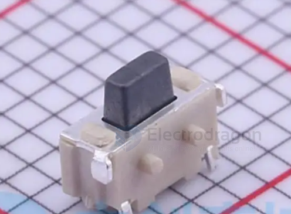
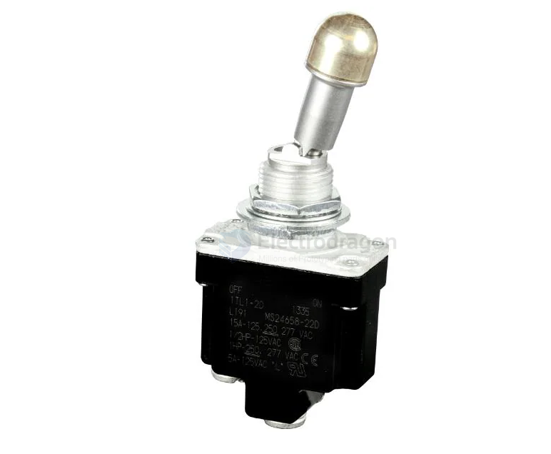
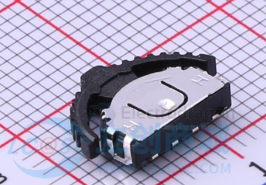

# switch-dat 

- [[rocker-switch-dat]]

- [[toggle-switch-dat]]

- [[KCD4-dat]] - [[KCD3-dat]] - [[KCD1-dat]]

- [[sensor-hall-switch-dat]]

- [[sensor-tilt-switch-dat]] - [[sensor-dat]]

## SMD Switch 

TS24CA == 4.55*1.8*3.5mm 卧贴 轻触开关

## KCD1 

	
Red Light 6A@250VAC ON/OFF DPST Snap in Panel

## KCD3 

- [[ISB1036-dat]] - [[ISB-dat]]

## types 

### SPST 

1TL1-2D

### DPDT

- [[ISB1045-dat]]

https://www.electrodragon.com/product/20pcs-smd-switch-type/

- [[ISB1033-dat]] - [[ISB1034-dat]]

https://www.electrodragon.com/product/88-lock-non-homing-switch/

- [[ISB1024-dat]] - [[ISB1025-dat]] - [[ISB1026-dat]]

### SPDT

## chip switch 

- [[PE4259-dat]] - [[UPG2179-dat]]

## thumbwheel switch

## switching ICs 

MC14053BCPG - IC SWITCH SPDT X 3 280OHM 16DIP

## power switch 

- [[power-dat]] 

AP22652/AP22653/AP22652A/AP22653A - PRECISION ADJUSTABLE CURRENT-LIMITED POWER SWITCHES

## ref 

- [[button-dat]]

- [[switch]]
