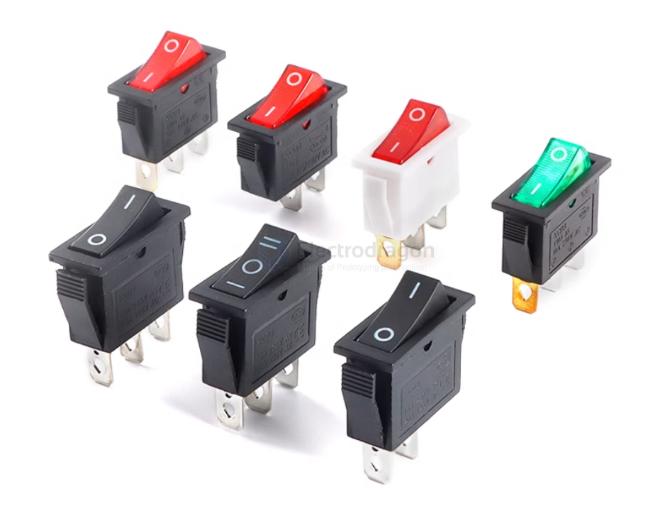

# switch-dat 

- [[rocker-switch-dat]]

- [[toggle-switch-dat]]

- [[KCD4-dat]] - [[KCD3-dat]] - [[KCD1-dat]]

## KCD3 

## types 

### DPDT

- [[ISB1045-dat]]

https://www.electrodragon.com/product/20pcs-smd-switch-type/

- [[ISB1033-dat]] - [[ISB1034-dat]]

https://www.electrodragon.com/product/88-lock-non-homing-switch/

- [[ISB1024-dat]] - [[ISB1025-dat]] - [[ISB1026-dat]]

### SPDT

## chip switch 

- [[PE4259-dat]] - [[UPG2179-dat]]

## ref 

- [[button-dat]]

- [[switch]]
