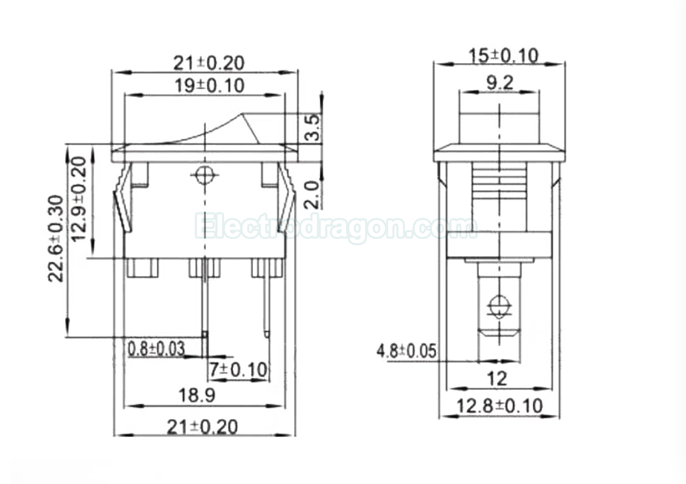

# switch-dat 

## KCD1-101

- [[KCD1-101F.pdf]]

version: 

3 pins / 2 shifts 
3 pins / 3 shifts 
6 pins / 3 shifts 
6 pins / 2 shifts 

color black/green/red, light: with or without light 

## types 

### DPDT

- [[ISB1045-dat]]

https://www.electrodragon.com/product/20pcs-smd-switch-type/

- [[ISB1033-dat]] - [[ISB1034-dat]]

https://www.electrodragon.com/product/88-lock-non-homing-switch/

- [[ISB1024-dat]] - [[ISB1025-dat]] - [[ISB1026-dat]]

### SPDT

## ref 

- [[button-dat]]

- [[switch]]
