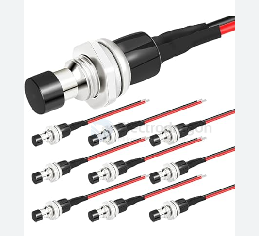
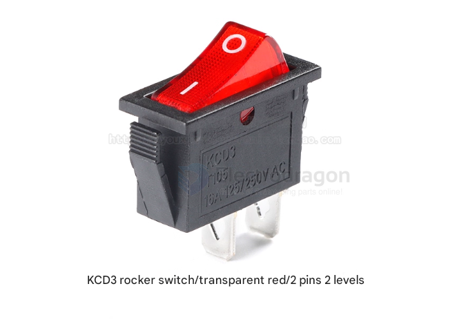

# switch-spst-button-push-dat

## press button / push button 

press to connect, release to diconnect 

- [[ISB1014-dat]] - [[ISB1007-dat]] - [[ISB1016-dat]]

## inter-lock button 

- [[ISB1033-dat]]

17 x 12 x 9.5

## press button / push button - wall amounted 

Mini Push Button Momentary Switch - SPST : 30-040

## KCD1 

- [[KCD1-dat]]
    
Red Light 6A@250VAC ON/OFF DPST Snap in Panel

## KCD3 

- [[ISB1036-dat]] - [[ISB-dat]]

## types 

### SPST 

1TL1-2D

## ref

- [[switch-dat]]