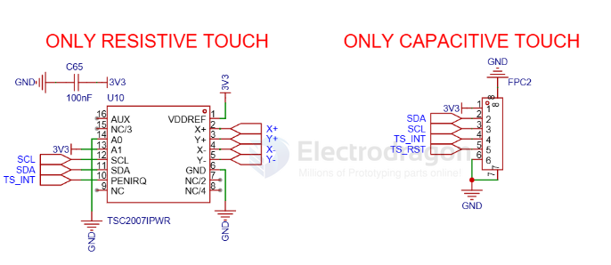

# touch-panel-dat

- [[touch-dat]] - [[touch-panel-dat]]

## driver 

- [[TSC2007-dat]] - [[TI-dat]] - [[touch-panel-dat]] == 1.2V to 3.6V, 12-Bit, Nanopower, 4-Wire Micro TOUCH SCREEN CONTROLLER with I2C™ Interface

- [[GT911-dat]] 

- [[XPT2046-dat]]

STMPE610 - S-Touch®: advanced touchscreen controller with 6-bit port expander

### NS2009-dat

触摸驱动为 [[CST816-dat]]（i2c接口），采样排线插接的方式安装。

## ref 

- [[LCD-dat]]