# lens-dat

- [[glue-lens-dat]] - [[glue-dat]]

- [[sensor-camera-dat]]

## 对比表（增加 8 mm 油封镜头假设）

| 参数                    | 空气设计 4 mm 镜头 | **油中可用的 4 mm 镜头（反推）** | **假设：油封 8 mm 镜头（你关心的）** |
| ----------------------- | ------------------ | -------------------------------- | ------------------------------------ |
| 标称焦距 f_air (mm)     | 4.0                | 4.0                              | 8.0                                  |
| 油中等效焦距 f_oil (mm) | ≈ 5.9              | ≈ 5.9                            | **≈ 11.8**                           |
| OBFL 估算范围 (mm)      | 3.5–4.5            | **5.5–6.8**                      | **10.5–13.0**                        |
| **推荐最小 OBFL (mm)**  | —                  | **≥ 6.5**                        | **≥ 12.5（关键）**                   |
| 光学总长 TTL 估算 (mm)  | 18–22              | **26–32**                        | **30–35**                            |
| 推荐 TTL 安全值 (mm)    | —                  | **≈ 28–30**                      | **≈ 32–35**                          |
| 所需调焦余量            | ±0.5 mm            | **≥ ±1.5 mm**                    | **≥ ±2.0 mm**                        |
| 油中合焦可行性          | ❌                  | ✅                                | **✅ 更高**                           |
| 工程稳定性              | ❌                  | ⚠                                | **✅ 很高**                           |

## 1️⃣ 光学参数

| 参数                                             | 作用 / 注意点                                                  |
| ------------------------------------------------ | -------------------------------------------------------------- |
| **焦距 (Focal Length, f)**                       | 镜头的主成像能力；液体中有效焦距会增加，焦点远离镜头           |
| **光学总长 (TTL, Total Track Length)**           | 镜头前端到后焦点的物理长度；液体中焦平面位置会变化，需要留余量 |
| **光学后焦距 (Optical Back Focal Length, OBFL)** | 后焦长度决定光线聚焦位置；液体中 OBFL 会明显增加，是最关键参数 |
| **最近对焦距离 (Minimum Object Distance, MOD)**  | 液体中物距增加，需要确保对焦范围覆盖目标                       |
| **镜片材料折射率 (n_glass / n_plastic)**         | 与液体折射率接近可减少焦距漂移和像差                           |
| **镜片组数 / 结构 (Lens Groups / Elements)**     | 多组多片镜头在液体中像差大，单组或双组结构更易适应             |
| **视场 (FOV / Field of View)**                   | 超广角镜头液体中畸变更严重，需要考虑容忍度                     |
| **畸变 / TV Distortion**                         | 高畸变镜头在液体中更难校正，鱼眼/全景镜头敏感性高              |

---

## 2️⃣ 机械参数

| 参数                                    | 注意点                                     |
| --------------------------------------- | ------------------------------------------ |
| **总长度与安装余量**                    | 聚焦后光学长度必须在安装空间范围内         |
| **对焦调整范围 (Focus Travel)**         | 液体中焦点远离原设计位置，需要足够调焦余量 |
| **螺纹或安装接口 (M12, C-Mount, etc.)** | 稳固安装且不易漏液                         |
| **镜头与传感器夹紧力矩**                | 防止液体压力下镜头旋转或移位               |

## lens tuning issue 

focus is not positioned on the sensor after immersion in oil or water

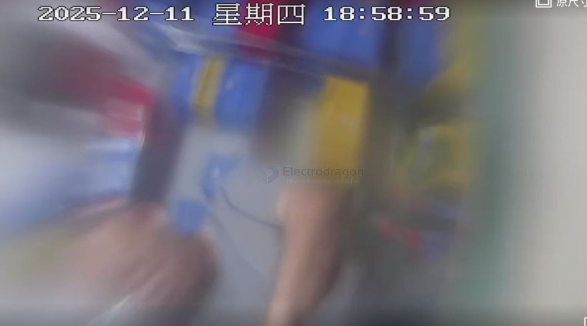

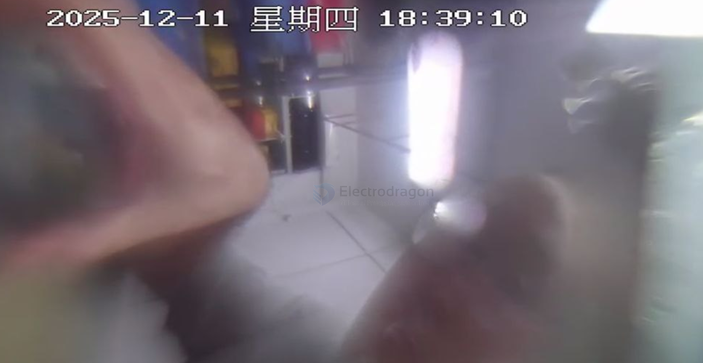

## lens 2 

M12 screw mount lens, 

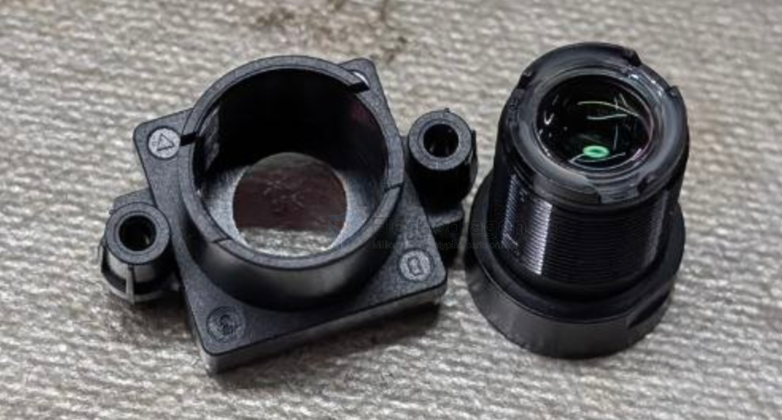

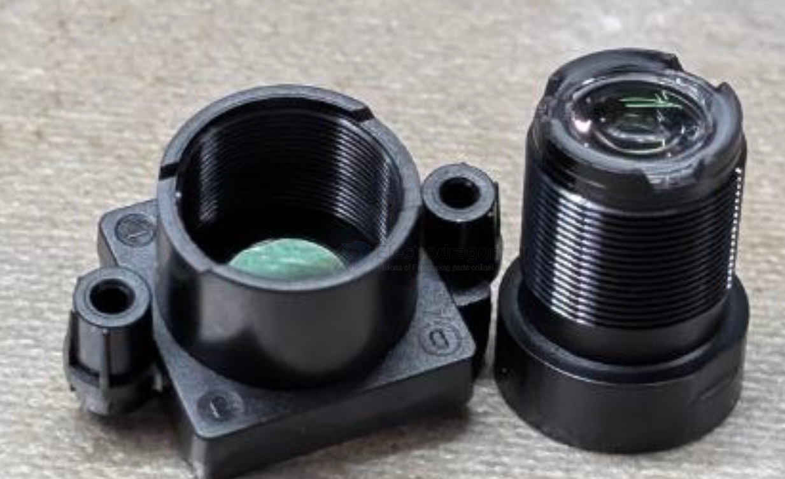

## lens with infrared filter 

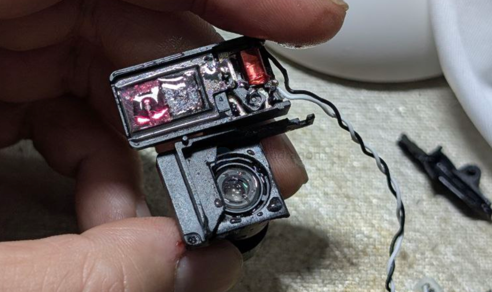

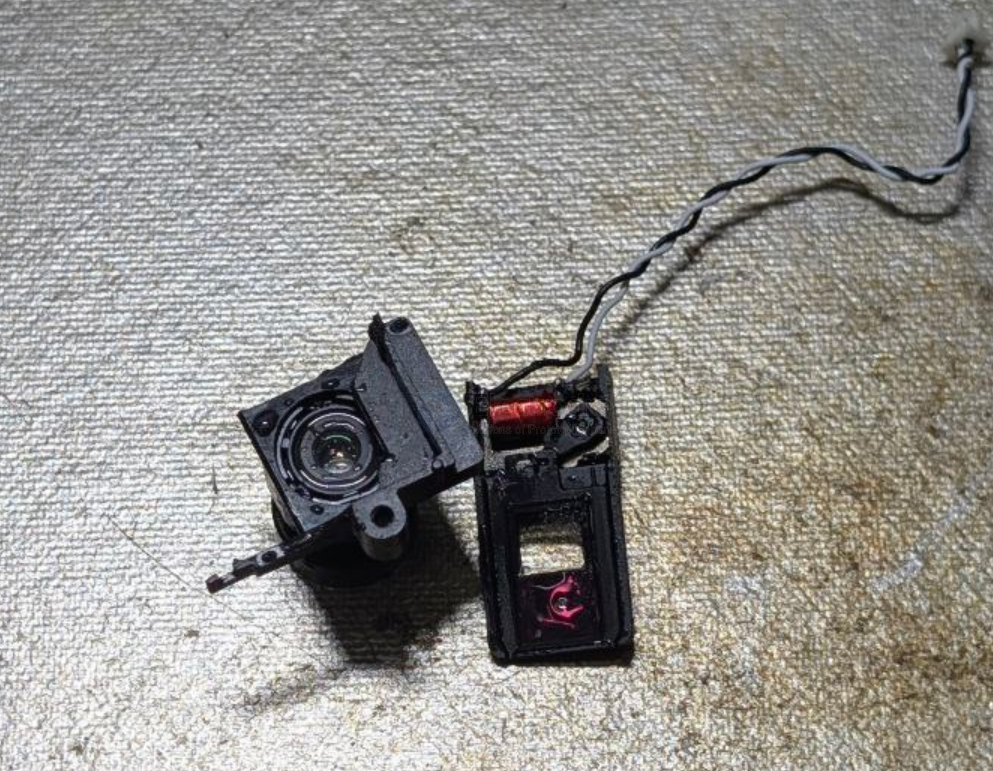

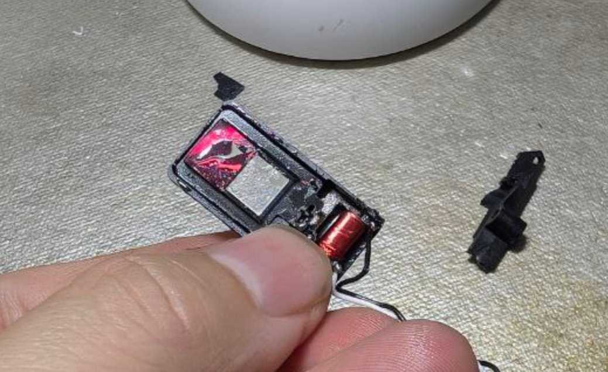

inside of the lens 

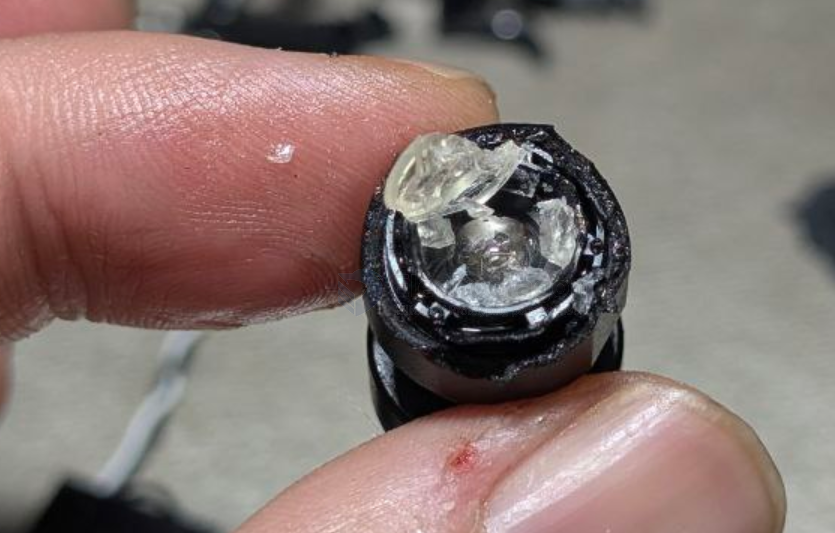

## lens and oil 

How mineral oil affects lens materials

### ● Glass elements  
Mineral oil **does not damage glass**. No dissolving or warping.

### ● Optical coatings (multi-coatings)  
Mineral oil does **not chemically attack coatings**, but it can leave an **oil film**.  
This causes:
- lower contrast  
- foggy look  
- ghosting  

### ● Optical glue (UV glue / epoxy glue)  
Most lens groups use **epoxy-based optical cement**.  
- Short-term contact: usually **safe**  
- Long-term soaking: may **soften**, **yellow**, or **release stress**

### ● Plastic parts (ABS, PC, nylon)  
Usually **stable** in mineral oil.  
Some plastics may swell after many months.

## lens tuning

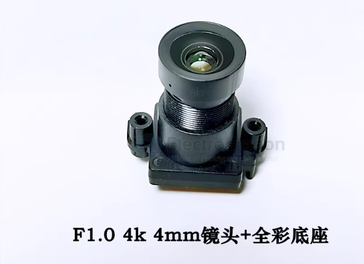

### Six keys to maintain clarity after oil immersion

- Use oil with a consistent, stable refractive index
- Avoid any trapped air bubbles
- Ensure every lens surface is completely clean
- Lens elements must not be decentered or loose
- Use oil that stays clear long-term (no discoloration or precipitation)
- Re-focus after oiling to restore optimal imaging

🔹 Step 3: Loosen M12 lens lock

Most M12 lenses have a locking ring / small set screw.

Loosen just enough to rotate the lens for focus adjustment.

Keep the lens barrel supported.

🔹 Step 4: Adjust focus

Rotate the lens barrel slowly while observing the live camera feed.

Look for the sharpest image on your test target.

Zoom in on the LCD or PC and check multiple points (center + edges).

Fine-tune until center and corners are acceptably sharp.

Note: Oil can slightly change corner distortion, so prioritize center sharpness.

🔹 Step 5: Lock the lens

Tighten the M12 locking ring or set screw after final focus.

Avoid over-tightening (plastic threads may strip).

Make sure the lens does not move after locking.

## camera lens

### 1G6P structure

    Front (facing object)
    ────────────────────────────
    1 × Glass lens (G)
    6 × Plastic lenses (P)
    Spacer rings
    Long rear barrel (tube structure)
    Rear protective window (your breakable piece)
    M12 metal housing

in chinese 

    前方（朝向物体）
    ─────────────────────
    | 第1片：玻璃透镜（1G 的 G，即唯一一片玻璃） |
    | 第2片：塑料透镜（P）                         |
    | 第3片：塑料透镜（P）                         |
    | 第4片：塑料透镜（P）                         |
    | 第5片：塑料透镜（P）                         |
    | 第6片：塑料透镜（P）                         |
    | 第7片：塑料透镜（P）                         |
    ─────────────────────
    | 后组保护片（可被损坏的那片，多叫 Shield 或 IR） |
    | IR-cut filter（红外截止滤光片） *
    | Spacer（间隔环）                              |
    | Rear Barrel（后镜筒）                          |
    ─────────────────────
    传感器

### lens structure 

#### **1. Glass + plastic lenses**
- 1 glass lens in the front  
- 6 plastic lenses behind  
- Held by the long tubular structure (rear barrel)

#### **2. Rear Barrel ("the long tube inside")**
- The long cylindrical module inside the metal housing  
- Holds and aligns all lenses  
- Controls internal light path  
- Not itself a lens

#### **3. Rear Protective Window (the breakable piece)**
- Flat optical-grade glass or clear polymer  
- Always placed at the very back of the lens  
- Easy to remove or break  
- Does not change FOV or focus significantly  
- Only protects, not part of the lens formula

---

#### What Happens if You Remove the Protective Window?

##### ✔ Image still works normally  
Because it is **not part of the optical design**.

##### ✔ More dust risk  
Dust may settle on the last lens surface, causing spots.

#### ✔ Last optical element becomes exposed  
Plastic lenses scratch very easily.

##### ✔ You may need to improve sealing  
Especially if you plan to waterproof the lens.

### 🟥 (A) IR‑Cut Filter (Infrared Cut Filter)

Most M12 lenses have a small IR‑cut piece near the sensor:

- IR‑cut (infrared cut filter)
- Very thin
- Looks like glass
- Breaks if pressed
- Shows a slight blue‑green reflection
- Purpose: block infrared light to improve white balance and color accuracy

📌 Note: this is the most common “fragile small lens.”

If you break it:
- Daytime colors shift toward pink / red
- Night view becomes brighter  
  (Many night‑vision cameras intentionally omit this filter.)

## lens selection 

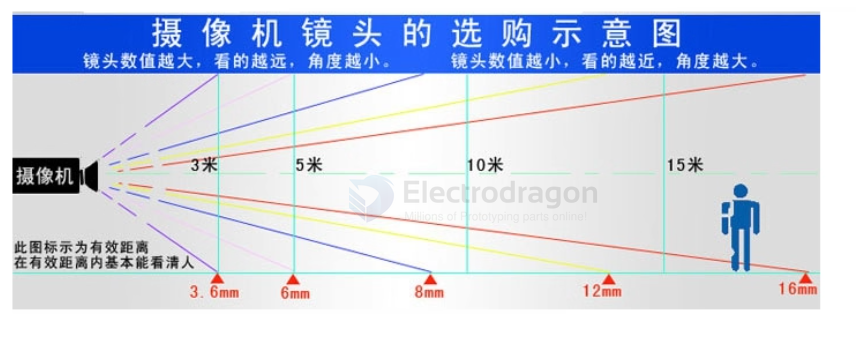

comparison table

| Parameter / Lens model                | lens 1                                                                                  | U1.56mm 5MP panoramic                                | 1.78mm                                                         |
| ------------------------------------- | --------------------------------------------------------------------------------------- | ---------------------------------------------------- | -------------------------------------------------------------- |
| Focal length (mm)                     | 3.9 ±5%                                                                                 | 1.56                                                 | 1.78                                                           |
| Optical back focal length (OBFL) (mm) | 3.94 ±0.2                                                                               | Not provided                                         | Not provided                                                   |
| Total optical length (TTL) (mm)       | 22.24 ±0.2                                                                              | Not provided                                         | Not provided                                                   |
| Minimum object distance (M.O.D)       | 2 m                                                                                     | Not provided                                         | Not provided                                                   |
| Lens construction                     | 1G6P                                                                                    | Not provided                                         | Not provided                                                   |
| FOV H / V (°)                         | 88.1 / 47.5 (1/2.7")                                                                    | ~180°                                                | ~160–170°                                                      |
| Liquid immersion suitability          | Moderate (requires oil correction or air + flat port)                                   | Poor (large focus shift, severe edge blur)           | Slightly better than 1.56mm, but still too short               |
| Remarks                               | Focus range sufficient, but multiple plastic lens groups will distort when oil-immersed | Ultra-wide short-focus; difficult to focus in liquid | Focus shift still severe; only suitable for center observation |

| 参数                    | 你的镜头 M12 3.9mm F1.0                | 推荐液体浸泡镜头规格                           |
| ----------------------- | -------------------------------------- | ---------------------------------------------- |
| 焦距 (mm)               | 3.9 ±5%                                | 3–6 mm（中焦偏广角）                           |
| 光学后焦距 OBFL (mm)    | 3.94 ±0.2                              | 5–8 mm（保证液体中焦点可调到传感器）           |
| 光学总长 TTL (mm)       | 22.24 ±0.2                             | 25–35 mm（包含机械调焦余量，适应液体焦点漂移） |
| 最近对焦距离 M.O.D      | 2 m                                    | ≥0.5 m（液体中焦点偏移增加）                   |
| 镜片结构                | 1G6P                                   | 单组或双组玻璃/耐油塑料，避免多片塑料组        |
| FOV 水平 / 垂直 (°)     | 88.1 / 47.5 (1/2.7")                   | 70–90°（避免超广角液体畸变严重）               |
| 液体中焦点漂移估算 (mm) | ≈ 1.9 mm                               | ≤2 mm（可通过机械调节补偿）                    |
| 液体浸泡适应性          | 中等偏好（需要油校正或空气+平面端口）  | 高（设计用于油浸或水下，折射率匹配）           |
| 备注                    | 聚焦范围足够，但多组塑料镜片油浸会畸变 | 专用油浸或水下镜头，确保清晰成像全画面         |

### lens 2 

  相对孔径<Aperture D/f'> == F1:2.2
  焦距<Focal-Length (mm)> == 25mm
  像面大小<lmage circle> == 1/3"

  机械后焦<Flange Bake Focal-Length （mm)> == 6mm
  光学总长<TTL> == 25
  最近焦距<M.0. D(M) == 0.2

| Parameter                       | Value |
| ------------------------------- | ----: |
| Aperture (D / f')               |  F2.2 |
| Focal length (mm)               | 25 mm |
| Image circle                    |  1/3" |
| Flange back focal length (mm)   |  6 mm |
| Total optical length (TTL) (mm) | 25 mm |
| Minimum object distance (M.O.D) | 0.2 m |

✅ 总结

优点：

焦距 25 mm 属于中焦偏广角 → 液体中焦点漂移比例小

TTL 25 mm + 后焦 6 mm → 可以通过机械调焦补偿液体折射引起的焦点移动

最近对焦距离短 → 可以对近景拍摄

适合液体浸泡：

相比超短焦 1.5–3.9 mm 镜头，这款镜头在油浸或水下使用更稳定

成像清晰度更好，畸变小

结论：这款镜头是一个适合油浸或水泡环境的选择，尤其是追求全画面清晰、可调焦的场景。

### lens 1 - Specifications - M12 小型 3.9mm 焦距、F1.0 大光圈镜头

- Aperture (F No.): 1.0 ±10%
- Focal length (焦距): 3.9 ±5%
- Optical back focal length (Optical Back Focal Length): **3.94 ±0.2 mm (in air)**
- Mechanical back focal length (Mechanical Back Focal Length): **3.85 ±0.2 mm (in air)**
- Total lens length (TTL): **22.24 ±0.2 mm (in air)**
- Image circle (像面大小): Ø6.9 mm (MAX)
- Lens structure (镜片构成): **1G6P** — note: if the first element is a plastic lens, wipe with alcohol only up to 3 times
- Mount (接口): M12 × P0.5
- Lens-to-base clamp torque (镜头与底座螺纹配合扭力): 60–600 gf·cm
- Minimum object distance (近摄距 / M.O.D): 2 m
- Resolution (解像标准): 3840 × 2160 (8MP)
- Suggested tilt tolerance of sensor packaging: ≤ 5' (minutes)
- Weight: /

### Field of view (FOV) — sensor size / sensor dimensions (mm)

- 1/2.7" — 5.760 × 3.240 × 6.609
  - H / V / D (水平 / 垂直 / 对角): 88.1° / 47.5° / 104.1°
- 1/2.8" — 5.568 × 3.132 × 6.388
  - H / V / D: 84.6° / 45.9° / 100.0°
- 1/2.9" — 5.376 × 3.024 × 6.168
  - H / V / D: 81.3° / 44.3° / 95.5°

### Optical characteristics (by sensor size)

- Optical distortion:
  - 1/2.7": -34.0%
  - 1/2.8": -32.0%
  - 1/2.9": -29.0%
- TV distortion (TVDistortion):
  - 1/2.7": -11.3%
  - 1/2.8": -10.4%
  - 1/2.9": -9.6%
- Relative illumination:
  - 1/2.7": 40.6%
  - 1/2.8": 43.0%
  - 1/2.9": 45.5%
- Chief ray angle (CRA):
  - 1/2.7": 11.2°
  - 1/2.8": 10.8°
  - 1/2.9": 10.5°

### Operation

- Focus (聚焦): Manual
- Iris (光圈): Fixed
- Environmental & Safety (环保 & 安全): RoHS

Notes:

- The first optical element may be plastic; if so, clean carefully and limit alcohol wipes to 3 times.

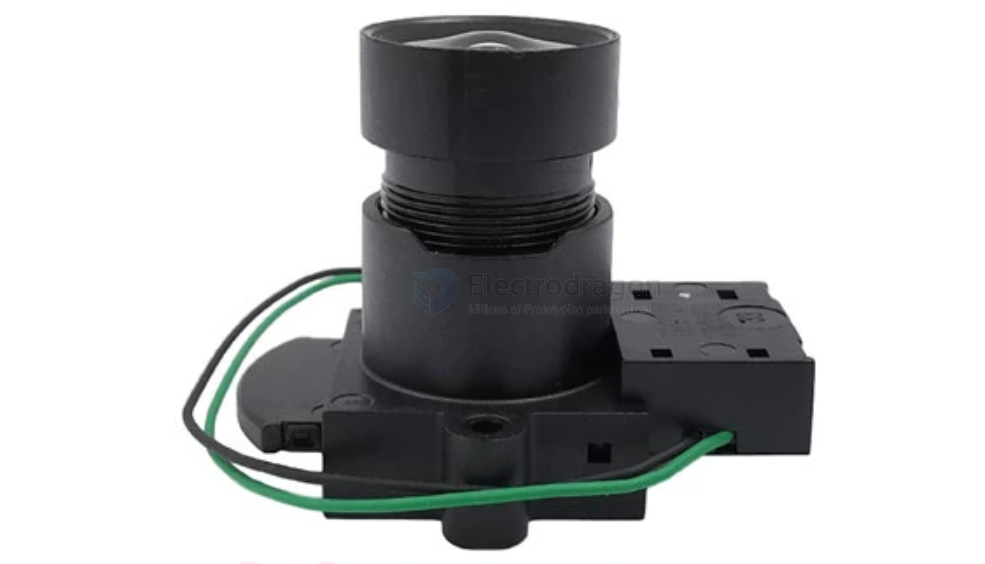

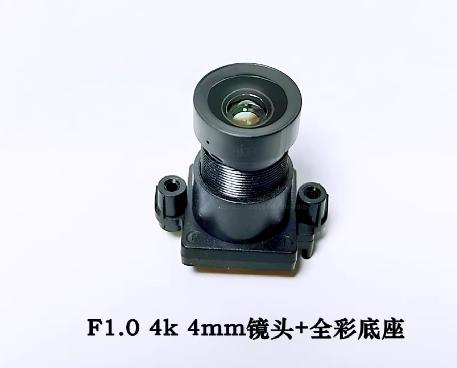

## specs 

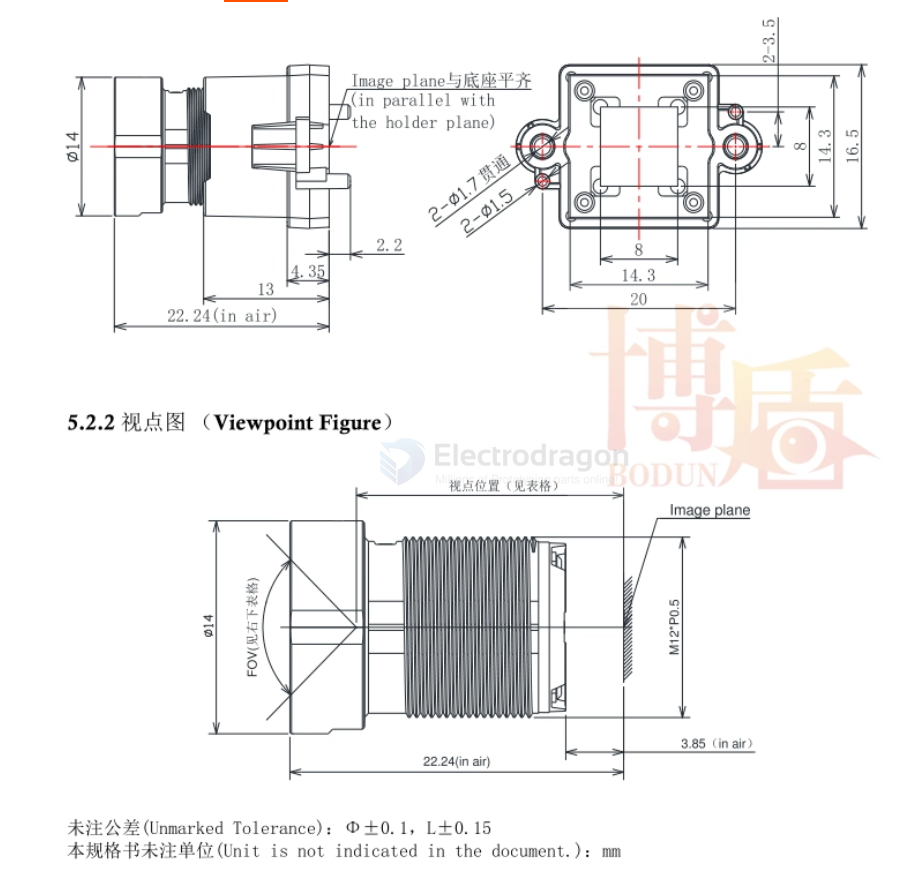

## infrared lens 

红外镜头，就是晚上有红外灯光时能看见，换镜头时先确认原装镜头底部有没有加650（镜头底部有片发红玻璃片，如下图示意）红外载止滤光片等一些特别的差异地方，如果有加而你没有备注加上，回去换上画面可能会偏红，颜色偏灰，绿色偏紫

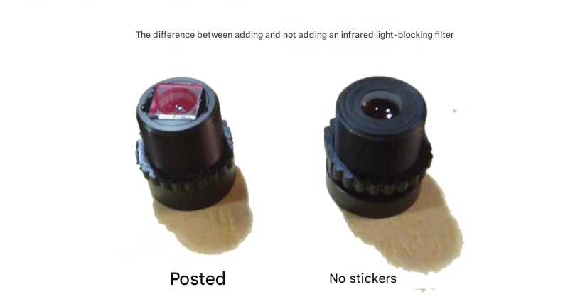

## ref 

- [[lens]] - [[tech]]