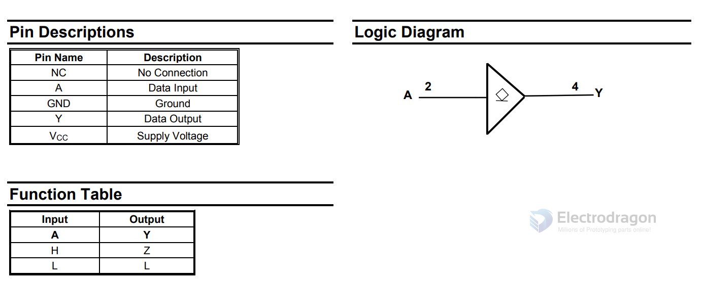
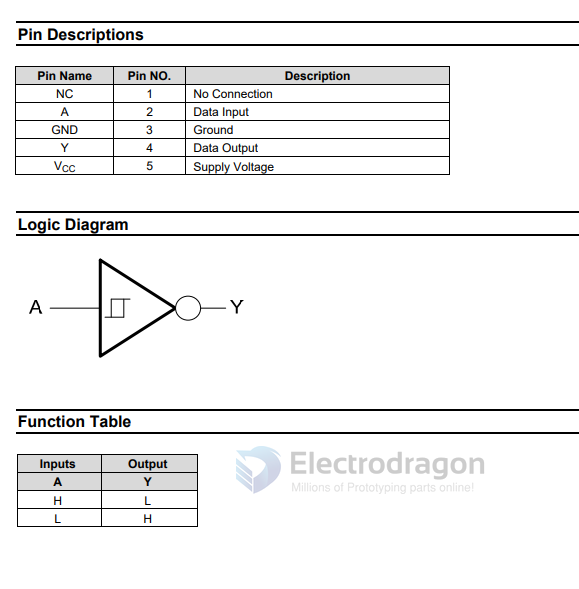

# buffer-dat 

- [[octal-buffer]] - [[shift-register]]

## common used 

- [[74HC245-dat]] - [[74HCT245-dat]]

- [[CD4050-dat]]

| Specification               | CD4050                          | 74HC245                          |
|----------------------------|----------------------------------|----------------------------------|
| Function                   | Hex buffer (non-inverting)       | Octal bus transceiver (bi-directional) |
| Logic Family               | CMOS (CD4000 series)             | HC (High-speed CMOS)            |
| Number of Buffers          | 6 (hex)                          | 8 (octal)                        |
| Direction Control          | Unidirectional                   | Bi-directional with direction control |
| Voltage Range              | 3V to 15V                        | 2V to 6V                         |
| Typical Operating Voltage  | 5V, 10V, 15V                     | 5V                               |
| Input Voltage Tolerance    | Up to 15V                        | Vcc + 0.5V (max)                 |
| Input Type                 | TTL/CMOS                         | CMOS/TTL compatible             |
| Output Drive Capability    | Moderate                         | High (up to ±35mA sink/source)  |
| Output Type                | CMOS push-pull                   | CMOS push-pull                  |
| Propagation Delay (at 5V)  | ~200 ns                          | ~8 ns                            |
| Package Types              | DIP, SOIC, etc.                  | DIP, SOIC, etc.                  |
| Use Case                   | Level shifting (e.g. 5V to 3.3V) | Bus interfacing, data buffering |

Summary:

**CD4050** is ideal for **level shifting **and operates over a wide voltage range. It is tolerant of high-voltage inputs.

**74HC245** is a high-speed **bi-directional bus buffer**, typically used for **bus-oriented communication** and interfacing between microcontrollers and peripherals.

## SINGLE BUFFER/DRIVER WITH OPEN DRAIN OUTPUT

74LVC1G07

**SN74LVC1G07** – Single Buffer/Driver with Open-Drain Output

## SINGLE SCHMITT-TRIGGER INVERETER

74AHC1G14

## SINGLE BUFFER GATE WITH 3-STATE OUTPUT

## SN74LVC2G04 Dual Inverter Gate

# buffer-dat 

- SN74LVC1G07 Single Buffer/Driver With Open-Drain Output

## Inverter 

SN74LVC1G14 Single Schmitt-Trigger Inverter - https://www.ti.com/lit/ds/symlink/sn74lvc1g14.pdf

- [[74hc541-dat]] - [[74hct245-dat]]

**74AHC1G125** – Single Bus Buffer Gate with **3-State Output**