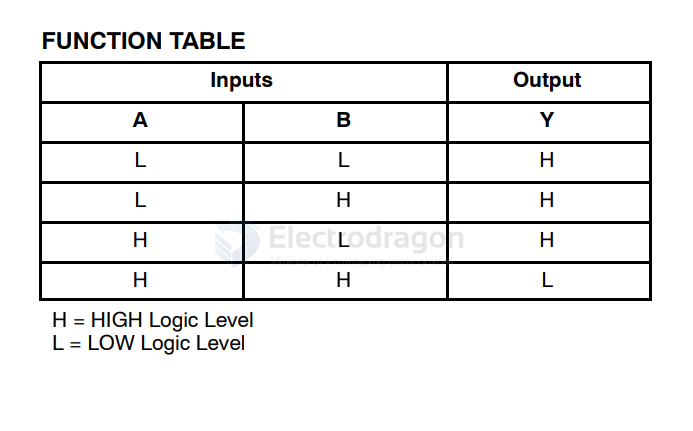

# logic gate 

## 74AHC1G125

https://www.diodes.com/assets/Datasheets/74AHC1G125.pdf

| OE  | A   | Y   |
| --- | --- | --- |
| L   | H   | H   |
| L   | L   | L   |
| H   | X   | Z   |

The output enters a high impedance state when a HIGH-level is applied to the output enable (OE) pin. 

## NAND 

### NC7SZ00

The NC7SZ00 is a single two−input NAND gate from onsemi’s Ultra−High Speed (UHS) series of TinyLogic.

